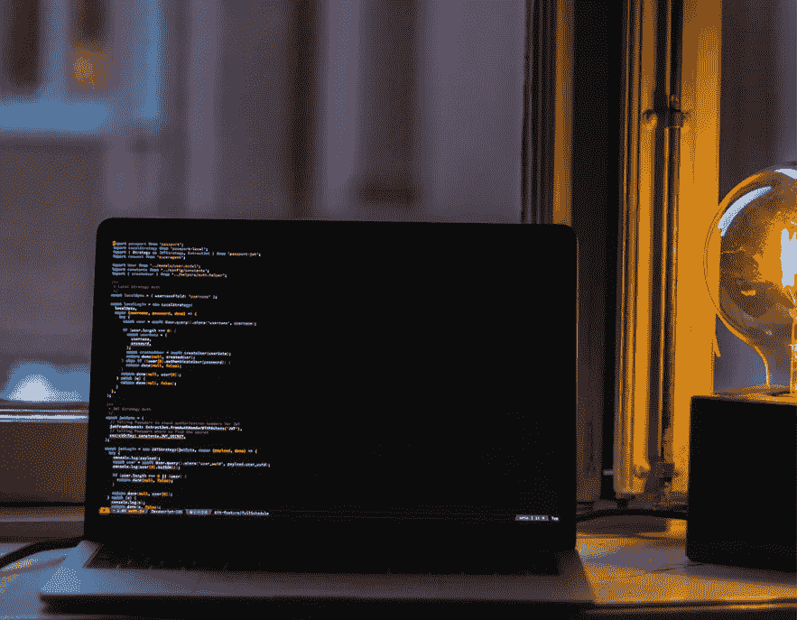

# 软件开发者:好的部分和坏的部分

> 原文：<https://medium.com/codex/software-developer-good-parts-and-bad-parts-ee539f5a98?source=collection_archive---------25----------------------->

## 让我们享受好的部分，避免不好的部分

奥斯卡·伊尔迪兹在 [Unsplash](https://unsplash.com/s/photos/developer?utm_source=unsplash&utm_medium=referral&utm_content=creditCopyText) 上拍摄的照片

每个职业都有好的一面和不好的一面。作为一名经验丰富的软件开发人员，虽然我喜欢我日常工作的许多部分，但也有我不喜欢甚至讨厌的事情。

## 什么是好的部分