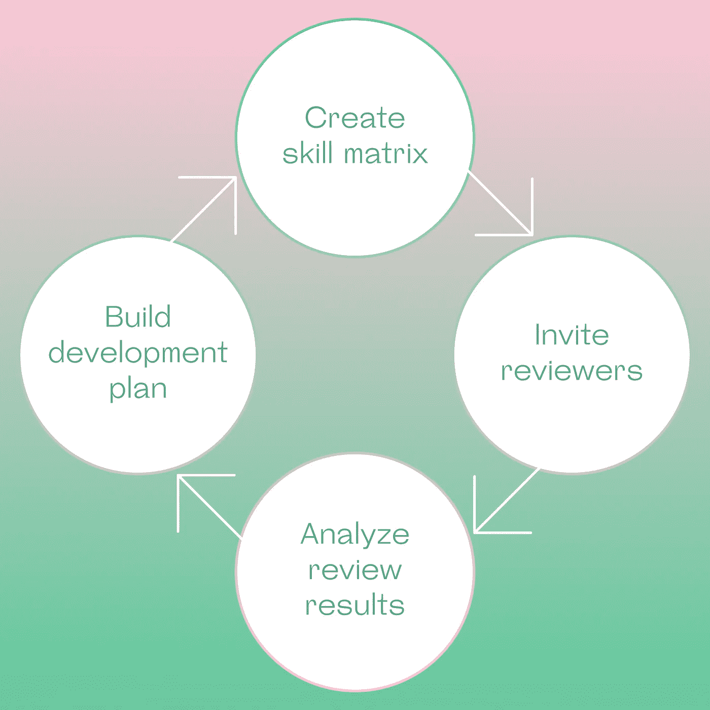
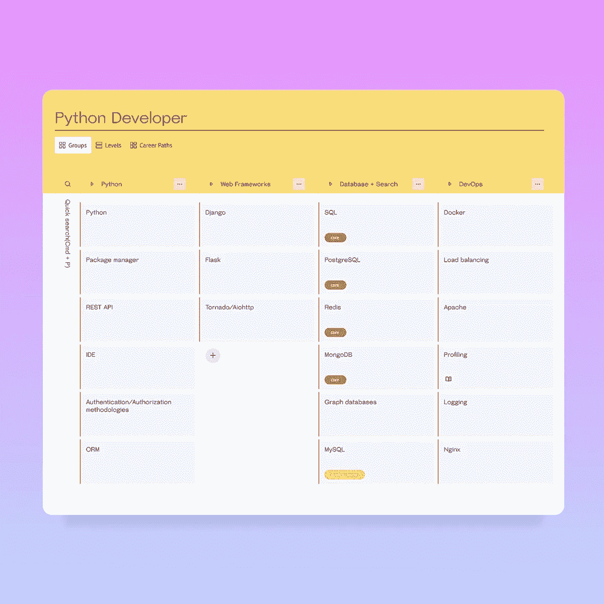
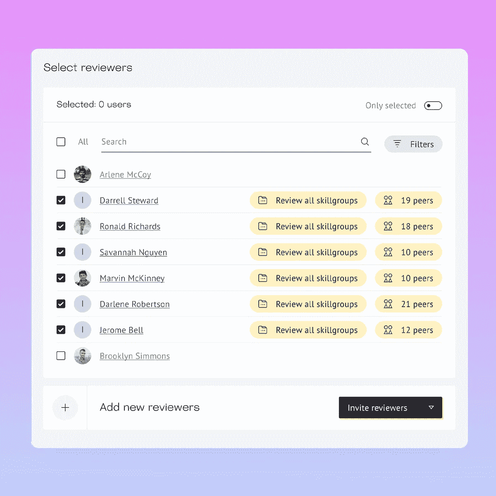
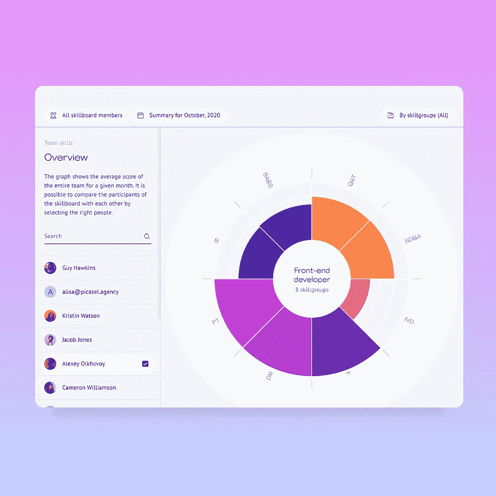
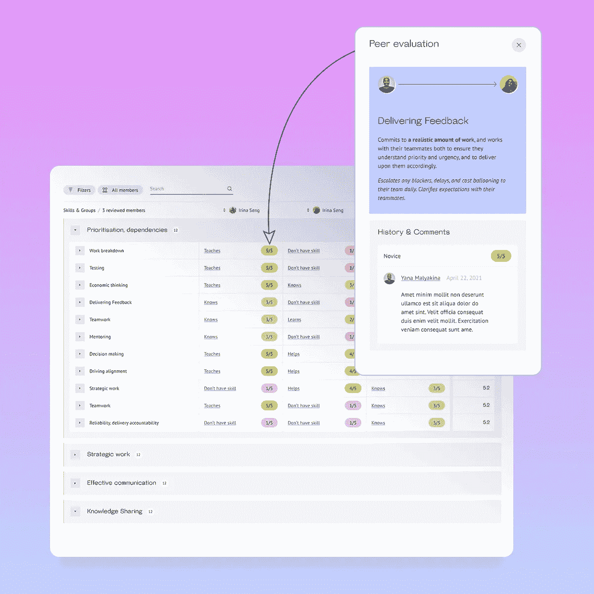
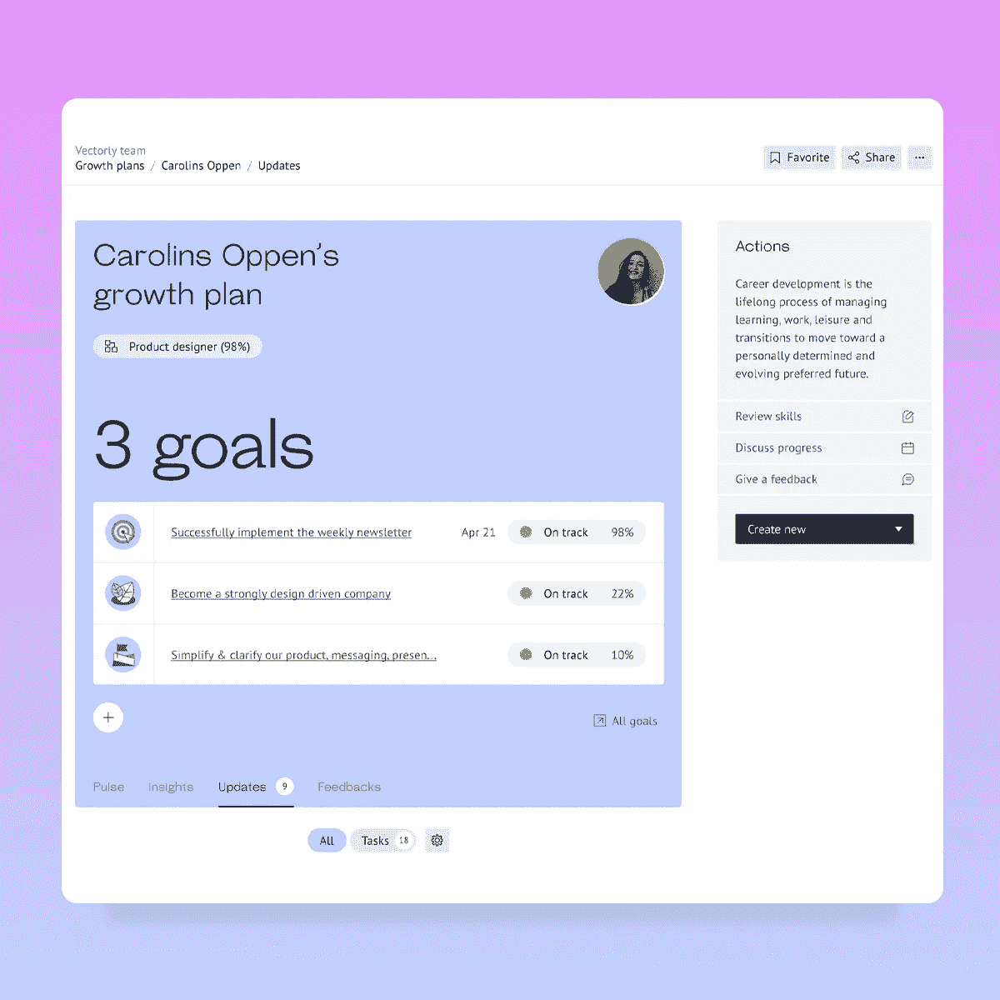
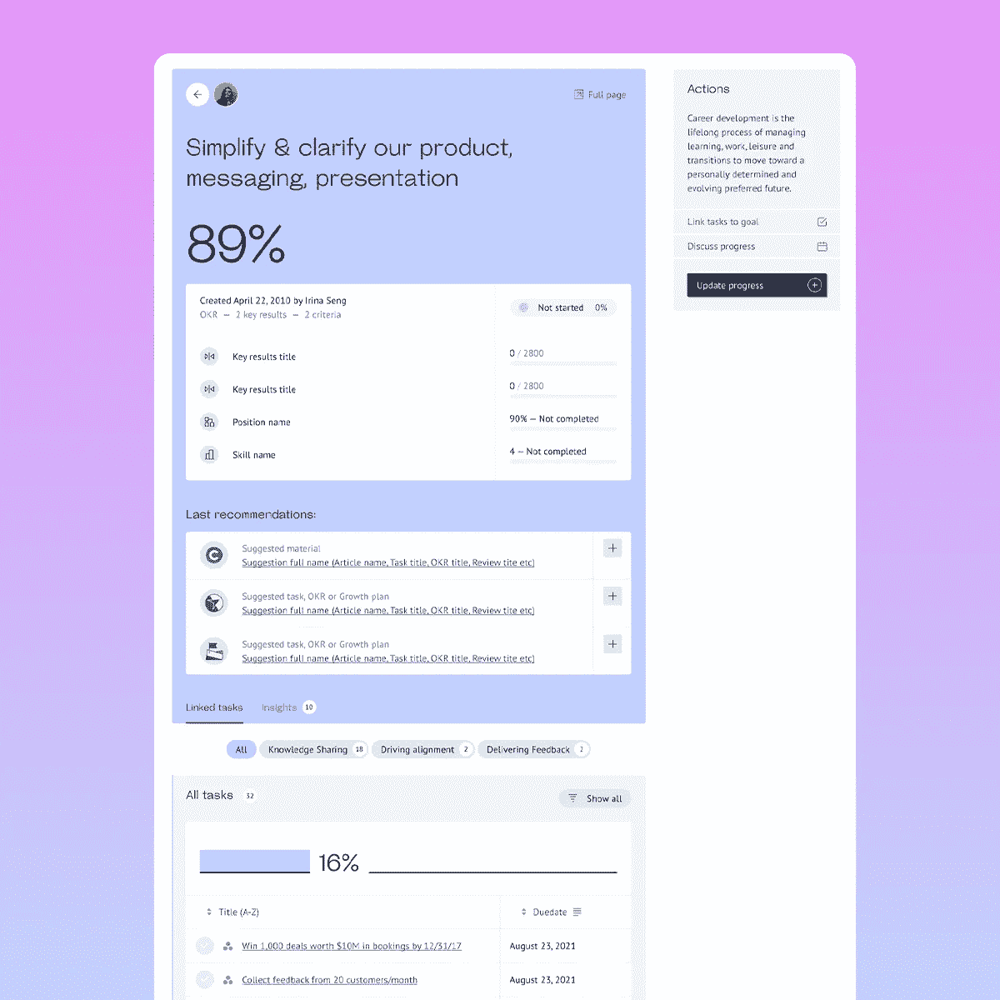
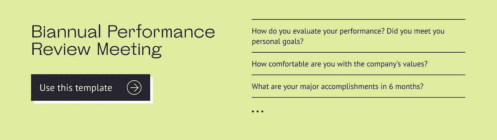

# 软件工程师绩效评审示例

> 原文：<https://medium.com/codex/software-engineer-performance-review-example-d87be69cf0fc?source=collection_archive---------7----------------------->

一个高质量的软件工程师性能评审程序是每个工程经理和团队领导的武器库中最强大和最通用的工具。在许多科技公司正在经历数字化转型的背景下，这一点尤其如此。今天，大多数企业跟上竞争的唯一机会是从根本上改变他们的经营方式，并向他们的客户和顾客提供价值。

这种方法非常强调团队的福祉、员工带来的技能和知识的多样性，以及营造一个每个团队成员都能发展技能的环境。

在全面、定期的绩效评估的帮助下，经理可以评估团队的当前状态以及他们在最重要项目上的进展，找出薄弱环节，并确保每个员工都在职业生涯中取得进步，从而确保团队日益强大。

在我们之前关于软件工程师绩效评审的文章中，我们已经讨论了这些评审的最佳方法[和使用技能矩阵](https://www.vectorly.team/vectorly-blog/a-step-by-step-guide-to-software-engineering-performance-review-skill-matrix-templates)。今天，让我们看看在[王牌](https://www.vectorly.team/?utm_source=medium&utm_campaign=codex)的帮助下，开发人员绩效评估是如何进行的。

# 为什么软件工程团队需要绩效评审？

但是首先，让我们考虑一下什么是软件工程师绩效评估，以及为什么它对一个技术团队如此重要。

说到管理软件开发团队，定期对员工的工作进行评审是绝对必要的。但是你怎么知道绩效评估是否到期了呢？以下是你需要注意的一些最常见的迹象:

*   **您的团队没有在截止日期前完成工作，或者生产出低价值的产品**

如果您已经注意到您的团队的表现正在下滑，期限正在错过，并且您的软件开发工作的最终结果是低于标准的——开发人员表现评估是过期的！

*   **团队成员表现出开发人员精疲力竭的迹象**

工程师特别容易精疲力尽，而你，作为一名经理，需要对抗经常源于精疲力尽的愤世嫉俗和拖延。经常和你的员工联系是跟踪他们精神和情感健康的最好方法。开发人员精疲力竭的残酷讽刺是，最敬业、最有生产力、最投入感情的员工，也就是传说中的 20%，处于精疲力竭的最高风险中。

*   **贵公司没有透明的开发路线图**

团队成员经常会发现自己迷失在公司的结构中。在这种情况下，员工对公司内部的各种职位没有清晰的了解，也不知道如何才能晋升到一个新的水平。与此同时，许多经理错误地将晋升建立在员工为公司工作的时间上。

*   **缺乏反馈文化**

软件开发人员，由于其职业的性质，可能会与公司的其他部门完全隔离。但是，通过确保你的员工有机会就他们的表现和团队的现状相互交流，你可以在公司内部培养一种反馈文化。

通过进行定期的绩效评估，你将获得无价的洞察力，包括你的团队作为一个整体的绩效，以及每个成员的进步、优势和劣势。评审是双向的——定期的反馈会议也是团队领导为他们的开发人员提供指导和方向的机会。

# 进行软件开发人员绩效评估的最好方法是什么？

在一天结束的时候，你不能否认对工程团队进行彻底、及时和一致的性能评审的必要性。现在，是时候回答重要的问题了:谁来做评审？你如何着手建立这个过程？简而言之，这是团队的努力。最好的方法是进行 **360 度全面评估**。

简而言之，360 度反馈是一个系统，在这个系统中，员工从他们周围的工作人员那里获得保密的、无偏见的反馈，并反过来提供他们对同事的绩效和职业发展的意见。这也是这种方法迅速成为行业标准的原因:找到问题根源的最佳方法是检查整个指挥链，深入了解每个员工的表现，听取经理和开发人员对事件的描述。

例如，当对软件开发人员进行 360 度评估时，你的主要目标是评估他们的硬技能，重点是可能的技能差距。同时，你需要评估员工与团队其他成员的契合度，他们的职业目标是什么，以及他们如何看待自己在公司的未来。

为了获得所有这些见解，您需要访问尽可能多的数据源。这就是为什么每个开发人员和软件工程师都需要被审查的原因:

*   由经理负责
*   由产品团队负责
*   部门的其他人
*   自行检查(自我检查)

# 360°回顾的优势

*   为您提供每位员工和您的团队绩效的全貌
*   让发现发展机会变得容易
*   让人们知道他们在公司是如何被看待的，并让他们的意见被听到
*   增强自我意识，树立信心，鼓舞士气
*   赋予员工权力，提高他们的工作满意度，减少人员流动
*   创造开放、反馈和协作的文化

# 360°回顾的弊端

*   往往是一个缓慢的过程，需要大量的监督
*   需要提前做很多计划
*   整个团队需要协作
*   你收到的一些反馈可能质量不高
*   焦点可以转向负反馈

一眼就足以看出利远大于弊。但是，让我们在这里完全诚实:这是一个高投资/高回报的情况。也就是说，你会得到不可思议的结果，但前提是你做对了每一件事。

360°评估可能是一项艰巨的任务。但是 [Ace](https://www.vectorly.team/) 真的可以帮助自动驾驶运行这个过程！它提供了一个强大、易用的工具来进行 360 度绩效评估，并为 60 多个技术角色提供了[技能矩阵](https://www.vectorly.team/templates?utm_source=medium&utm_campaign=codex#skill-matrix)。一旦您拥有合适的工具，看看这样的任务会变得多么容易！

# 如何进行软件工程师绩效评审(示例)

[Ace](https://www.vectorly.team/?utm_source=medium&utm_campaign=codex) 允许您自动化、简化并加速开发人员绩效评估的整个过程，使其对所有相关方透明清晰。让我们一步一步来看看它是如何工作的。

软件工程师绩效评审的阶段

## 第一步。创建技能矩阵

第一步是创建或更新作业地图(简档)。在这里，您可以确定公司中每个角色需要哪些技能，以及您希望这些技能达到什么水平。

面向 Python 开发人员的 Ace 的[技能矩阵模板](https://www.vectorly.team/templates?utm_source=medium&utm_campaign=codex#skill-matrix)

> 免费获取 60 多个技术角色的[技能矩阵模板。](https://www.vectorly.team/templates?utm_source=medium&utm_campaign=codex#skill-matrix)

## 第二步。邀请审阅者

现在是时候邀请员工开始评估流程了。在您为每个职位创建并最终确定职位图(个人资料)后，您可以邀请评审人员开始填写他们同事的个人资料，当然，也可以为他们自己写一份自我评审。

360 度绩效评估的评估者列表

## 第三步。分析审核结果

提交所有评估后，您可以访问分析来查看您团队的结果，以及每个员工的明细。该报告将使确定您的团队缺少哪些技能以及每个员工需要提高哪些技能变得容易。

在 Ace 中分析[评审结果](https://www.vectorly.team/?utm_source=medium&utm_campaign=codex)

使用下表，很容易发现每个团队成员的技能差距，并制定发展计划。

软件工程师绩效[评审结果](https://www.vectorly.team/?utm_source=medium&utm_campaign=codex)在 Ace

## 第四步。制定发展计划

现在，轮到你采取行动了！第四步是当你终于可以开始使用这些数据，看看你需要采取什么具体步骤来改善你的团队。

一旦您确定了任何潜在的技能差距，您就可以开始为每个员工制定发展计划。你可以选择必要的技能，并为每项技能设定期限。对于每项技能，您可以创建自定义任务或与每位员工分享一些阅读和观看材料。

选择技能以创建发展计划。来源:[王牌](https://www.vectorly.team/?utm_source=medium&utm_campaign=codex)

在个人发展计划中添加任务。

> 获取关于如何管理技术团队成长的免费电子书。

## 第五步。跟踪进度

跟踪每个员工的进展。定期的一对一会议是最好的方式。为了节省准备时间，您可以使用现成的一对一会议模板，如下所示:

[一对一会议模板](https://www.vectorly.team/templates?utm_source=medium&utm_campaign=codex#1-to-1-meeting)由 Ace 提供

> 召开一对一会议，在早期发现并解决问题。为了提高效率，[免费下载我们的模板](https://www.vectorly.team/templates?utm_source=medium&utm_campaign=codex#1-to-1-meeting)。

## 关键想法

*   在全面、定期的绩效评估的帮助下，您可以评估团队的当前状态以及他们在最重要项目上的进展，找出薄弱环节，并确保每个员工都在职业生涯中取得进步，从而确保您的团队日益强大。
*   最好的方法是进行 360 度的评估。360 度反馈是一个系统，在这个系统中，员工从他们周围的工作人员那里获得保密的匿名反馈，并反过来提供他们对同事的绩效和职业发展的意见。
*   这将为你提供每个员工和你的团队绩效的全貌，但可能是一个缓慢的过程，需要很多监督。
*   Ace 允许您自动化、简化和加速开发人员绩效评审的整个过程，使其对所有相关方透明和清晰。