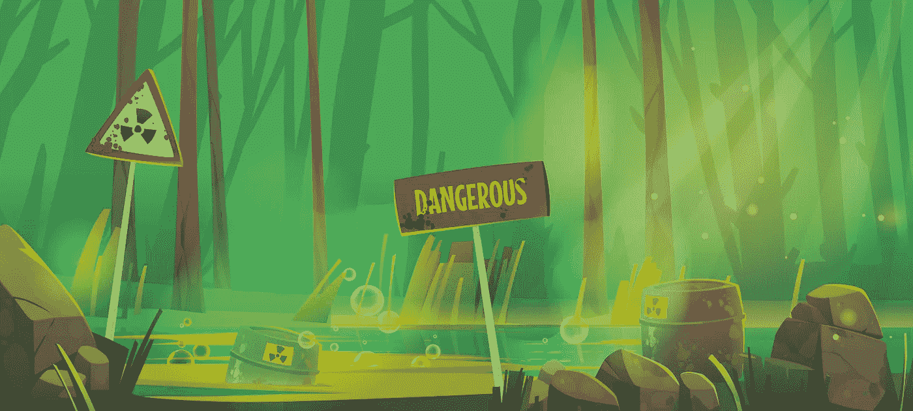

# 软件工程现在是有毒的

> 原文：<https://medium.com/codex/software-engineering-is-toxic-now-b0da98061e5b?source=collection_archive---------0----------------------->

沼泽矢量由[乌普克利亚克](https://www.freepik.com/author/upklyak)——【www.freepik.com】T2 创建

让我们停止假装软件工程行业仍然是一个充满志同道合者的和平行业。可能曾经也是那样，但是幻觉就像泡沫一样在破灭。事情已经发生了变化，我们正在走向一种 hustle 文化，这种文化要求我们不仅将编程作为一项工作，而且作为一种爱好。我们被期望做副业，知道最热的极快的框架，贡献…