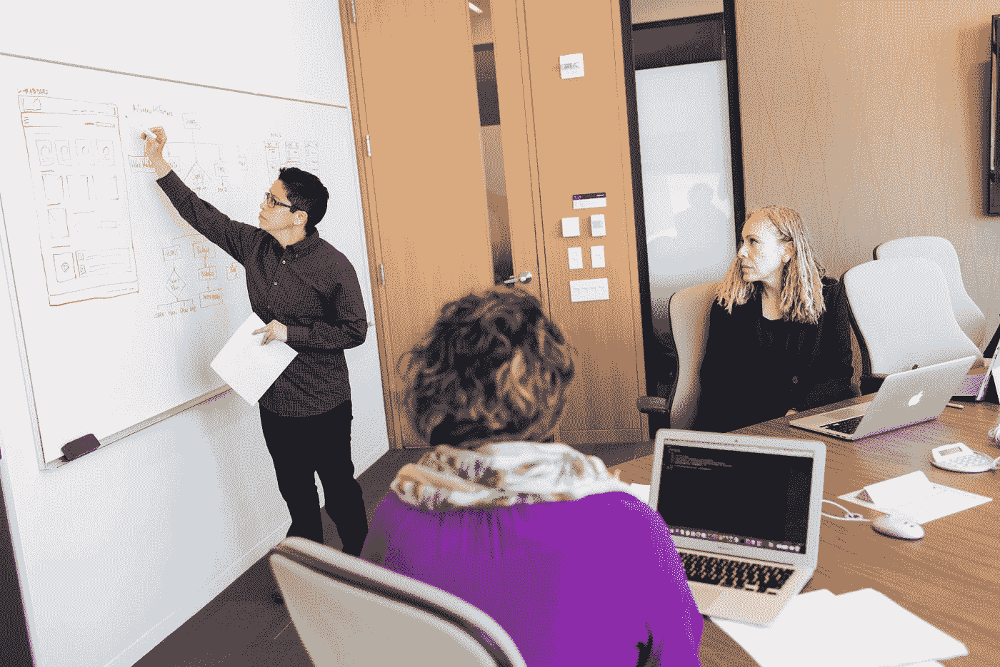

# 软件工程 vs 软件编程

> 原文：<https://medium.com/codex/software-engineering-vs-software-programming-b7c00b2edad8?source=collection_archive---------6----------------------->

我们是“软件工程师”还是“软件程序员”？。我们是不是把两者当成了一样来使用？。如果我们看一下《谷歌的[软件工程》这本书的第**第一**章，看到他们为此专门写了整整一章，我们可以假设他们是不一样的。这是值得一读的一章，并得到了他们揭露的所有细节。今天，我想通过一点描述和一个真实的例子向你们展示我的观点。](https://www.amazon.es/Software-Engineering-Google-Lessons-Programming/dp/1492082791)

**软件程序员**

照片由 [Florian Olivo](https://unsplash.com/@florianolv?utm_source=medium&utm_medium=referral) 在 [Unsplash](https://unsplash.com?utm_source=medium&utm_medium=referral) 上拍摄

编程是我们生成更多软件的方式，所以软件程序员只是一个能够创建软件的人，仅仅是一段做某事的代码。

另外，编程是软件工程的一部分。

**软件工程师**

照片由[克里斯蒂娜@ wocintechchat.com](https://unsplash.com/@wocintechchat?utm_source=medium&utm_medium=referral)在 [Unsplash](https://unsplash.com?utm_source=medium&utm_medium=referral) 上拍摄

软件工程师是一个不仅仅需要开发软件的人。软件工程必须考虑:

*   **时间**:溶液持续多长时间。这是短期解决方案吗？，是很久了吗？，也许我们不知道…
*   规模:它能变得多大？
*   **权衡**:每个解决方案的好处和问题

现在我想展示一些我日常工作中的真实例子，这些例子可以归入每一个类别(工程和编程)。

**编程案例**

检测到一个极限情况，一些元素状态没有正确更新。在检查代码并理解问题后，进行了修复。

现在，我们需要修复那些值不正确的状态。创建一个小程序:

*   找到了不正确的元素
*   寻找正确的值
*   更新每个不正确元素的状态

我们只需要创建一个执行这些指令的软件，并定义如何运行它。

也就是说，不需要考虑其他事情，只需要解决具体问题的正确指示。

**工程案例**

我们需要帮助我们的用户完成签约过程中最复杂的步骤，这是一个关键的过程，它依赖于外部服务，有时可能会失败。当它失败时，它会使我们的用户进程变慢，并给我们的支持团队带来更多的工作。

我们评估了几个选项:

*   选项一:在流程中为客户添加额外的步骤，以帮助他们运行替代流程
*   选项二:创建一个调度任务来运行一个进程，该进程缓存在该进程中使用的信息

我们首先考虑的是:每个解决方案的工作量。

*   选项一需要后端工作以及应用程序(IOS 和 Android)的工作。要实施的流程相当复杂，有几个新的步骤和变化。任何使用原生应用的人都知道每个平台的发布过程，以及发现新错误时的问题。因此，作为一个复杂的流程和业务问题，本机应用程序并不了解这一点，它可能会导致我们需要更长的发布时间，可能会出现错误，是一个糟糕的解决方案，需要将其从流程中删除，等等。记住:一个本地应用程序在发布的时候就已经完成了，你不需要确保用户拥有最新的版本(至少以一种简单的方式)。
*   选项二只需要后端团队的工作，它降低了流程的复杂性，避免了团队之间的同步，只涉及具有业务问题知识的团队，可能的 bug 可以在没有用户交互的情况下解决(只更新后端)。同时，这种解决方案对一些用户来说是不可行的。但是，在这里，增量变化开始发挥作用，其他任务将被计划来解决这种情况(也减少变化和重用已经存在的功能)

一旦我们有了一个赢家选项，我们就该考虑流程，并设计考虑不同细节的流程了:

*   要处理的数据量:使用正确的并发性、算法、数据结构和设计模式。
*   外部服务的可用性:调用并发性、执行任务的时间范围。
*   任务抽象，配置可能性:不知道过程，允许配置任务来响应需求。
*   任务结果:写日志，创建监控和仪表板，保存历史化过程的结果数据，并能够分析结果。

正如你可能注意到的，我在这个例子中使用了“我们”这个词来描述动作，这个“我们”是编程和工程之间最重要的区别之一。工程是一项团队工作！

如我们所见,“工程”过程需要程序软件，但这只是过程的一个步骤。在这个过程中有更多的东西，在需要的时候(当我们只是写一个简单的代码的时候)，我们应该努力成为“软件工程师”和“软件程序员”。

我们能做些什么来在每一方面做得更好？

**软件程序员**

*   掌握你的主要编程语言，并学习其他语言。
*   掌握你的编辑器，按键绑定，调试工具，…
*   改进数据结构和算法。
*   学习最常用的结构和行为模式。
*   提高你的测试技能。

**软件工程师**

*   提高沟通技巧(听、写、说)。
*   学习建筑模式。
*   提高你的抽象能力。
*   了解系统设计。

以上是我的一些例子和建议，希望对大家有所帮助。如果你喜欢它，请在 Medium 上关注我的其他文章！。

这两个概念有没有其他的定义或者例子？