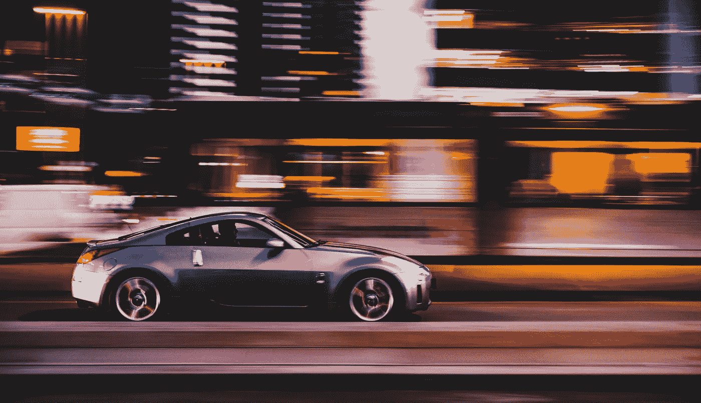

# 软件是汽车的价值

> 原文：<https://medium.com/codex/software-is-the-value-of-the-car-bcaf96a2d37f?source=collection_archive---------7----------------------->

## 为什么软件的价值在增加，前面有什么挑战

在 [Unsplash](https://unsplash.com/?utm_source=unsplash&utm_medium=referral&utm_content=creditCopyText) 上[给](https://unsplash.com/@laurentmedia?utm_source=unsplash&utm_medium=referral&utm_content=creditCopyText)拍照

交通是美国空气污染的主要来源[。汽车行业面临着变得更加环保的新挑战，这一要求对汽车制造商改变产品线和行业转型有两个重要影响。](https://www.ucsusa.org/resources/cars-trucks-buses-and-air-pollution)