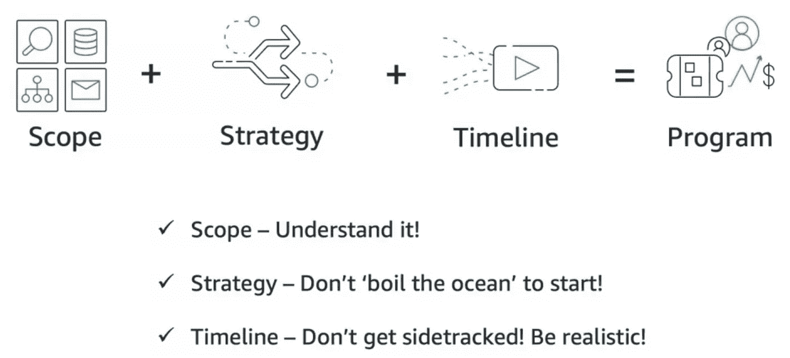

# 软件迁移和最佳实践

> 原文：<https://medium.com/codex/software-migrations-and-best-practices-2eb12b58385c?source=collection_archive---------16----------------------->

## 无论规模大小，执行迁移的最佳实践。

托德·特拉帕尼在 [Unsplash](https://unsplash.com?utm_source=medium&utm_medium=referral) 上的照片

我在西雅图开始工作的第一周，我仍然记得我的一位高级经理在午餐时开玩笑说，当时 7 个人的团队中有 4 个人正在按照领导的指示进行从 Oracle 到 AWS 的数据存储迁移——“所有软件项目基本上都是一种迁移、集成和废弃的形式”。随着我的任期接近 7 年，这种说法与事实相去甚远。我参与了一些令人兴奋的、紧张的最后期限以及一些被迫的迁移。当我用一路走来学到的一些艰难的教训结束另一篇文章时，在这里反映我的想法。

迁移通常涉及将技术解决方案从一个平台移植到另一个平台，需要更改代码配置、数据存储、相应的管理控制台，有时甚至需要更改应用程序逻辑。这些活动可能非常简单，只需在配置中做一行更改，就可以执行从一个平台到另一个平台的迁移，也可能非常复杂，甚至涉及到应用程序和业务逻辑的更改。

# 成功实施迁移的成功标准

# 迁移的最佳实践:

## 人员视角

管理层支持:

*   确定一个有权做决策的领导者
*   在高层领导和利益相关者之间就成功的样子达成一致。

团队协作和所有权:

*   创建一个专注于实现的跨职能团队。
*   了解谁需要参与各个阶段，并与他们合作。
*   就不同团队之间的协作方法达成一致。

培养

*   主动培训团队使用各种工具。不要让它成为瓶颈。

## 过程视角

*   尽量减少不必要的改变。
*   明确定义的上报途径。
*   报道的唯一真实来源。
*   尽早建立关键原则并记录下来。
*   波浪计划从小规模开始，随着团队和过程的发展而加速。
*   迁移过程中的持续改进。

## 技术视角

*   自动化是大规模迁移的关键
*   提前建立你的着陆区。
*   制定一个 T 减计划，记录先决条件活动。
*   实施迁移后检查和回顾，以实现持续改进。

为了便于理解和实现最佳实践，我将典型的迁移活动分为四个主要阶段。理解这一点将有助于人们将遵循的最佳实践关联起来，并在他们的项目中实现它们。

# 典型的迁移阶段:

## 1.准备迁移

*   了解迁移活动
*   需求收集
*   设计
*   了解应用程序中所需的更改
*   项目准备

## 2.技术实现

*   执行代码更改
*   执行代码评审
*   创建测试案例来测试迁移活动
*   开发人员桌面中的本地测试
*   Beta 和 Gamma 环境中的集成测试
*   迁移团队的用户可接受性测试
*   利益相关者的可用性测试

## 3.对生产应用程序的更改

*   生产变更管理流程
*   部署计划
*   更改沟通和断电通知计划
*   回滚计划
*   生产推动和监控

## 4.迁移后

*   利益相关者的可用性测试
*   日志监控
*   错误监控
*   回顾
*   证明文件
*   创建运营工具/脚本的 SOP

# 常见的迁移类型:

## 数据迁移

数据迁移是风险最大的迁移类型之一。

*   **难以回滚。**当代码发生变化时，通过回滚代码可以很容易地回滚迁移。但是数据并不总是如此。
*   **难以用原子的方式做到。**理想情况下，数据迁移作为一个原子步骤完成。
*   **数据迁移经常与代码变更联系在一起**。为了使迁移按预期进行，通常需要在迁移数据的同时进行代码更改。
*   **更多要担心的边缘情况**。您需要担心一些边缘情况，比如生产者写入旧数据库或使用旧模式，或者消费者无法理解新模式。

## **基础设施迁移**

基础架构迁移风险最大，因为它们会影响使用该基础架构的所有服务。基础架构迁移出错会导致所有相关服务停止运行。因此，这些通常比数据迁移需要更多的准备。

虽然所有其他迁移都是虚拟的，因为它们通常涉及移动代码或数据，但基础架构迁移是指物理基础架构可能也需要移动或更改，并且可能需要现场工作。尽管大多数公司使用云计算提供商，如 AWS、Azure 或谷歌云，但许多公司仍然运营自己的数据中心，或运行自己的服务器。基础架构迁移也意味着这些方面的变化。

## 代码迁移

移动代码库的一部分以使用不同的框架、库或编程语言。

这种迁移的最大挑战是:

*   **大规模变化。**不得不更改大量文件和代码行的情况并不少见。
*   **难以回滚**。因为变化如此之大，所以很难或者有时不可能轻松地回滚变化。这与大多数代码变更相反，代码变更很小，很容易撤销。
*   **在生产中更难测试**。由于更改是大规模的，因此在生产流量下测试全部更改可能会更加困难。

## 服务迁移

用新服务替换旧服务，并让所有客户最终使用新服务。

第 2 部分将包含我领导的三次主要迁移的具体技术挑战。