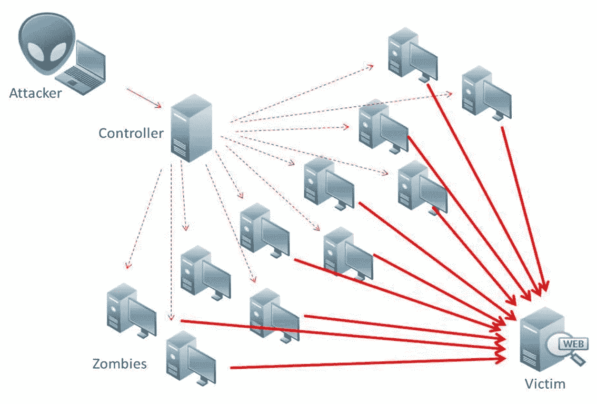
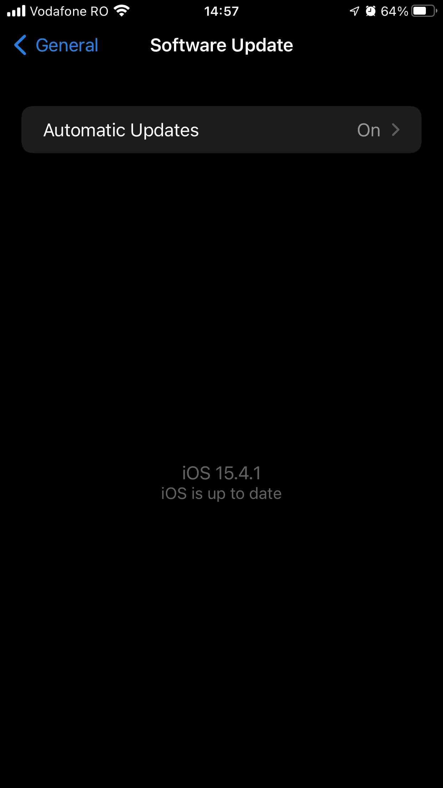
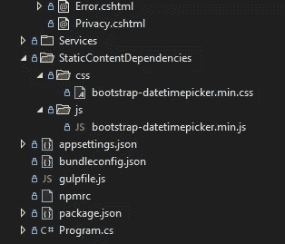
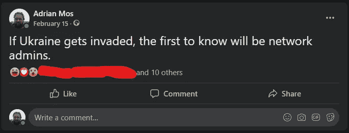

# 战争期间的软件安全

> 原文：<https://medium.com/codex/software-security-during-war-876bcea6c3f1?source=collection_archive---------19----------------------->

## 战争时期软件开发人员应该警惕什么，以及一些最常见的攻击

大多数开发人员开发的软件在设计上并不能抵御在战争时期有用的技术和攻击。但是不安全的软件，甚至是使用不安全的安全软件，都可能被用作武器。

以下是一些建议，旨在最大限度地减少你的软件被用来对付它应该服务的人。

# 期待 DDoS

对网络应用程序最简单的攻击之一是拒绝服务攻击:这种攻击会产生大量请求，以使服务器的容量饱和。您的服务器，就像任何计算机一样，资源有限，因此，如果它们被用来分析、处理和响应虚假请求，那么它用于响应真实请求的资源就会减少。

更大的兄弟，分布式拒绝服务，是一种更高级和更大规模的攻击，涉及许多分布在全球各地的假冒客户端。让较小的应用程序离线很快，因为它们根本无法处理增加的流量和请求。

DDoS，图片来自[bleepstatic.com](https://www.bleepstatic.com/images/news/u/1011204/Cryptocurrency/Ddos-attack-ex.png)

更高级、更有效的形式是存在的，尤其是如果攻击者知道一点您的应用程序是如何工作的，或者至少可以预测到。这里有一个例子:

让我们假设您的应用程序提供了一个 API URL，如下所示:

[https://my site/API/apartments-for-sale/list？极限=30](https://mysite/api/apartments-for-sale/list?limit=30)

这个链接告诉你什么？

如果我运行它，看到它确实返回了 30 个结果，我下一个请求是:

[https://my site/API/apartments-for-sale/list？极限=60](https://mysite/api/apartments-for-sale/list?limit=60)

…然后:

[https://my site/API/apartments-for-sale/list？极限=200](https://mysite/api/apartments-for-sale/list?limit=200)

如果我分别得到 60 个，然后 200 个结果，我将逐步测试*极限*参数，直到我达到一个硬上限，或者我已经找到我需要的。如果没有实施硬限制，则使用以下 URL 的 DDoS:

[https://my site/API/apartments-for-sale/list？限制=2000000000](https://mysite/api/apartments-for-sale/list?limit=2000000000)

…对您的应用程序来说绝对是毁灭性的，因为它不仅会使您的应用程序服务器充满请求，而且还会通过每次请求从数据库中提取可能所有的对象来使您的数据库服务器和两者之间的所有带宽饱和。

如果您要在业务级别保护您的应用程序，并且不允许如上所述的有知识的攻击进入下一个级别，这有帮助吗？绝对的。执行路径越短，直到你发现一个请求是假的，应该被丢弃，越好。比方说，如果在上面的例子中，您将 30 作为默认限制，并且您的 UI 将限制 200，那么可以有把握地假设，如果您对*限制*参数施加硬限制，正常用户操作将不会介意。更好的是，如果您发现没有一个被接受的使用场景需要超过 200 个条目，那么验证参数并立即返回 HTTP 400 Bad 请求，而不是通过限制硬上限和获取会有很大帮助。

那么普通的 DDoS 呢？假设你已经做好了准备。尽管是主动的，但仍有许多事情要做:您可以将流量分流到多个 DNS/路由路径上，这意味着，如果您受到来自一个完全随机的国家的 DDoS 攻击，比如俄罗斯，您需要做的只是阻止或限制服务于俄罗斯的路径，直到攻击消失。

当然，现实生活中的战争场景会比这大得多。如果你的应用程序受到来自政府层面的攻击，你几乎没有机会让你的应用程序继续运行。为了避免成本上升，最好还是关闭它。

始终确保你的核心目标受众知道发生了什么:如果你受到攻击，就说出来——用户更可能理解一个告诉他们受到攻击的应用程序，而不是一个工作起来像废物的应用程序。当然，这样做时不要让他们担心自己的数据已经被泄露。即使你不得不结束交易——这样做的时候要知道你已经尽了最大努力为顾客服务，但是这种攻击对你来说实在是太难应付了。

还有一个更好的建议，特别是对于有文档、法律、手册和其他类似文件的应用程序:获取 cdn 并使用永久链接。一旦你把一个文件放在 CDN 上，如果你的应用被攻击，它就不再是不可见的了。即使应用程序屈服于虚假请求的巨大浪潮，CDN 可能仍然存在，并且您的数据仍然会通过其他应用程序(如搜索引擎)提供给用户。你的用户肯定会感谢你的努力。

让我们回顾一些建议:

*   通过对数据限制的硬性限制来保护您的数据库
*   尽可能缩短执行路径
*   按地区或任何其他有意义的方式分离你的流量，即使这并不意味着更多的服务器
*   获得一些适当的 DDoS 保护，如用户网关和为您的应用服务的灵活云解决方案
*   尽可能把你的内容放在 cdn 上——这就是它们存在的原因

# 更新是你的朋友

对系统最有问题的攻击类型之一是不一定涉及某人做错事的攻击，而是仅仅因为软件中的缺陷而传播恶意软件。

一部 iPhone。目前是最新的。

早在 2003 年，当真正的宽带接入还很年轻，许多用户仍然是面色红润的狂热分子，他们相信互联网是一个好地方，世界上不会出任何问题，一个名为 [Blaster](https://en.wikipedia.org/wiki/Blaster_(computer_worm)) 的蠕虫迅速提醒我们所有人，安全应该是我们的想法。我个人记得有多少朋友的 Windows PCs 在被感染后很快就倒下了，他们都本着计算机新手的真正精神，开始在他们的机器上重新安装 Windows，只是惊讶于蠕虫在之后很快重新出现，好像他们计算机外部的某种东西正在传播它。嗯…

另一方面，我和另外一个人没有受到影响。另一个人使用的是 Linux 机器(这在当时很少见，在我所在的地方，对于消费者来说)，所以只剩下我:唯一一个启用了 NAT 和显式端口转发的 Windows Server 2003 用户。我安装了所有的更新。

事实证明，Blaster 利用了 Windows RPC 中的一个漏洞，允许它感染其他只是连接到互联网或受影响网络的机器，如果它们打开 RPC 服务端口并进行侦听的话。当然，在那个时代，大多数消费者对端口及其使用没有足够好的理解，防火墙的概念还是新的。另一方面，我使用 NAT，以及一种关闭所有端口的策略，除非它们需要打开。

如今，这种利用可能不再发生，但其背后的原则仍然存在:如果你的软件中有一个缺陷，它迟早会危及你的安全。

但是从 Blaster 的故事中最重要的收获，实际上，是它最初是如何被创造出来的。微软在 5 月 28 日发布了一个补丁来修复漏洞，并在 7 月 16 日发布了一个公共补丁来处理 Blaster 使用的内容。只是后来，8 月 11 日，爆破者蠕虫病毒在网上发布。请注意，在微软向所有人提供补丁并将其包含在定期更新中之后，已经过去了近一个月，蠕虫甚至出现了。它传播的速度显示了大多数人对修补他们的系统并保持更新的松懈态度。

仅仅一年后，也就是 2004 年，这种蠕虫从公众的视野中消失了，最终在大规模的修补尝试、新的“防火墙”软件的大量使用和全球的喧嚣中被击败。

这一切都证明了一件事:让您的系统尽可能地保持最新，尽管这可能并不令人愉快(尤其是在任务关键型系统上)，但这是确保您的系统至少没有那么多可用漏洞的好方法。

让我们回顾一些建议:

*   让您的系统保持最新，至少在安全更新方面
*   使用具有适当更新渠道的系统，并通过这些渠道保持最新状态
*   如果您有需要锁定功能的关键任务系统，大多数主要操作系统和重要软件都有长期支持(LTS)版本

# 让你的黑客离你近一点，让你的图书馆离你更近一点

库是软件开发中的主要支柱。今天没有软件，也许除了简单的“你好，世界！”应用程序，可以声称是真正独立的(关于这些应用程序依赖于什么，无论如何，是 Java 还是。网“你好世界！”仍然使用底层虚拟机/运行时)。所有的软件都建立在多年的市场经验之上，并且依赖于许多库，继承了它们的特性，也继承了它们的缺陷。虽然，有时，结果是令人捧腹的，但往往结果是灾难性的。

2016 年，一个名为 left-pad [的 NPM 模块被从 NPM](https://www.theregister.com/2016/03/23/npm_left_pad_chaos/) 移除，因为其作者的一个决定。许多主要的软件将会看到他们的构建失败，因为他们或者，更重要的是，他们所依赖的一些其他模块，已经将-pad 作为一个依赖项。

这种情况的后果是深远的，许多包/模块/库仓库决定不再允许删除已经发布的内容。我个人只是在 NuGet [决定反对包移除](https://docs.microsoft.com/en-us/nuget/nuget-org/policies/deleting-packages)后才发现整个左翼联盟的崩溃，并且必须承认，在那一刻之前，我认为一切都是理所当然的，从来没有考虑过捍卫我的依赖。

尽可能让您的依赖关系本地化

显然，这里的关键要点是确保你所依赖的东西也是可访问的。想象一下，如果你愿意，你失去了检索一些依赖项的能力，因为一个恶意方拒绝访问它们。你会怎么做？如果这只是一个构建依赖，那没什么大不了的，但是如果你的应用程序有一个需要在运行时从外部加载的依赖，就像许多网站加载 jQuery 或 Bootstrap 一样，那就太悲惨了。

因此，让我们回顾一些建议:

*   始终保留一份依赖关系的副本。有许多方法可以创建一个联合存储库来创建您的依赖项的安全副本，例如 [jFrog 的 Artifactory](https://jfrog.com/artifactory/)
*   确保您拥有开源依赖项的源代码，以防您发现它们是攻击您软件的媒介，并且原始依赖项/开发人员不可用

# 赛道友好

现在，虽然以上几节讨论的建议在任何情况下都是好的，但这一节专门讨论的是战争时期或恐怖袭击中最常见的危险。

永远不要低估你的软件追踪事物的能力，也不要低估攻击者如果获得追踪信息所能获得的能力。

如果你的软件被用于战争地区，或因种族、宗教或政治原因而侵犯基本人权的国家，请关闭你的追踪。你从跟踪中得到的任何东西都只能被认为是血腥钱。

让我们考虑下面的场景:你的软件跟踪你的用户的位置，无论他们何时在线，并且有助于协调人群。在准备恐怖袭击的过程中，您的软件受到威胁，攻击者可以访问您用户的实时位置。结果应该很明显。

在这种情况下，攻击者是否能够访问连续的实时位置数据都无关紧要。重要的是，他们可以访问历史位置数据，并从中进行推断。如果你的用户倾向于多年来每个工作日都聚集在一个特定的地标周围，他们很可能会继续这样做。攻击者可以从这些数据中进行推断，并认真提炼目标位置列表。

让我们举一个不同的例子。让我们假设一场政治清洗正在计划中。众所周知，你的软件可以跟踪用户偏好，并试图根据共同兴趣将用户分组。违规方想要为该清理活动确定某个用户子集。通过检查你的软件使用的算法(相信我，这对于一个由整个国家的政府支持的攻击团队来说并不像你想象的那样遥不可及)，违规方将能够创建与他们的目标偏好相同的虚假账户，然后通过你自己的算法轻松地将这些账户分组为真实账户。通过在你的社交应用程序中的许多入口点引入许多假账户，很快这些假账户的圈子将不可避免地开始相交，它们的相交将导致那些最有可能成为目标的人:那些有影响力的人——足以在当地或区域范围内产生影响，或者对被清洗的政治学说非常重要，但不够高调——足以使他们的突然消失立即导致丑闻或革命的爆发。换句话说，不要瞄准有名无实的领导，而是瞄准那些真正让齿轮转动的人。

但是让我们假设你的软件不是一个社交网络或者其他可以被用来追踪人的东西。不过，请想一想:你追踪的每一条信息真的重要吗？例如，用户的电话号码对你来说很重要吗？毕竟，也许你的应用程序无法跟踪你的用户，但也许其他人可以:在这种情况下，移动网络运营商可以给定一个电话号码，不管愿意与否，跟踪它到一个大致的位置，甚至可以拦截通信。攻击者可能不太需要你的软件，但是，针对特定的人，每一条信息都很重要。

假设您不会将电话号码与人相关联，但是您会将它与电子邮件地址、屏幕句柄或任何其他信息相关联。攻击者可能不会从您那里发现一个人的身份，但他们可能会发现这种相关性，并攻击一个不同的应用程序，该应用程序也可以关联数据，并能够与他们的目标人建立联系。你瞧:没有一个应用程序是单独负责的，事实上，暴政能够成功地针对个人，但所有的应用程序，作为一个整体，都是如此。

在战争地区或有侵犯人权记录的地方，你可以不跟踪用户信息吗？那么你应该这么做，因为在浩瀚的人类活动中，你可能永远不知道谁需要你所拥有的那一条信息，而是认为它是微不足道的。

关键要点:

*   对于来自战区的用户，只跟踪你绝对需要的数量；你永远不知道什么信息会让他们陷入危险
*   尽可能少地关联你绝对需要的战区用户——任何关联都可能最终创建一个与他人的连接，这反过来又会创建另一个连接，直到可以建立足够多的连接来识别单个实体
*   如果一部分用户突然处于危险之中，停止跟踪并删除跟踪数据——你不可能总是预测到什么时候会发生这种情况，所以花些时间为你的数据设置一个清理服务，以防万一
*   除非对您的业务至关重要，或者法律强制要求，否则不要收集此类信息，这些信息以后可能会被用来通过其他更容易获取的方式(如电话号码)跟踪或监视他人

# 每个人都很重要

可悲的是，许多人完全忘记了这一系列建议，尽管我个人很难理解它们为什么不完全显而易见。

2010 年，白俄罗斯的软件安全研究人员成功识别出后来被称为 [Stuxnet](https://en.wikipedia.org/wiki/Stuxnet) 的蠕虫病毒，该病毒的目标是西门子制造的一个非常特殊的 SCADA 系统。该蠕虫将通过各种方式传播，并且大多是不加选择的，但是它不会对受感染的机器做太多事情(除了对其进行 rootkitting)，除非它检测到一个非常特定的西门子 SCADA 软件，该软件主要用于重工业设备。如果发生这种情况，它会感染该软件，并决定将特定代码放入它所控制的设备的 PLC 中，并以潜在的破坏性方式干扰其操作。

这是网络战的产物的第一个迹象是它被严重利用。为了传播和感染，它使用了不少于 4 个零日漏洞，这证明了开发人员不惜任何代价让代码在尽可能多的目标机器上运行的决心。

第二个迹象是它的攻击面有多窄。虽然它会不加选择地感染任何它能感染的计算机，但它的核心行为(感染 SCADA 系统)只有在特定软件被发现时才会执行，并且只有当该软件被连接到具有特定特征的 PLC，安装了来自特定供应商的特定硬件模块，并且只有当它在某些非常特定的参数下运行时才会执行。巧合的是，铀浓缩过程中使用的气体离心机的具体参数。

第三条线索，也是将所有这些联系在一起的线索，是它主要感染了伊朗的电脑，当时伊朗正在结束其铀浓缩计划。

但是，Stuxnet 最大的问题实际上是它是一种设法跳过空气间隙的蠕虫，这意味着它可以感染没有连接到互联网的计算机。这是如何发生的故事实际上是这一节的寓意。接下来的一段是对实际事件如何发生的推测，但是主要的攻击路径是真实的。

原来，受到禁运的伊朗无法独立实施铀浓缩的工业过程，所以它采取了秘密购买工业设备，并从俄罗斯聘请专家作为承包商。因为伊朗的系统是有空隙的，不可能被感染，所以攻击者把目标集中在更容易接近的俄罗斯承包商身上，他们可能推断，因为他们的文化和运营模式不同，而且因为他们是需要进行设置的人，所以他们更有可能在有空隙的网络中携带自己的个人设备，以便能够工作。该计划是成功的，被感染的俄罗斯机器产生了被感染的 USB 驱动器，然后当它们被插入时，感染了有空气间隙的伊朗系统。

通过 USB 进行的感染是一种已知且经过验证的感染方法，虽然确切的攻击路径甚至连攻击者自己都可能不知道，但上述推测被认为是伊朗空中封锁系统最有可能被感染的方式。但是，关于它是如何发生的，还有一个更奇怪的故事(尽管更可信，尽管它基本上只是一个城市传说)。

正如传说中所说，像几乎所有的工业设施一样，伊朗的工厂都有停车场。在其中的一个停车场，一个为外国情报机构工作的间谍在一大早的时候“不小心”把几个 u 盘掉在这里和那里，在关键的地方，这些东西肯定会被其他人注意到。不知情的员工注意到了这些 u 盘，把它们捡起来，试图找出它们是谁的，然后把它们插到他们的电脑上。然而，这是在早上，当员工进入时，他们当然使用他们的工作机器，从而使蠕虫容易进入空气间隙网络。

现在，当然，上述段落实际上正如所述:一个传说。在这个特定的场合，事情不可能像那样发生:可以有把握地假设这些设施受到严密保护，有人会注意到有人反复“意外”掉落 u 盘，而彻底的分析(就像俄罗斯承包商可以要求他们的多家严肃的软件安全公司做的那样)可能会在有机会造成任何损害之前暴露整个事情，更不用说暴露内奸了。但是这个特别的传说确实激发了整个文化迷因，并且在黑帽 2016 上， [Elie Bursztein](https://en.wikipedia.org/wiki/Elie_Bursztein) 向[展示了一项研究，该研究证明了](https://www.youtube.com/watch?v=ZI5fvU5QKwQ)这种类型的攻击(称为“USB Drop”)实际上对平民非常有效。

为什么会这样？更重要的是，我们能做些什么来避免这种情况发生？

有一种倾向是将责任完全归咎于那些做了明显愚蠢的事情，危及我们系统安全的员工。但是，正如 Jayson E. Street 在 [DEFCON 演讲](https://youtu.be/JsVtHqICeKE?t=2180)中指出的那样(链接指向了确切的部分，但整个演讲值得观看，尽管只是与本节试图表达的观点相切):是时候我们从我们的安全词汇中淘汰“愚蠢的用户”了，是时候我们开始将每个人都视为系统安全整体的一部分了。每个人，意思是工人，无论是蓝领还是白领，安全，管理，行政，外部承包商，清洁队…每个人都应该不仅准备好处理可能的威胁，而且有权这样做。

[布雷特·塞尔斯](https://www.pexels.com/photo/man-wearing-jacket-and-peaked-cap-grayscale-photo-1119152/)摄于 [Pexels](https://www.pexels.com/)

想象一下，如果离心机承包商定期扫描他们的计算机和设备，情况会有多么不同。假设网络通信可以传播出去，你认为这种传播蠕虫病毒所需要的网络通信会在多大程度上被忽视？如果用户无意中安装了一个新的设备驱动程序(就像蠕虫一样),实际上花了一些时间看着屏幕上他们正在安装的东西，你认为这样做有多不被注意？如果人们认识到“放错位置”的 u 盘可能是因为某个原因而被放错位置，并简单地说“我会让 IT 安全部门来处理这件事，毕竟，这正是任何人在丢失 u 盘时都会想到的地方”，那么这个传说会有多大的不同呢？

这一部分有一个要点:

*   培训和授权你接触到的任何人都要有安全意识，并且毫不犹豫地报告他们觉得不合适的任何事情

# 包扎

战争是一件棘手的事情，这一点现在在任何人的头脑中都是毫无疑问的。但是，如果你已经设法阅读了这篇文章，你会注意到我试图提出的观点并没有真正谈到战争，也没有真正谈到软件。那么，我为什么把它呈现给你呢？

因为在和平时期不被注意或几乎不影响公众周边视力的东西，在战争时期可能会变得非常重要。

我以 DDoS 开始我的文章是有原因的。撰写本文时，[俄罗斯 2022 年入侵乌克兰](https://en.wikipedia.org/wiki/2022_Russian_invasion_of_Ukraine)正在进行。2 月 15 日，我在脸书上发布了这个:

有根据的推测

事实证明，我是正确的。在入侵之前，乌克兰的 IT 基础设施遭到了严重的攻击，一些网站停电，整体混乱，在 2022 年 2 月 23 日达到高潮，当时部署了数据擦除恶意软件，网络攻击的强度设法使一些乌克兰政府网站瘫痪。2 月 24 日凌晨，俄罗斯入侵。接下来的事，你们都知道了。

然后我反复强调，任何事情都可能被用来对付你，即使你没有意识到这一点。在这场特殊的冲突中，乌克兰人很快学会了这一点，并设法调整了他们的策略，所有支持他们的国家也是如此。另一方面，俄罗斯人利用已经进行了很长时间的精心策划的社会工程，以及对欧洲网络基础设施的野蛮和精心策划的攻击，成功地造成了令人难以置信的混乱。不过，谢天谢地，这也对他们不利，因为他们自己的网络安全事故导致了一些非常尴尬的局面。

最后，但并非最不重要的是，我试图指出，一个人可能不知道会遇到什么样的威胁，来自谁，接下来会发生什么，所以明智的做法是努力向你的员工灌输适当的教育和严肃的授权意识(如果你是政府代表，请阅读“公民”)，以便尽可能让他们不落入敌人的明智陷阱，无论他们可能是谁。

最后，我不确定在人类和计算机短暂而混乱的历史中，如果遵循了上述所有建议，会挽救多少生命。但我绝对相信，这笔钱是值得的。