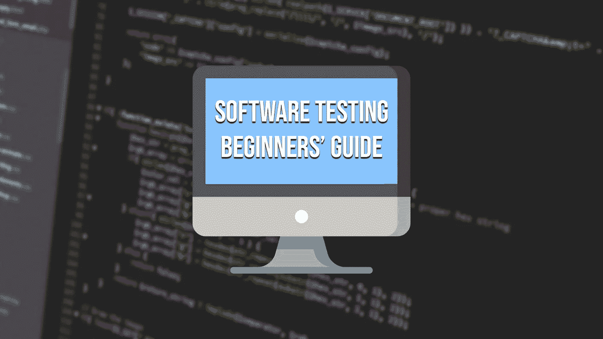
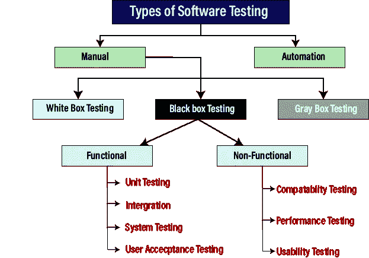

# 软件测试:我希望我以前有过的基本指南

> 原文：<https://medium.com/codex/software-testing-the-basic-guide-that-i-wish-i-had-before-6aac14ce0f57?source=collection_archive---------9----------------------->

去年夏天，我开始在计算机工程市场寻找工作。明年二月，我将完成我的计算机科学学位(或者我现在是这么认为的)，我已经开始寻找一份计算机工程师的工作。

我可以参加一些招聘人员的面试和技术挑战。在这些面试中，招聘人员问了我很多问题，有技术性的，也有非技术性的。我总是完成并发送一个技术问题，面试官告诉我:

*“好的，问题解决了但是我没有看到任何* ***测试*** *，你把它们放在哪里？”*。

对于这个问题，我的回答是:

*“我没有开发任何测试，* ***我的学位没有学过*** *”。*

是不是很不可思议，你觉得呢？在每一次面试中，我都被要求做一些像测试一样重要的事情，我对此一无所知，因为任何人都在大学教我(如果你想知道我在大学学到了什么，可以看看我的文章:[*“5 分钟 4 年的计算机科学学位”*](/@jesuslagares/4-years-of-a-computer-science-degree-in-5-minutes-2fdbf915e627) )。你会爱上它的)。

出于这个原因，我写了这篇文章，给你一个简单的指南，我希望在我第一次面试之前就有这个指南。简短、清晰、易于理解的指南，涵盖了测试的基础知识。

你想避免发生在我身上的事吗？那我们开始吧。

# 测试？什么是测试？

如果你在网上搜索，你会发现一些复杂的测试定义。然而，只有通过观察这个词，你才能想象你的意思。我喜欢的一个简单定义是…

> 软件行业中的测试是检查我们开发的软件是否符合预期要求并且没有错误或缺陷的过程。

测试我们的软件使我们能够交付没有任何错误的所需软件。所以我们可以降低成本，减少编码时间，给我们的用户他们想要的体验。

[图片](https://www.javatpoint.com/software-testing-tutorial)来自[Java point](https://www.javatpoint.com/software-testing-tutorial)

# 为什么我们必须学习测试？

想象一下，你买了一个新的微波炉，但当你开始工作时，它不工作。你去商店通知问题。商店里的人告诉你，他不会退还你的钱，因为你要的是微波炉，而不是指定的工作微波炉。这难道不会令人沮丧吗？

当然会啦！这是因为你不必要求一个工作的微波炉，**工作和无错误是你在购买产品时最起码应该期待的。由于这些原因，了解测试和测试我们正在开发的软件是很重要的。**

了解测试很重要，因为测试是软件开发过程中**的基本部分。通过测试，我们可以识别程序中的缺陷和错误，提高代码的质量(如果我们在交付代码之前发现一个错误，这将是代码质量的一个增量)，并且我们可以确定我们的软件做了它被创建来做的事情。**

你现在明白它为什么重要了吗？完美！但是……怎么才能做到这个过程呢？

# 我们如何测试我们的网络、应用…？

我敢打赌，你现在一定在想，为了测试你的应用程序，你必须手动尝试所有的输入和你的软件拥有的所有组合学。但是，我很抱歉地告诉你，但是……**你错了**。除非你想把所有的时间都花在手工和可怕的重复性工作上，否则手工测试不是一个选项。

相反，我们有自动化测试。作为软件开发人员，自动化这些重复的任务可以改变我们的生活。假设您想对 GUI 进行一些更改。如果您之前创建了 GUI 测试，那么您可以进行任何更改，您可以更改任何您想要的内容，并确保一切正常工作。

我们必须编写的创建测试的代码会根据我们使用的编程语言而改变。通常，有一些**库或框架**来为我们的程序生成自动化测试。我鼓励你在互联网上搜索类似这样的内容:“JavaScript 中的 [*测试*](https://www.google.com/search?q=Testing+in+JavaScript&rlz=1C1DIMC_enES817ES817&oq=testing+in+java&aqs=chrome.0.69i59j69i57j0i22i30l4j69i60j69i61.3806j0j7&sourceid=chrome&ie=UTF-8) ”。

总之，这里有一些资源:

*   [**JavaScript 中的测试**](https://www.browserstack.com/guide/unit-testing-in-javascript#:~:text=JavaScript%20Unit%20Testing%20is%20a,organized%20in%20the%20test%20suite.) 。
*   [**Python 中的测试**](https://realpython.com/python-testing/) 。
*   [**c++中的测试**](https://github.com/google/googletest) 。

我敢打赌，你现在一定会这样想:

“好吧，我将自动化我的测试，但是我必须遵循什么样的顺序呢？我的应用程序有一个 API、一个 GUI、一个登录界面，还有很多很酷的功能……”。

这个问题没有绝对的答案，但是有一些方法可以为测试过程提供一个“正确”的顺序。例如，我们测试的一个众所周知的方法是遵循**测试金字塔**。

## 测试金字塔

测试金字塔是 Mike Cohn 在他的书*中引入的一个图形隐喻，用来描述我们在编写测试代码时必须考虑的顺序和重要性。然而，这不是一个完美的公式。有很多人在努力将这个金字塔正确地付诸实践。*

**

*[图](https://martinfowler.com/articles/practical-test-pyramid.html)来自[马丁福勒](https://martinfowler.com/articles/practical-test-pyramid.html)*

*然而，**没有一个完美定义的方法来测试我们的软件**。所以可以跟着最适合自己的走。重要的方面是你必须测试你正在开发的代码。*

# *最后的想法*

*软件已经成为我们生活的世界不可或缺的一部分。我们每天都在使用应用程序和网站，我们希望它们能够正常工作。但是我们不仅仅是消费者，我们还是软件的生产者。我们是开发人员，或者简单地说，我们热爱科技行业，我们为乐趣而编码。在任何情况下，**我们开发的代码必须准确地实现其被创建的目的，没有错误或错误**。如果我们想达到这个目标，我们必须测试我们的软件。*

*编写测试的方式将取决于我们将要使用的语言。但是我们知道我们将使用一种被设计来给过程一个逻辑顺序的**方法学**来开发**自动化测试**。测试是我们作为软件开发人员的一个重要部分，我们必须给予它应有的重视。我喜欢的一种方法是让测试过程不会变得无聊，那就是考虑如何破解我刚刚创建的软件。*

*你以前知道测试吗？你在工作中编写测试吗？*

# *结论👋*

*谢谢大家！非常感谢您阅读这篇文章。我很想知道你对此的看法，所以不要写在评论里，我会读给你听。*

*反过来，如果这篇文章已经帮助你记住了，你可以为它鼓掌，并与你的同志分享。如果你不想错过我的任何一篇文章，别忘了关注我。*

# *关于作者🤓*

*我的两个爱好是技术和交流，所以我抓住一切机会谈论或写关于技术的东西。*

# *想要连接吗？📲*

*📩**jesuslagaresgalan@gmail.com***

*📸 [**Instagram**](https://instagram.com/jesuslagares_)*

*💼[领英 ](https://www.linkedin.com/in/jesus-lagares/)*

*📹 [**Youtube**](https://www.youtube.com/c/Jes%C3%BAsLagares)*

*🐦 [**推特**](https://twitter.com/jesuslagares_)*

*谢谢！❣️*