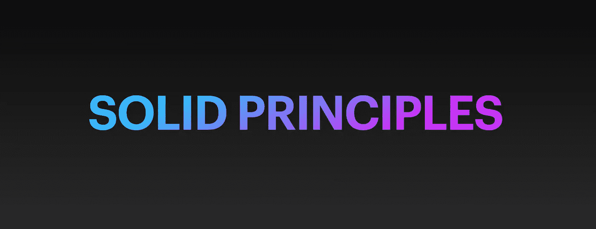
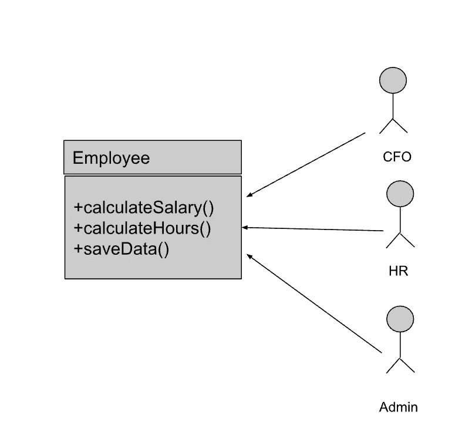

# Android 的坚实原则

> 原文：<https://medium.com/codex/solid-principles-in-android-cdc226605111?source=collection_archive---------3----------------------->



坚实的原则是面向对象设计的最重要的原则之一。它们告诉我们如何将函数和数据结构组织成类，以及这些类应该如何相互连接。

只要记住这些原则，就可以帮助我们不仅在 Android/Java 中，而且在任何软件中编写干净的代码。

这些原则的目标是创建一个软件结构

*   能容忍变化
*   很容易理解
*   是其他组件的构建模块。

固体代表

单一责任原则

o:开闭原则

李:里斯科夫替代原理

I:界面分离原理

依赖倒置原则

让我们试着用一个例子来理解每一个原理。

**单一责任原则:**

这是最容易被误解的原则，因为这个名字可能会误导我们认为每个模块/类/函数应该只做一件事。然而，它真正意思是

*一个模块应该有且只有一个改变的理由。*

这也意味着一个模块只对一个参与者负责。

这用一个常见的例子就很好理解了。有一个雇员类。



尽管 Employee 类及其方法看起来合乎逻辑，但它们违反了单一责任原则。正如我们所看到的，calculateHours()的变化可能会影响 calculateSalary()，因此不同的参与者或用例会因为一个用例的变化而受到影响。

因此，在这种情况下，最好创建 3 个不同的类。


在 Android 中，有一种非常常见的违法行为。

“Context”类有 150 多个方法，这些方法互不相关。他们绝对有不止一个改变的理由。

例如，考虑几个上下文类的方法

getSystemService(字符串)

checkSelfPermission(字符串)

getString(int)

这些显然是不相关的。

类似地，经常可以看到一个片段或活动处理比 UI 更多的逻辑。

“上帝”类通常会成为后来的瓶颈，因为它们很难更改，而且很多时候，一个小的更改会导致新的错误。

MVP，MVVM 建筑在某种程度上帮助我们遵循这个原则。

**开启关闭原理:**

软件工件应该对扩展开放，但对修改关闭。

换句话说，软件工件的行为应该是可扩展的，而不必修改工件。

这绝对是最重要的原则之一，因为简单的改变永远不会导致巨大的变化。

这也可以广义地概括为，任何新功能都应该通过添加新的类、属性和方法来实现，而不是改变现有的类、属性和方法。

实现 OCP 最简单的方法是在新的派生类中实现新的功能，并允许客户端通过抽象接口访问该功能。

如果我们的代码中有许多 If 和 else 条件，我们通常会违反这个原则。例如 Util 类。

如果不遵循 OCP，就会导致以下问题:

*   很容易理解
*   是其他组件的构建模块。
*   我们需要测试整个功能，导致更多的测试工作和回归测试。
*   维护开销增加
*   单一责任原则也遭到违反。

假设我们的应用程序中有一个 NotificationSender 模块，它处理所有传入的通知。

```
public class NotificationHandler *{* private Sender sender; void send*(*String message, Notification notification, Module   module*){* if*(*notification.type==BILLING*){* sender.send*(*message,module,notification.isSuccess*() )*; *}*else if*(*notification.type==USER*){* sender.send*(*message, module*)*; *}* *}**}*
```

这不仅违反了开闭原则，还会使这个类知道所有其他模块。如果一个模块必须接收通知，那么我们需要代码中的另一个 If 条件。

相反，我们可以创建一个界面

```
interface Notifiable *{* void notify(String message, Notification notification);*}*
```

所有需要通知的模块都可以实现这个接口。

```
public class NotificationHandler *{* void send*(*String message, Notification notification,List*<*Notifiable*>* notifiableList*){* for*(*Notifiable notifiable:notifiableList*){* if*(*notifiable.shouldNotify*(*notification*))* notifiable.notify*(*message,notification*)*; *}* *}**}*
```

现在，任何新模块都可以添加到这个列表中，而不需要改变代码中的任何内容。

这就是这个原理的力量。

**利斯科夫替代原理。**

*这个原则声明子类型必须完全可以替换它们的基本类型。*

基本上，我们需要仔细考虑什么时候子类型可以替换它的超类型，也就是说，客户应该能够很容易地用相应的派生类替换基类。

行为子类型化意味着子类型不仅提供父类型中的所有方法，而且它*必须遵守父类型*的行为规范。这确保了子类型满足客户对超类型行为的任何假设。

每当我们使用继承时，这个原则可以作为指导方针。

让我们看一个电商 app 中常见的例子。可以有多种商品，但是假设只有服装有折扣。因此，我们可以创建一个新方法“getDiscountedPrice()，仅用于服装。


这显然违反了里斯科夫替代原理。现在物品不能到处都被衣服代替，因为它可能不考虑折扣价格。

我们该如何处理？

我们必须在 getPrice()方法本身中处理折扣，以便将来任何其他项目，如配件或鞋类，也可以处理折扣。


在这种情况下，getPrice()和 getDiscount 的实现如下所示:

```
```long getPrice()*{* return price-getDisocunt*()*;*}*long getDiscount()*{* return discount;*// 0 if no discount**}*
```

**界面偏析原理**

这个原则声明，“客户不应该被迫依赖他们不使用的接口”。

这个原则的目标是通过将应用程序接口分解成较小的接口来减少使用较大接口的副作用。这也可以认为是将单一责任原则应用于接口。

在 android 中，假设我们有一个 BaseFragment，并且从这个 BaseFragment 扩展了多个片段。使用接口从 BaseFragment 到其他片段进行通信是非常常见的。


这三个片段都实现了侦听器。现在，FragmentA 可能只对 changeA 和 changeB 感兴趣，而 FragmentB 可能只对 changeD()感兴趣，但是所有的片段都被强制实现所有这些不必要的方法，从而使类膨胀。即使我们在接口中添加了一个额外的方法，所有 3 个片段都必须改变。

这也违反了其他原则。

相反，我们可以将接口分离成更小的接口，这些方法在逻辑上属于同一个接口。这导致了更清晰的设计和可维护的代码。

**依存倒置原则:**

Robert C Martin 对依赖倒置原则的定义包括两个部分:

1.  高级模块不应该依赖于低级模块。两者都应该依赖于抽象。
2.  抽象不应该依赖于细节。细节应该取决于抽象。

这不是光看原理就能理解的那么简单。

让我们试着用一个例子来理解。

假设有 3 个类，A 类依赖于 B 类，B 类又依赖于 c 类。


乍一看，这种依赖似乎没什么不好。然而，这带来了几个问题，如

*   编写单元测试变得很困难，因为我们需要模拟我们的类所依赖的所有类。
*   更改一个类会导致更改许多其他类。
*   类变得紧密耦合

这可以通过使类依赖于抽象来解决，即接口而不是另一个类。


现在，这两个类都依赖于接口，而不是具体的类，这使得编写单元测试更容易，并且还解耦了有助于更好地管理变更的类。

作为另一个例子，假设我们在 Android 应用程序中有一个缓存，这是一个共享的偏好。

我们的共享首选项类包含以下方法。

```
public class SharedPrefHelper *{* private SharedPreferences.Editor mEditor; private SharedPreferences mSharedPreference; public SharedPrefHelper*(*@NonNull Context context*) {* mSharedPreference =   context.getApplicationContext*()*.getSharedPreferences*(*PublicDefine.*SHARED_PREF_NAME*, Context.*MODE_PRIVATE)*; mEditor = mSharedPreference.edit*()*; *}* public void putLong*(*String key, long value*) {* mEditor.putLong*(*key, value*)*; mEditor.apply*()*; *}* public long getLong*(*String key, long defaultValue*) {* return mSharedPreference.getLong*(*key, defaultValue*)*; *}* public long getLong*(*String key*) {* return mSharedPreference.getLong*(*key, 0*)*; *}* public void remove*(*String key*) {* mEditor.remove*(*key*)*.apply*()*; *}* public void clear*() {* mEditor.clear*()*.apply*()*; *}**}*
```

如果我们的片段直接依赖于这个类，那么这些方法实现中的任何变化都会导致我们所有的 UI 类发生变化。

我们可以创建一个这样的界面:

```
public interface AppCacheStore *{* public void putLong*(*String key, long value*)*; public long getLong*(*String key, long defaultValue*)*; public long getLong*(*String key*)*; public void remove*(*String key*)*; public void clear*()*;*}*
```

如果我们的 UI 层依赖于这个接口，而不是具体的类，我们可以很容易地改变实现并使用数据存储而不是共享首选项，我们的 UI 层将不会受到影响。

**结论**

坚实的原则很容易记住，在编写代码时牢记这些原则将创建干净、可测试、可重用和模块化的代码。