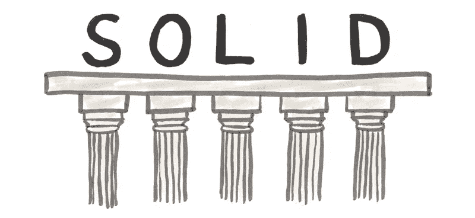

# C#中的坚实原则

> 原文：<https://medium.com/codex/solid-principles-in-c-df43187697f4?source=collection_archive---------0----------------------->

[https://www . freecodecamp . org/news/content/images/2020/08/solid . png](https://www.freecodecamp.org/news/content/images/2020/08/solid.png)

**坚实的原则**

SOLID 原则是在 20 世纪 90 年代引入的，它为我们提供了从紧耦合代码和少量封装到非常需要的松耦合和封装代码的方法。SOLID 是以下五个原则的缩写:

*   单一责任原则
*   开闭原理
*   利斯科夫替代原理