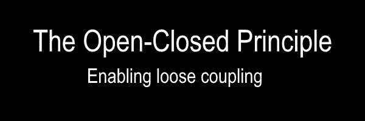

# 坚实的原则:开闭原则(下)

> 原文：<https://medium.com/codex/solid-principles-the-open-closed-principle-part-ii-9c601a3e4cc9?source=collection_archive---------5----------------------->

坚实的原则告诉你如何将你的功能组织成类，以及这些类应该如何相互关联。

当坚实的原则被正确地应用时，你的软件基础设施将会容忍变化，更容易理解并且关注于可重用的组件。

看完了[单责任原则](https://codersite.dev/solid-principles-the-definitive-guide/)，我们继续第二个原则。

开闭原则