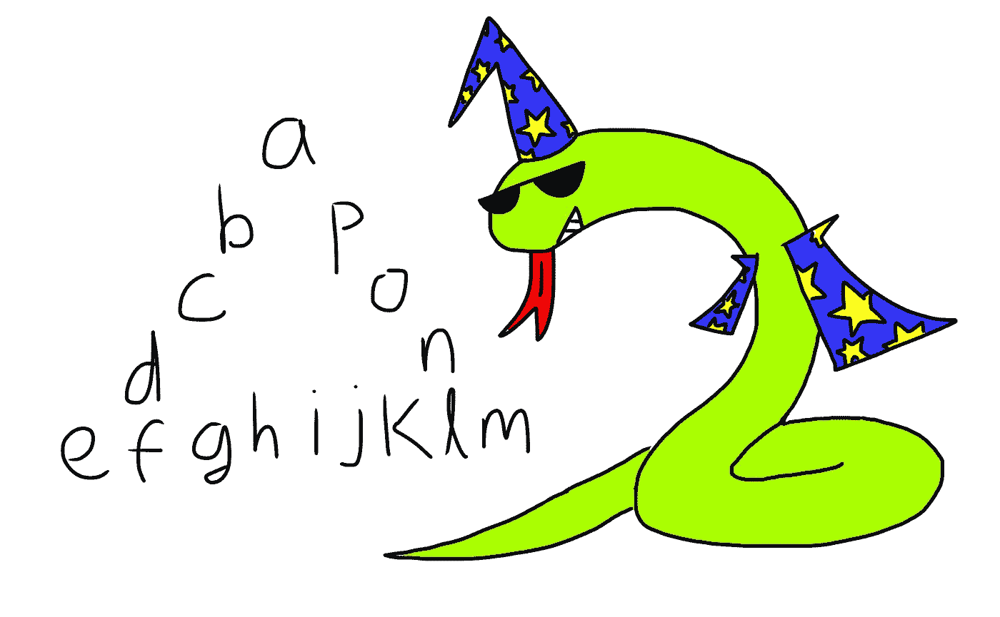

# 用一行 Python 代码解决——字母的空心三角形

> 原文：<https://medium.com/codex/solved-in-1-line-of-python-hollow-triangle-of-letters-742118c6c44?source=collection_archive---------9----------------------->

在我的上一篇文章(见下文)中，我分享了一个我刚刚起步时遇到的棘手的 Python 问题。