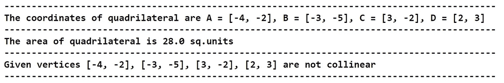

# 从零开始用 Python 解决坐标几何问题

> 原文：<https://medium.com/codex/solving-coordinate-geometry-problems-with-pure-python-7417619db690?source=collection_archive---------0----------------------->

## [法典](http://medium.com/codex)

## 学习构建自己的 Python 函数来解决几何问题，而无需导入任何包

# 介绍

坐标几何也被称为解析几何或笛卡尔几何，用于通过坐标和顶点的手段来分析或研究几何。这个概念存在于许多几何数学中，例如使用坐标来寻找几何形状的面积，寻找中点，将线段分成 m:n 的比例，等等。这些概念中的每一个都有自己解决问题的公式和方法。如果我们可以用 python 解决这些问题呢？

Python 作为一种通用编程语言，在解决数学任务或问题时非常强大和高效。即使有几个科学软件包，如 NumPy 和 SciPy，在 python 上定义我们自己的数学函数和参数会更灵活。那么，我们要解决什么？阅读下面的概念以了解更多信息。

# 概念

在这篇文章中，我们将要解决一个基于三角形的问题和一个简单的计算四边形面积的方法。

**三角形案例:**给出了三角形 P，Q，R 的三个中点，它们的坐标分别为(12，6)，(11，4)，(8，4)。我们必须找到三角形的顶点(A、B 和 C)，三角形的面积，比较原始三角形和中点三角形(基于大小)，检查共线性，最后绘制三角形。当然，这个问题需要四页才能完成，但是用 python 计算只需要几分钟。

**四边形情况:**给出坐标分别为(-4，-2)，(-3，-5)，(3，-2)，(2，3)的四个顶点 A，B，C，D。我们必须找到四边形的面积，检查共线性，并绘制四边形。这就是整个概念的内容。

现在，我们用 python 编程计算一下。

# 解决三角形案例

为了解决这个问题，给定的组件只是中点的坐标。因此，我们必须导出顶点的坐标，找到面积，检查共线性，比较原始三角形和中点三角形，最后绘制原始三角形和中点三角形。

## 步骤 1 |找到顶点的坐标

第一步是找到顶点 A、B 和 c 的坐标。要计算顶点的坐标，我们可以定义一个以中点为参数的函数，并传递一个公式来计算 A、B 和 c 的坐标。让我们用 python 来定义这个函数！

**Python 实现:**

**代码解释:**首先，我们定义一个以中点为参数的函数‘find _ triangle _ coordinates’。在函数内部，我们将给定的中点分割成单个数值变量，并将它们存储为 p1、p2、q1、q2、r1、r1。接下来，我们将创建三个名为 A、B 和 C 的空列表，用于存储计算出的坐标。之后，我们将传递一个公式，其中我们使用了中点的切片值，并将其存储在相应的数值变量中。直观地解释该公式，我们将第一个和第三个中点值相加，然后用第二个中点值减去该值。接下来，我们将所有计算出的坐标追加到相关的顶点 A、B 和 C 中，并最终返回这些坐标。

## 步骤 2 |计算面积

在这一步中，我们将定义一个以三角形顶点为参数的函数来计算三角形的面积。我们将在函数内部传递一个函数，以使用顶点的坐标来查找面积。按照代码在 python 中定义函数。

**Python 实现:**

**代码解释:**就像我们在上一步中所做的一样，我们正在定义一个函数‘find _ triangle _ area’，它以顶点的坐标作为参数。在函数内部，我们将值分割并存储到各自的坐标值中。之后，我们将传递一个公式，该公式获取切片坐标值并计算面积。这个公式除了取坐标值并乘以它们之外什么也不是。为了更有效地理解公式，想象一个矩阵，所有的 x 坐标在第一行，所有的 y 坐标在第二行。注意，在矩阵中列出所有三个 x 和 y 坐标后，我们必须在矩阵的末尾添加 x 和 y 坐标的第一个值。现在，用 x1 和 y2 交叉相乘，像这样，x2 和 y3，x3 和 y1。计算完这一部分后，我们必须用一组其他交叉相乘的值减去它，从 y1 开始与 x2 相乘，y2 与 x3 相乘，最后 y3 与 x1 相乘。有时候应用这个公式，我们可能会得到一个负的结果，但是面积不能是负的。因此，使用“abs”函数，如果值为负，我们将符号转换为正，并将输出乘以 0.5 或 1/2(公式的一部分)。在整个过程之后，我们将返回函数的最终输出。

## 步骤 3 |检查共线性

什么是共线性？在坐标几何中，当三角形的面积导致“零”平方单位时，顶点被称为具有共线性。我们可以在 python 中定义一个函数，帮助我们检查给定的顶点是否有共线性。

**Python 实现:**

**代码解释:**像往常一样，我们正在定义一个以三角形顶点为参数的函数 check _ triangle _ 共线性’。在函数内部，我们使用了一步前定义的“find_triangle_area”函数来计算三角形的面积。之后，我们传递一个 if-else 语句，当我们在函数中计算的面积等于“零”时，该语句返回 true。如果该语句得到满足，它将返回一条消息，说明给定的顶点是共线的。否则，它将返回一条非共线性的消息。

## 步骤 4 |比较三角形

在这一步，我们将定义一个简单的和最小的函数来比较给定的三角形，并给出一个结果，即原始三角形比中点三角形大多少倍。遵循 python 中定义函数的代码。

**Python 实现:**

**代码解释:**前面说过，这个函数‘compare _ triangles’是一个简单极小的函数，它以原三角形面积和中点三角形面积为参数。在函数中，我们存储了一个字符串，该字符串表示原始三角形比变量“message”中的中点三角形大多少倍。最后，我们返回消息变量。

## 步骤 5 |绘制三角形

在这最后一步，我们将定义一个函数，使我们能够使用顶点的坐标绘制一个三角形。当涉及到绘图或图形时，没有任何其他选项，我们必须使用 matplotlib 包，否则，我们需要很长时间来定义函数。因此，请确保您的 python 环境中安装了 matplotlib。如果 python 环境中没有安装 matplotlib，那么按照或者复制代码并粘贴到您的命令提示终端:***pip install matplotlib***

安装绘图包后，我们现在可以用 python 定义我们的绘图函数了。

**Python 实现:**

**代码解释:**我们正在定义一个函数‘plot _ triangle’，它以三角形的顶点和三角形的颜色作为参数。在函数内部，我们将坐标分割成单个数值变量(就像我们在前面的步骤中所做的那样)。之后，我们将导入绘图包 matplotlib，并调整一些参数来定制绘图的大小(宽 20 英寸，高 10 英寸)和样式(ggplot)。接下来，我们将图形存储到变量“fig”中，并最终返回绘图。

## 第 6 步|结果

与所有其他步骤相比，这一步是最令人兴奋的一步，因为我们将使用我们定义的函数来解决问题并查看结果。我们可以通过调用它们来使用已定义的函数。事不宜迟，让我们用 python 实现我们定义的函数吧！

**Python 实现:**

输出:

图片由[作者](https://nikhiladithyan.medium.com/)

现在看到结果，让我们回答所有的问题:

1.  找出顶点 A，B，C 的坐标

**Ans:** A = (9，6)；B = (15，6)；C = (7，2)

2.用顶点的坐标求三角形的面积

答案:三角形的面积= 12 平方单位

3.检查共线性

**答:**给定的顶点 A、B 和 C 不共线

4.比较三角形

**Ans:** 原三角形比中点三角形大四倍

5.画出三角形

**答:**使用我们定义的‘plot _ triangle’函数，我们已经绘制了原始三角形和中点三角形。

我们成功地解决了三角形问题，并得到了正确的结果。我们的下一个案例是解决四边形问题。

# 求解四边形情况

在这个问题中，我们的目标是找到面积，检查共线性，并绘制四边形。给定的分量是四边形 A、B、C 和 d 的顶点。

## 步骤 1 |定义四边形函数

我们要定义的函数与三角形函数非常相似，但唯一的区别是我们要添加另一个顶点。所以，中间不会有任何代码解释，但在最后会有。事不宜迟，让我们用 python 定义所有的四边形函数吧！

**Python 实现:**

**代码解释:**我们定义的第一个函数是以顶点坐标为参数，计算四边形面积的‘find _ quadraulic _ area’(用来计算四边形面积的公式和用来计算三角形面积的公式是一样的)。下一个函数是“check _ 四边形 _ 共线性”,它将顶点的坐标作为参数，检查给定顶点之间是否存在共线性。最后一个函数是“plot _ quadrilateral ”,它将顶点的坐标作为参数，并返回一个四边形的绘图，这个函数是在 matplotlib 包的基础上构建的。

## 第 2 步|结果

就像我们对三角形问题所做的那样，我们将调用函数，并使用它来查看结果和回答问题。按照代码获取 python 中的结果。

**Python 实现:**

输出:

图片由[作者](https://nikhiladithyan.medium.com/)

看到结果后，让我们通过回答所有问题来解决四边形问题。

1.  求四边形的面积

答案:这个四边形的面积是 28 平方单位

2.检查共线性

**答:**给定顶点不共线

3.绘制四边形

**答:**使用 plot _ 四边形’功能，我们已经绘制了四边形。

就是这样！我们已经成功地使用我们自己定义的函数 python 优化地完成了所有的问题。

# 最后的想法！

经过一大堆编码和数学计算，我们成功地解决了所有问题。您可能认为这种解决坐标几何问题的方式比在笔记本上手动解决要花更多的时间，因为我们正在学习新的概念，并引入了编程世界来解决这类问题。手动解决和计算问题只会在一定程度上帮助你，但不会贯穿整个过程。用数字化的方式解决它，尤其是在你自己的工作中，会给你更多的信心去做更多的事情，并拓展你的思维以获得更多的知识。记住，这需要时间，但绝不是毫无价值的。至此，您已经到了本文的结尾，如果您忘记了遵循任何编码部分，请不要担心，因为我已经在文章的结尾提供了完整的源代码。永远不要停止学习，挑战自己的极限，创造奇迹！

> 有 Python 在就不用担心数学了！

**完整代码:**