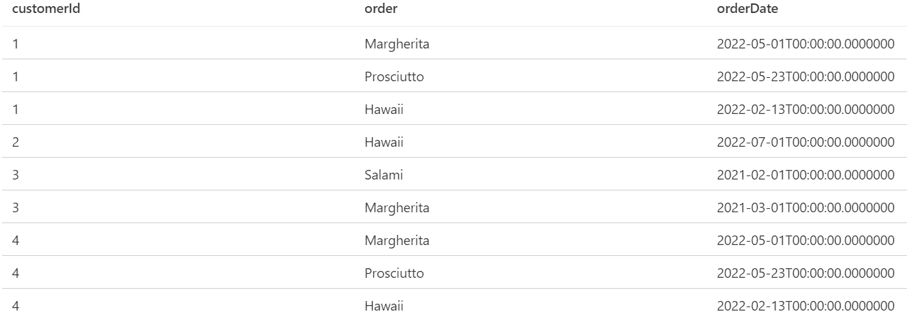
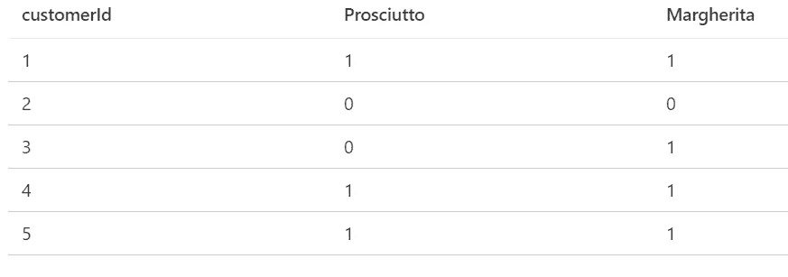
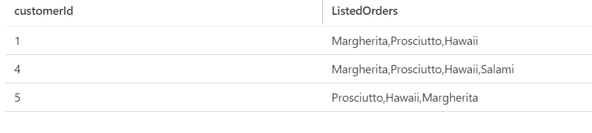

# 使用 SQL 解决数据分析挑战，并解释每一步(第 1 部分)

> 原文：<https://medium.com/codex/solving-data-analysis-using-sql-queries-with-every-step-explained-part-1-94ea447eb0be?source=collection_archive---------7----------------------->

凯文·Ku 在 [Unsplash](https://unsplash.com?utm_source=medium&utm_medium=referral) 上的照片

为了理解一些概念是如何工作的，观察其他开发人员的思维过程通常是非常有益的。这正是我想在这里做的。以有趣的 SQL 挑战为例，解释它，我是如何解决这些挑战的，以及我为什么要以这种方式解决。希望这能帮助你更深入地理解 SQL。请记住，没有人是完美的，如果你看到一个问题或有更好的解决方案，非常欢迎你在评论中纠正我。

此外，我将始终使用某种示例数据，而不是我所面临的这些问题的真实数据。所以，如果数据看起来有点奇怪，不要感到困惑，但是所使用的查询背后的逻辑仍然是相同的。现在我们开始吧！我从一个简单的例子开始。

## 对数据的调查

首先，让我们来看看本次展示的数据:

表的快照

这里我们看到我们的表叫做 orders，这是一个来自某个比萨饼店的订单集合的超级基本的例子。我们将 customerId 作为我们的客户标识符，一个保存订购的比萨饼的 order 列和 orderDate。

我必须解决的问题是找到顾客，他们至少点了一些特定的披萨(玛格丽塔和意大利熏火腿)。只有这些客户有资格进行进一步处理。

那么我们该如何解决这个问题呢？难道我们不能像这样使用 where 语句吗:

这当然会过滤掉每一行，只留下正确的订单，但是我们仍然不能说这个查询中的所有客户都是正确的。因为例如客户 3 只购买了熏火腿，因此不符合进一步处理的条件，但将是该查询结果的一部分。我们必须想办法同时查看更多的行。

为了解决这个问题，我想出了两个主意:

解决同时查看两行的问题的一个方法是简单地旋转这个表，将我们不同的订单作为列。这将使我们能够为每个客户使用一个简单的 WHERE 子句来检查他是否订购了正确的披萨。如果你需要一个关于旋转的快速回顾，你可以看看这个博客:

 [## SQL —案例与透视

### 数据透视表通常为您的分析提供巨大的价值。在这篇博客中，我将向您展示如何使用 SQL 创建它们…

graflinger.medium.com](https://graflinger.medium.com/sql-case-vs-pivot-586402c6979f) 

对于这样一个简单的例子，一种快速透视我们的表的方法是使用如下的 CASE 语句:

这将导致以下输出:

由旋转产生

这个表使我们能够使用 WHERE 条件进行简单的过滤，找到每个选择了正确比萨饼的顾客。在我们的示例中，这将是客户 1、4 和 5。让我们使用 CTE 轻松集成我们的解决方案，并筛选这些客户:

但是我们真的需要改变数据吗？我想到的一个更好的解决方案是，如果两个条件都满足的话，聚合这些行来获得信息。这可以通过 COUNT(*)轻松完成。如果在我们的过滤查询中有我们的两个比萨饼，我们将从我们的计数中收到结果 2。这可以用在 HAVING 语句中，我们所有的问题都解决了。这可能看起来像这样:

## 额外问题

现在解决了这个问题，对于我进一步的工作来说，拥有一个从过滤掉的客户那里订购的所有比萨饼的列表真的很有好处。为了在 T-SQL 中实现这一点，我使用了 STRING_AGG:

结果看起来像这样:

订单列表

我希望你喜欢这个博客，并且能够学到一两件事。欢迎任何反馈！