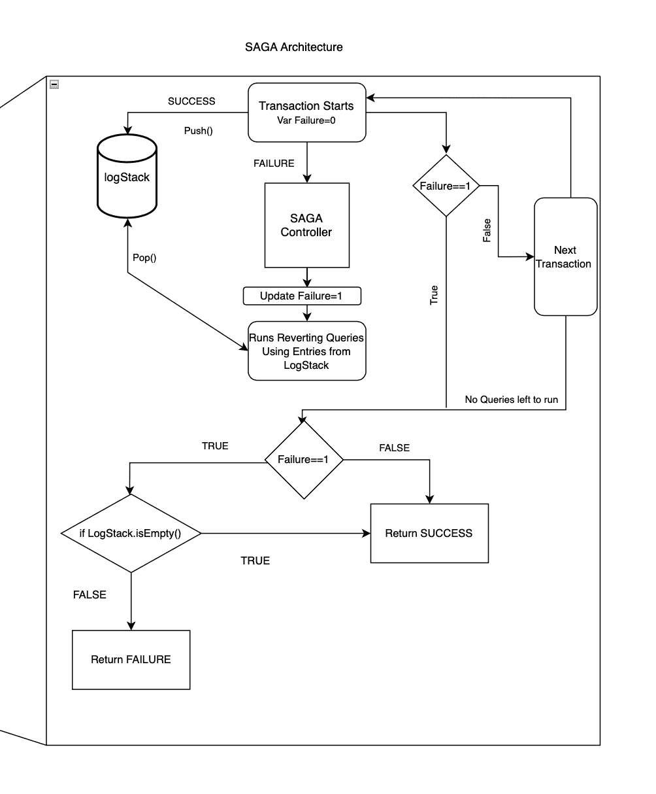

# 解决分布式事务管理问题的微服务架构

> 原文：<https://medium.com/codex/solving-distributed-transaction-management-problem-in-microservices-architecture-586ab3087efe?source=collection_archive---------0----------------------->

问题:处理跨越多个服务/数据库的事务。跨微服务维护 ACID(原子性、一致性、完整性、持久性)属性具有挑战性，因为每个服务都执行本地事务。

分布式事务管理的重要问题:

*   如何维护事务的原子性？原子性意味着事务中的所有步骤都必须成功，否则如果一个步骤失败，所有已经完成的步骤都应该回滚。另一方面，一个事务可以由多个本地事务组成，这些本地事务由微服务架构中的各种微服务处理。因此，如果其中一个本地事务失败，如何回滚以前成功的事务？
*   如何控制并发查询的事务隔离级别。事务隔离级别指定事务中语句可见的数据量，特别是当多个服务调用同时访问同一数据源时。如果来自任何微服务的对象被持久化到数据库，而另一个请求同时读取相同的对象，服务应该返回旧的还是新的数据？

提议的解决方案:

1.  两阶段提交:

分布式事务也可以通过使用这种模式的微服务来实现。有一个控制节点容纳了大部分逻辑和参与节点(微服务),在两阶段提交中在这些节点上执行操作。它分两个阶段发挥作用:

*   准备阶段(阶段 1):控制节点查询所有参与节点，看它们是否准备好提交。参与节点给出是或否的响应。
*   提交阶段(阶段 2):如果所有节点的回答都是“是”，则控制节点请求它们提交。即使一个节点做出否定响应，控制节点也会请求回滚。

阶段的数量对整体性能也有影响。因为任何就绪节点都必须等待来自较慢节点的确认，所以由于协调器的喋喋不休，整个系统受到最慢资源的限制。此外，这种协调器的典型实现的同步特性会导致未来吞吐量的降低。

2PC 仍然有以下缺点:

*   如果一个微服务在提交阶段关闭，就没有办法回滚另一个事务。
*   其他服务的确认必须等到最慢的服务完成。服务的资源被锁定，直到整个事务完成。
*   由于它们依赖于事务协调器，两阶段提交被设计得很慢。特别是，在涉及许多服务和基于微服务的应用程序的回滚场景中，这会导致可伸缩性问题。

关于实施，请参考以下内容:

*   [使用提交和回滚来管理 Python 中的 MySQL 事务](https://pynative.com/python-mysql-transaction-management-using-commit-rollback/) — Python
*   [如何用 NodeJS 处理 MySQL 数据库事务](https://sehannrathnayake.medium.com/how-to-handle-mysql-database-transactions-with-nodejs-b7a2bf1fd203) — NodeJS

# 2.世家建筑

Saga 模式使用一系列本地事务来管理跨多个微服务的事务。恢复事务通常被称为“补偿事务/动作”。

补偿动作有能力逆转传奇中的任何动作。Saga 保证所有操作成功完成，或者对所有操作执行适当的补偿操作，以撤销任何先前的工作。

为了确保系统的稳定性，我们需要实现 Saga 执行控制器。该控制器确保在出现故障时触发补偿查询。

它确定发生故障时的回滚事件，并保留所有分布式事务事件的顺序记录。

此外，SEC 确保回滚事件除了反转本地事务之外没有任何其他影响。补偿事务应该是幂等的和可重试的。执行补偿查询的顺序应该与原始事务发生的顺序相反。

*注意:SEC 内部使用一个名为 Saga log 的“堆栈/日志”来跟踪所有交易*

嗯，我想为一个在多个数据库上处理事务的 API 实现 SAGA Arch，所以我做了一些修改来满足我的需要。

附上我如何实现它的流程图

原来你是这么做的，谢谢。