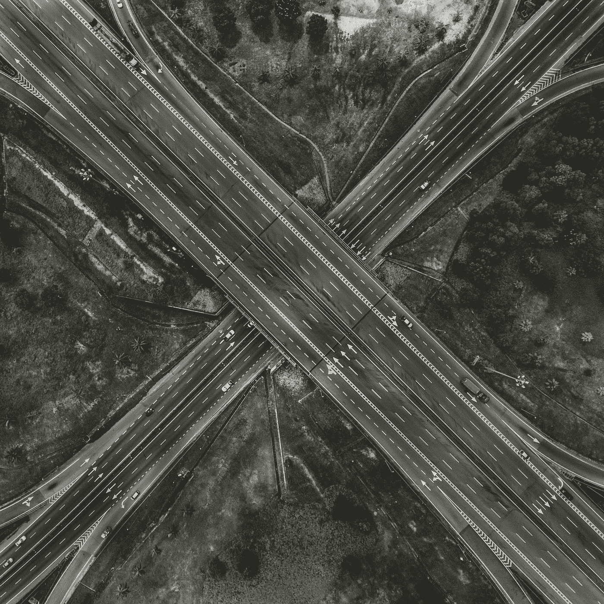

# 解决图形问题—寻找最佳路径

> 原文：<https://medium.com/codex/solving-graph-problems-finding-most-optimal-paths-f9782a824836?source=collection_archive---------6----------------------->

## 在图表系列的第三篇文章中，我们将处理寻路问题——一条最省力的路径和一条最大概率的路径。

在 [Unsplash](https://unsplash.com?utm_source=medium&utm_medium=referral) 上由 [Deva Darshan](https://unsplash.com/@darshan394?utm_source=medium&utm_medium=referral) 拍摄的照片

大家好！本文是图论问题系列的第三部分，将试图讨论和解决两个问题