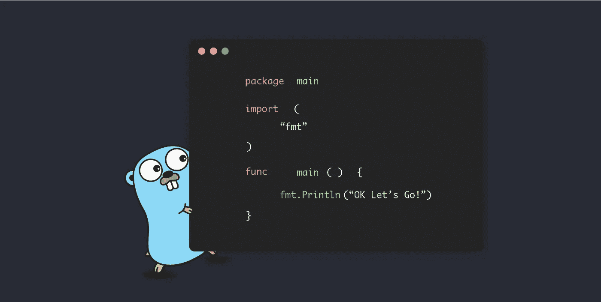
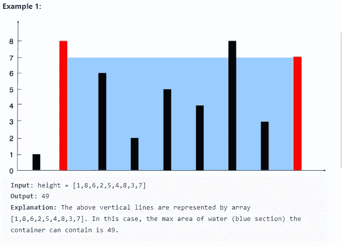
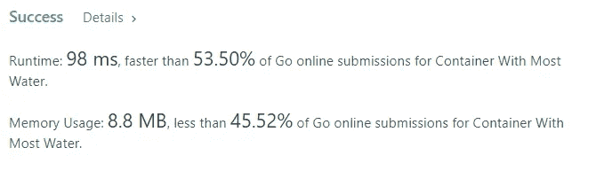

# 用 Golang 解决 Leetcode 问题

> 原文：<https://medium.com/codex/solving-leetcode-problems-with-golang-43cba8727053?source=collection_archive---------3----------------------->

## 问题:盛水最多的容器



来源:[Golang 是什么以及如何安装它|作者:萨扬·蒙达尔|升级编码(gitconnected.com)](https://levelup.gitconnected.com/what-is-golang-and-how-to-install-it-2275236fe657)

# 动机

最近，我决定我要准备面试，编码比赛，并学习一门新的编程语言。为了一箭双雕，我决定每天用 Golang 练习 Leetcode 问题。用你不熟悉的语言解决算法问题，迫使你思考实际需要解决的问题，这有助于你成为更好的开发者。当然，在获得正确的语法时会遇到一些小问题，但是最重要的是不管使用什么工具都能解决问题。

旅程开始后不久，我注意到 Golang 中对 Leetcode 问题的支持远不如 C++、Python 或 Java。鉴于这些语言的历史，像 Go 这样的现代语言得不到同等水平的支持也就不足为奇了。然而，这篇文章将是我为 Golang 中的 Leetcode 问题提供解决方案的系列文章的第一篇。

***免责声明*** *:如前所述，我还在学习围棋。如果有人有任何建议可以让我的代码更地道，请在评论中提供。*

# 盛水最多的容器

难度:中等

通过率:53%

给你一个长度为`n`的整数数组`height`。画有`n`垂直线，使得`ith`线的两个端点是`(i, 0)`和`(i, height[i])`。

找出与 x 轴一起形成一个容器的两条线，这样容器中的水最多。

返回*一个容器可以储存的最大水量*。

**注意**不要倾斜容器。



## 问题分解

简而言之，他们希望您将直线的坐标视为矩形的边，并找到返回所形成矩形的最大面积的边的组合。

问题是你不能倾斜容器。在图像中，你可以看到答案涉及到两个方面，其中一个是高度 8，另一个是高度 7。这一点很重要，因为我们必须确保矩形的边是平衡的，所以当处理两条不平坦的边时，我们将使用两条边中较小的一边来计算矩形的面积。

索引 j 和 I 之间的差将为我们提供矩形的长度。因此，我们对矩形面积的计算如下:

面积=矩形长度*矩形高度

矩形长度= j-i

rectHeight= height[i]

## 天真的方法

简单/强力方法包括利用嵌套的 for 循环来遍历每个可能的。在分解和理解问题之后，实施天真的方法，然后使它更有效，这总是好的。这个想法是永远不要首先直接瞄准最有效的方法。你必须先了解问题，以及如何解决问题。效率是精通的奢侈品。

这是 Golang 中的强力解决方案，由于使用了嵌套的 for 循环，它的运行时间不是很理想。

```
func maxArea(height []int) int {
    var maxArea int = 0
    var size int = len(height)

    for i := 0; i < size; i++ {
        currentArea := 0
        for j := 0; j < size; j++ {
            segmentLength := j-i
            var segmentHeight int = height[i]

            if(segmentHeight >= height[j]) {
                segmentHeight = height[j]
            }

            currentArea = segmentLength*segmentHeight
            if(currentArea > maxArea) {
                maxArea = currentArea
            }
        }
    }

    return maxArea
}
```

该代码将提供正确的答案，但是由于超过了可接受的最小时间限制而导致测试用例失败。现在，我们优化。

## 优化解决方案

优化这个解决方案需要注意问题的微妙之处。如果我们从数组开头的 I 开始，在末尾的 j 开始，我们可以向内移动指针，这样计算矩形的面积。为了向内移动指针，我们将增加 I，减少 j。

这对我们有什么帮助？因为长度会不断变小，面积变大的唯一方式就是高度增加。

如果涉及两个指针，则强力算法是 O(n ),并且问题涉及我们搜索满足给定标准的子元素的组合，那么我们有 9/10 的机会使用滑动窗口方法来优化解决方案。

滑动窗口方法为我们节省了许多小的计算步骤，但最重要的是允许我们将代码重构为 O(n)解决方案。

以下是优化的解决方案:

```
func maxArea(height []int) int {
    var maxArea int = 0
    var i int = 0
    var j int = len(height)-1
    var result int = 0

    for i < j {        
        if(height[i] <= height[j]) {
            result = height[i] * (j-i)
            i++
        } else {
            result = height[j] * (j-i)
            j--
        }

        if(result > maxArea) {
            maxArea = result
        }
    }
    return maxArea
}
```

# 结束语

以下是优化解决方案的性能指标:



在我的问题解决方法和 Golang 代码中，非常感谢任何提示、建议或反馈

关注更多！