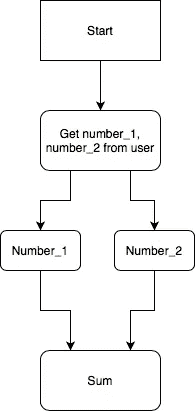
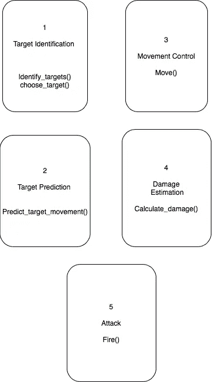
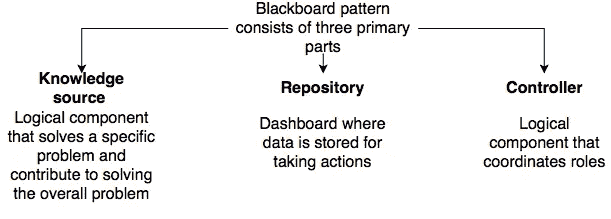
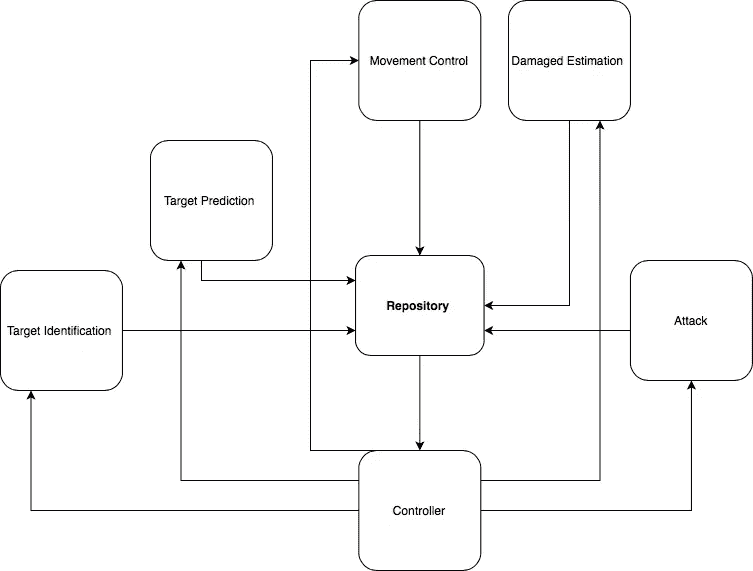

# 用黑板架构解决非决定论。

> 原文：<https://medium.com/codex/solving-non-determinism-with-blackboard-architecture-d871ab22271?source=collection_archive---------22----------------------->

# **顺序模式以及为什么它不是您所有问题的解决方案**

解决不同架构所遵循的许多问题的标准方法是顺序模型。

顺序模型或程序是一个执行一系列步骤的程序，这些步骤按照一定的顺序执行并输出相同的结果，它用于解决有特定解决方案的确定性问题。例如，计算用户给定的两个数字的和，程序的流程图如下所示。

顺序模型不能解决具有非确定性解决方案的问题，非确定性解决方案是在解决问题时没有预定义的解决方案或公式来计算的解决方案

.

计算两个数之和的模型。

不管用户提供的是哪两个数值，它都将按照相同的顺序使用加法符号来计算总和。

如果我们想要解决具有不确定性的更复杂的问题，而我们不知道解决问题的正确步骤序列，该怎么办？在下一段中，我们将给出一个非确定性问题的例子，并提出解决它的方法。

# **设计一款对战皇室游戏**

比方说，我们想设计一个像堡垒之夜或 Pubg 这样的皇家战斗游戏。游戏资产和逻辑已经开发，只剩下一件事需要开发，攻击玩家的机器人，我们正试图让这个游戏变得更难，因此，机器人将成为人工智能代理，可以获得潜在的威胁(真实的玩家或其他机器人)，并以实时的方式跟踪他们的所有信息。

人工智能代理应该识别其周围的所有潜在威胁(玩家、其他机器人)并检索它们的位置坐标，并尝试预测玩家未来的移动，基于这种预测，机器人应该向相同的方向移动以攻击玩家并造成他们能够造成的最大伤害。

如果我们将每个相关的功能分成不同的模块，我们将有五个组件/模块，如下图所示。

游戏的组成部分

如果我们试图为这个游戏设计一个序列模型，它将与下面的模型相似。

博弈的顺序模型。

顺序模型可能看起来是解决问题的好方法，但是我们将看看为什么顺序模型不是一个健壮的解决方案。

让我们假设机器人检索了一个玩家的坐标，玩家坐标通过了目标检查，但它在损害估计阶段确实改变了位置，所以玩家的新坐标与坐标不同，损害函数正在计算，如果损害足够高，攻击组件将开火，攻击将前往不同的坐标，这个问题的发生是因为游戏的持续更新，因为玩家一直在改变他的位置，按照顺序执行步骤不会有帮助。

可以解决这个问题的架构模式之一是黑板模式。

# **黑板图案。**

黑板模式是一种用非确定性解解决问题的模式。比如 AI 中的问题，博弈论问题。

黑板分为三个主要部分，如下图所示。

黑板包括:-

**。知识来源**

知识源代表用于解决问题的模块，没有单一的知识源或组件可以解决问题，它们的努力被组合起来解决问题。

**。储存库**

存储库用于存储每个组件的输出，另一个组件将其用作输入。例如，目标识别组件的输出由目标预测组件使用。

**。控制器**

控制器用于管理组件之间的数据流，以共享来自黑板的数据。

黑板组件

黑板交互图

如上图所示，黑板部件的不同组件之间的交互，组件修改存储库和控制器中的数据，存储库通知控制器数据的变化，每个组件可以查看存储库，控制器允许组件决定下一个组件。

# 黑板模式将如何解决问题。

黑板使用系统中的三个部分来获得关于玩家的更新信息，其中每个组件在存储库中发布其数据，并且基于报告中的数据，控制器通过向前向后的方法采取行动，其中每个组件基于每个组件可访问的存储库中的最新更新数据来计算其功能，因此组件获得其最新数据，而不像顺序模型那样基于陈旧数据做出决策。