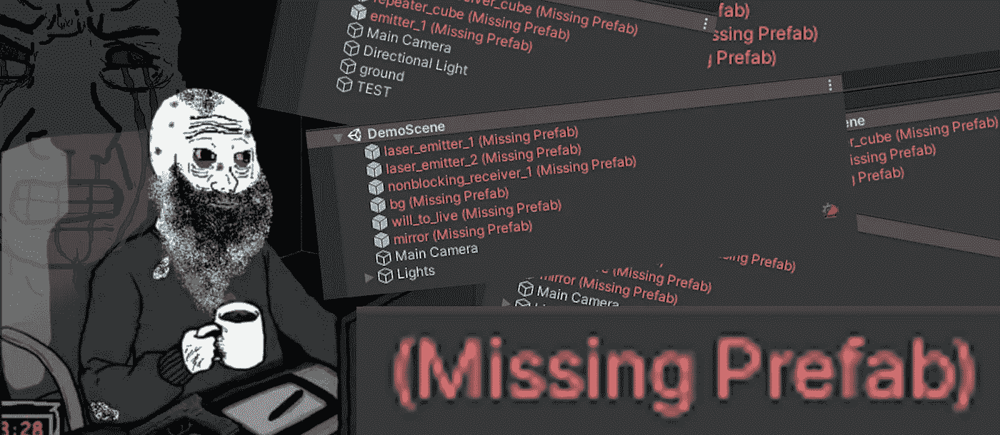
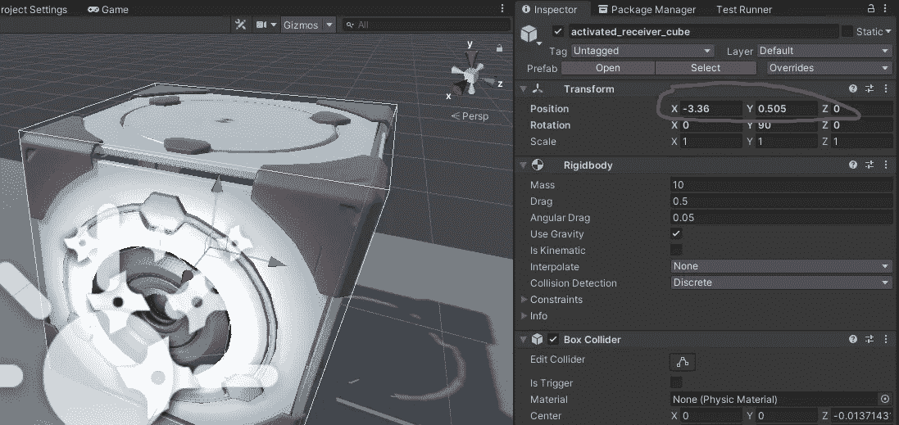
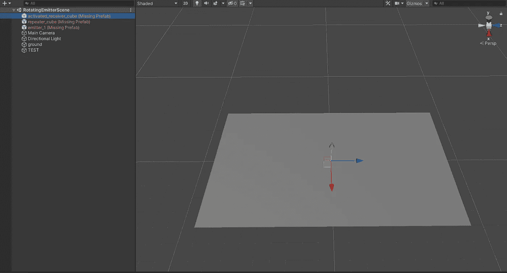
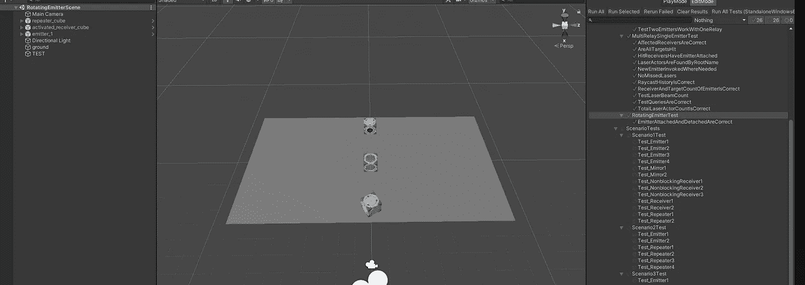

# 解决 Unity3d 中的预设缺失问题

> 原文：<https://medium.com/codex/solving-the-missing-prefab-issue-in-unity3d-ae5ba0a15ee9?source=collection_archive---------0----------------------->

当你开始为你的 Unity 项目使用源代码控制解决方案时，你可能会在某个时候遇到可怕的缺少预置或者缺少引用的错误。在这篇文章中，我们将看看为什么会发生这种情况以及如何解决它。

痛苦。痛苦。您刚刚完成了一个复杂的特性，并且很高兴合并您的代码并切换到另一个分支来完成一个新特性或一些错误修复。但是当你看到上面的内容时，你的心会漏跳一拍。

我第一次看到这一点是在我的资产商店项目[Unity](https://assetstore.unity.com/packages/tools/game-toolkits/laser-system-for-unity-217289)激光系统中。我刚刚写完我的自动化测试，看起来我不得不从头开始，因为测试场景完全被破坏了。

请注意，这里我添加了一个简化的示例，以保持文章简洁。游戏场景通常要复杂得多，即使你知道场景中有哪些资产，你也不一定记得它们的位置、脚本和所有其他东西。基本上你将不得不重新创建你的场景！

让我们探讨一下这个问题，了解其原因，看看有什么解决办法。

**缺少参考文献**

Unity 使用`.meta`文件来存储你的资产信息。*全部*。原因是你不能以一种实际的标准文件格式编写 Unity 特定的导入信息，例如`.png`。在[手册](https://docs.unity3d.com/Manual/AssetMetadata.html#:~:text=Meta%20files%20and%20asset%20files,moves%20or%20renames%20the%20corresponding%20.)中，第一行明确说明了为什么摆弄这些东西可能是导致头痛的主要原因:

> 当 Unity 导入资产时，它还存储和管理关于资产的附加数据，例如 Unity 应该使用什么导入设置来导入资产，以及在整个项目中使用资产的位置。

简而言之，如果你弄乱了你的`.meta`文件，Unity 将不知道你的资产在整个项目中被用于何处。让我们来看看我的一个有问题的元文件:

。我的资产 receiver_cube.prefab 的元文件

从本质上来说，`.meta`文件是以`.yaml`格式提供的关于您资产的信息。`guid`用于在项目中的任何地方标识您的资产，包括您的场景。它在我的测试场景文件`RotatingEmitterTestScene` 中是这样使用的:

RotatingEmitterScene 截断到重要部分

场景也是`.yaml`文件。注意修改目标的`guid` 。场景文件的这一部分*将我的预设的变换属性*链接在一起，片段包含位置。

浏览上面的例子，你会知道 Unity 是如何在场景文件中使用资源的`guid`来关联特定的属性的。随着`.meta`文件的消失，`guid`没有指向任何有效的资产，换句话说，它丢失了。

但是为什么这又是一个问题呢？如果我删除现有文件，Unity 不会为我的资产生成新的 `**.meta**` **文件吗？**

是的，它是。但是在删除该资产的`.meta`文件之前，它不会出现与您曾经拥有的`guid`完全相同的文件。如果您没有将您的`.meta`文件包含在您的 git 中，那么当您切换分支或获取其他人的提交时，它们将不会与您的资产一起使用。如果我这样做了，你会看到下面可怕的结果。

真实的恐惧:丢失的预置

基本上，您需要采取两个步骤来恢复资产的原始`guid` :

1.  **识别您资产的旧版本** `**guid**`
2.  **用旧文件**替换您资产的新 `**.meta**` **文件中的** `**guid**`

**反之亦然，只要`guid`匹配就行。**

**如果你给它起了一个好名字，在你的场景中找到一个`GameObject` 是最容易的:**

**预设被引用到它的名称属性**

**在你刚刚点击`Ctrl + F`的代码编辑器中打开你的场景文件，输入/粘贴你的`GameObject`的名字。Unity 场景只是一堆被引用在一起的属性。在上面的代码片段中，名称在`value`中，ObjectReference 的`target`文件的`guid`是您的资产的旧标识符。复制并粘贴到您的资产的`.meta`文件中，以替换其当前的新`guid`。**

**对我所有丢失的预设进行这样的操作产生了以下结果:**

****

**失踪的预制解决**

**所有丢失的预制构件都以原始状态再次出现。**

****以后如何避免这个问题****

**无论怎样强调都不为过**

> **使用 git 时，**资产和它们的** `**.meta**` **文件总是一起**。即使生成了这些`.meta`文件，它们**也必须包含在您的提交**中，这样才能始终确保正确的标识。**

**更不用说它们还包含导入设置。**

**感谢您阅读我的文章，我希望我能帮助您避免寻找解决方案的头痛。请考虑在推特上打个招呼，看看我在做什么。**