# 用 Python 解决 Wordle

> 原文：<https://medium.com/codex/solving-wordle-with-python-a729882e2e8a?source=collection_archive---------3----------------------->

如今沃尔多是不可避免的。我们能使用 Python 来帮助我们每次都赢吗？让我们来了解一下！

我们先加载一些有用的包。

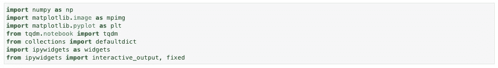

我们首先需要的是一份英语单词表。最初我下载了一个通用的，但事实证明你可以找到游戏中实际使用的列表。[这个](https://www.reddit.com/r/wordle/comments/s4tcw8/a_note_on_wordles_word_list/)是我在哪里得到的。需要注意的一点是，这个游戏实际上使用了两个单词列表:一个是更完整的列表，包含所有你可以猜测的单词(有许多你可能从未听说过的罕见单词)，另一个是更短的列表，包含更多可能解决方案的常用单词。

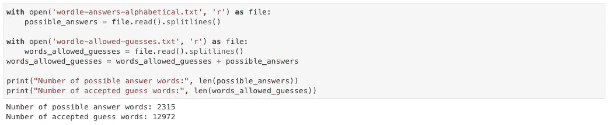

现在我们有了单词，如果有一个函数能够告诉我们，给定一个猜测和解决方案，哪些字母不存在，哪些字母存在但位置不正确，哪些字母存在但位置正确，这将是非常有用的。

我将使用一个 Wordle 游戏作为例子，我从单词 RAISE 开始(因为我听说这是一个很好的开始单词，但稍后会有更多关于它的内容)，并且，剧透一下，解决方案是 GORGE。

我选择将结果表示为字符串，0 表示不存在的字母，1 表示存在但位置错误的字母，2 表示存在但位置正确的字母。这是用 Python 写的:

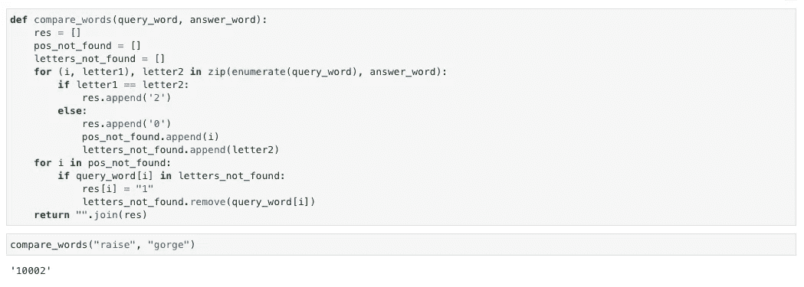

现在我们有了这个，我们可以创建一个函数来过滤单词，只保留与模式匹配的单词，给我们一个仍然是可能的解决方案的单词列表。

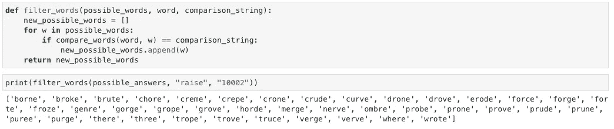

现在出现了一个问题:我们选择哪一个最好？如果我们能给他们每个人分配一个分数，告诉我们玩这个单词会有多大好处，那就太好了。评分函数的第一个想法是:一个包含常见字母的单词将更好玩，因为它更有可能匹配来自解决方案的字母。所以让我们来看看按英语单词使用频率排序的字母列表。

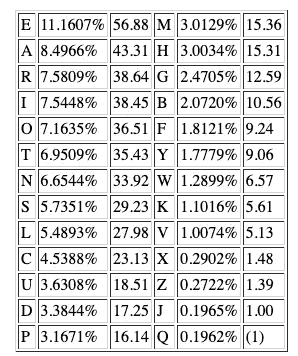

英语单词中最常见的字母，按频率排列

例如，一个单词的分数可以这样构造:

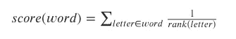

其中，等级(字母)是字母在频率列表中的等级。

这是用 Python 写的:

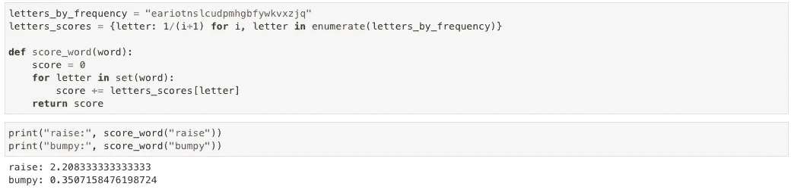

既然有了这个，我们就可以把所有的可能性按分数排序，选出最好的一个。

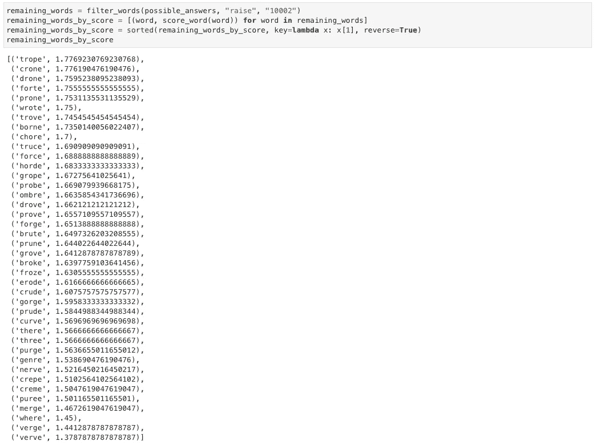

然后我们将选择 TROPE 作为下一个单词。让我们继续我们的示例游戏。

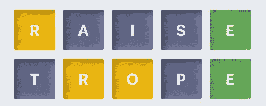

并且我们可以再次过滤可能的单词并选择最佳候选。

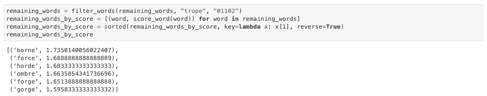

我们要玩的下一个单词是 BORNE。如果我们继续到最后，我们得到这个博弈:

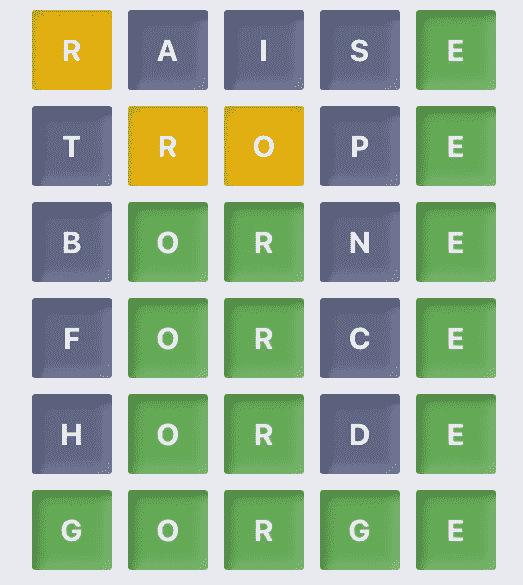

很接近，但是我们赢了。这次我们可能有点不走运。现在我们可以在所有可能的解字上测试我们的求解器，看看我们的平均表现如何。

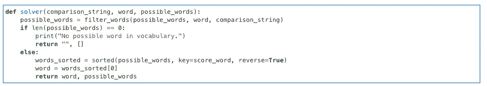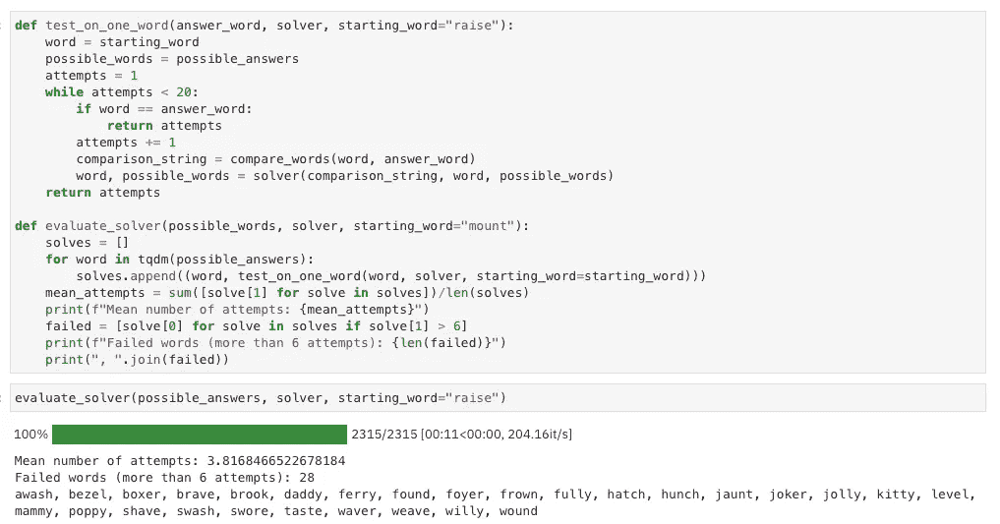

我们平均在大约 3.82 次尝试中找到这个词，这似乎还不错！然而，有 28 个单词我们在 6 次尝试后都找不到答案。

在一条推文中，WaitButWhy 的 Tim Urban 给出了 Wordle 评分的想法:

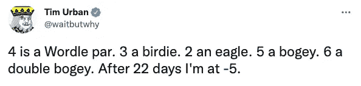

所以我们已经低于标准了。然而，22 天后为-5 将使 Tim 的平均值约为 3.77。该死，蒂姆真厉害！我们能打败他吗？

我们可以尝试改进我们给候选词打分的方式。一个更具体的优化选词的方法是，在播放一个候选词后，考虑所有的可能性。我们可以为每一个可能的结果模式计算与之匹配的单词数。当对所有可能的结果进行平均时，最佳候选将是留下最少可能性的单词。

这里，我们显示了在将单词 RAISE 作为第一个单词播放后，与每个可能的结果模式匹配的单词数:

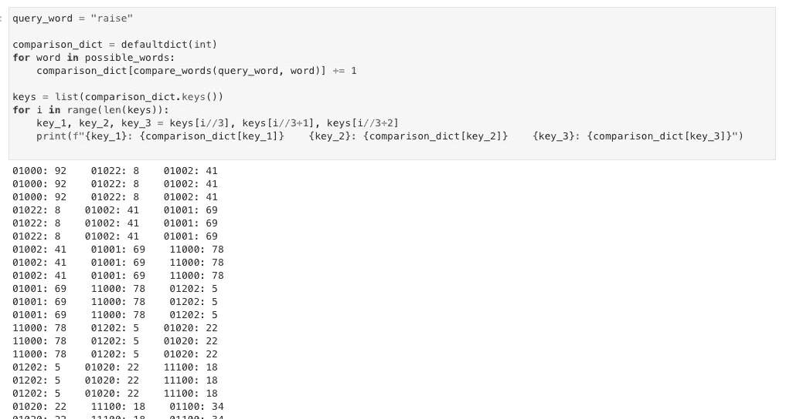

然后，我们可以用以下方式定义一个新的得分函数:

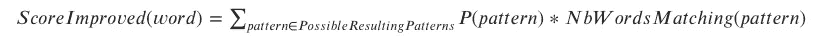

这次我们要选择最小化这个分数的单词。顺便说一下，这个想法与信息论中的[熵](https://en.wikipedia.org/wiki/Entropy_(information_theory))的概念有关。

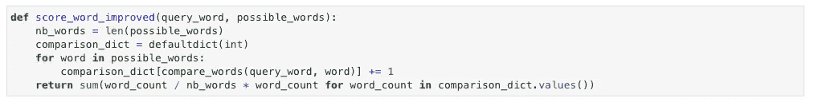

我们也可以用这个来计算每个起始单词的分数。

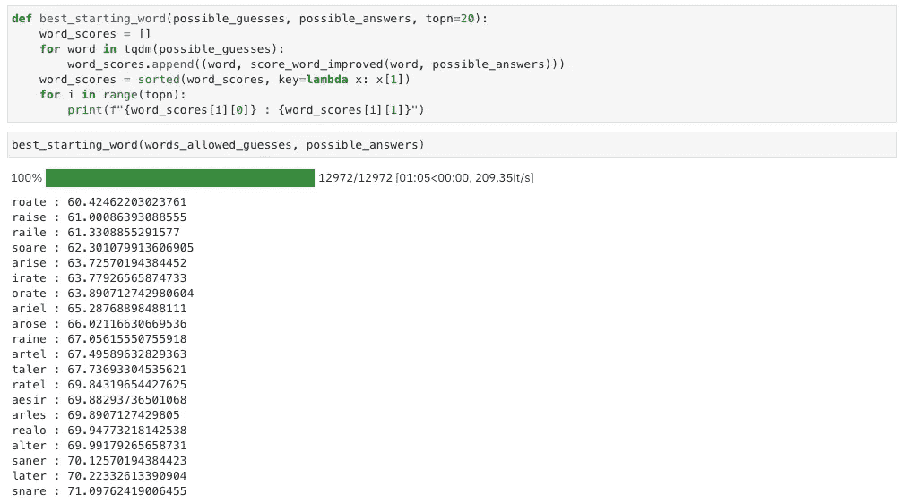

显然，ROATE(不管那是什么意思)是最好的开始词，但是 RAISE 确实很好，似乎是第二好的选择。

然后，我们可以创建一个新的求解器，只需用新的单词评分函数替换旧的即可。

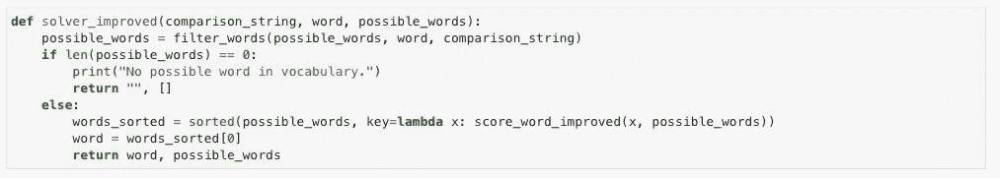

我们可以在所有可能的解决方案上再次测试这个求解器，看看它的平均表现如何。这一次，我们也是从 ROATE 开始，而不是加注。

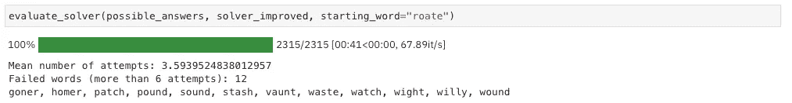

我们取得了不错的进步，我们能够击败蒂姆·厄本的平均水平！然而，我们仍然无法在几个词上取得胜利。

我们能做得更好吗？好吧，现在我们把自己的猜测限制在能解决问题的词上。但是在某些情况下，使用我们知道不能解决问题，但是能给我们更多信息的词语可能会更好。然后，当可能性的数量变少时(这里我选择了 3)，我们回到只尝试可能是解决方案的单词。

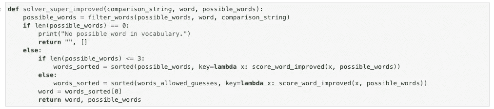

让我们在所有可能的单词上再次测试这个策略。

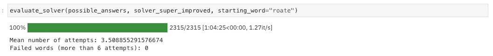

我们得到了另一个改进，这一次我们为每一个可能的单词赢得了比赛，这是相当令人满意的！平均 3.50 分是我能得到的最好成绩，但如果有可能取得更好的成绩，我也不会感到惊讶…

下面是我们改进的求解器如何玩之前的游戏:

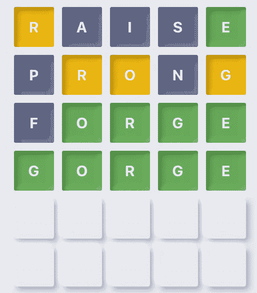

正如我们所看到的，这一次求解器不害怕使用没有 E 的单词 PRONG，但是获得了更多的信息。

我还用 ipywidgets 库做了一个交互版，让你玩(骗)起来更轻松。

这就是如何使用 Python 在 Wordle 上取胜的方法！

你可以在那里拿到笔记本。