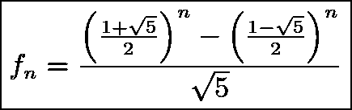

# 七个很酷的斐波那契函数

> 原文：<https://medium.com/codex/some-cool-fibonacci-functions-in-a-few-different-languages-69db36e7bc1a?source=collection_archive---------0----------------------->


照片由[卢德·洛伦兹](https://unsplash.com/@luddelorentz?utm_source=medium&utm_medium=referral)在 [Unsplash](https://unsplash.com?utm_source=medium&utm_medium=referral) 上拍摄

每当我学习一门新语言时，我首先要写的就是一些简单的斐波那契数列函数，一个是递归的，一个是迭代的，还有一个是生成斐波那契数列直到 n 的函数。这三个问题通常揭示了不同语言之间的哲学差异，或者展示了在一种语言中处理一个问题的不同方法。以下是我发现的一些最酷的斐波那契函数。

# 传统递归

这是 Python 中标准的递归斐波那契函数。我们以前都见过。这很无聊，而且慢得令人难以置信。

```
def fib(n):
    if (n < 2):
        return 1
    return fib(n - 1) + fib(n - 2)
```

尽管在 Haskell 中使用模式匹配看起来很优雅:

```
fib 0 = 1
fib 1 = 1
fib n = (fib (n - 1)) + (fib (n - 2))selection-clipboard: primary
```

# 传统迭代

相比之下，迭代版本当然快得令人难以置信。不过还是很无聊。

```
def fib(n):
    a, b = 1, 1
    for i in range(n):
        a, b = b, a + b
    return b
```

# 比奈公式

比奈公式是第 n 个斐波那契数列的公式:



信用:解决问题的艺术

这是到目前为止的第一个单句程序，但是它很蹩脚:

```
def fib(n): 
    return int((((1+5**0.5)/2)**n - ((1-5**0.5)/2)**n)/5**0.5)
```

# 哈斯克尔·齐威思

有趣的事情从这里开始:

```
fibs = 1 : 1 : zipWith (+) fibs (tail fibs)
```

这创建了一个延迟生成的无限斐波那契数列。使用它，我们可以通过索引或切片无限列表来访问第 n 个斐波那契数。对于那些不熟悉 Haskell 的人来说，这可能看起来很神奇，但是我会试着解释一下，但不会试图从总体上解释 Haskell。

本质上，对于前两个元素之后的每个元素，我们将列表添加到自身，但将它偏移一:

```
[1, 1] -- starting list-- Add the offset list to the non offset list [1, 1]
+ [1]-- resulting in:
[1, 1, 2]-- and then again;
  [1, 1, 2]
+ [1, 2]-- resulting in:
[1, 1, 2, 3]
```

# 递归 Python Oneliner

这是一个极其愚蠢的实现，但是当我被要求在不使用 Binet 公式的情况下用 Python 写一个斐波那契数列单行程序时，我想到了这个实现。

```
def fibs(n): [fib(x) for x in range(n) for fib in [lambda x: 1 if x < 2 else fib(n - 1) + fib(n - 2)]]
```

本质上，这个函数使用一个元素列表理解来内联创建一个斐波那契函数。它甚至比标准的递归函数都慢，但这是一个有趣的技巧。

# 。折叠()一行

下一个是标准迭代版本的一个非常酷的版本，它可以在任何语言中使用`.fold()`方法和匿名函数。这是它在 Rust 中的样子:

```
fn fib(n: usize) -> usize {
    (0..n).fold((0, 0), |(a, b), _| (b, a + b)).1
}
```

如果你熟悉`.fold()`和更高级的函数，这很容易理解，在 Rust 中，它和标准迭代函数一样快。

# 无限生成器

Haskell 的 zipWith Fibonacci 函数之所以简洁，部分原因是它生成了一个无限的 Fibonacci 数列表，以后可以对其进行索引或切片。虽然懒惰是 Haskell 的核心部分，但在使用生成器或懒惰迭代器的语言中也可以做到这一点。

```
def fibs():
    a, b = 1, 1
    while True:
        yield b
        a, b = b, a + b
```

嗯，这是我最后一个了，但我肯定还有很多我错过了。尤其是，我对任何简洁的 Lisp 解决方案感兴趣。如果你有任何酷的东西，请在下面分享！