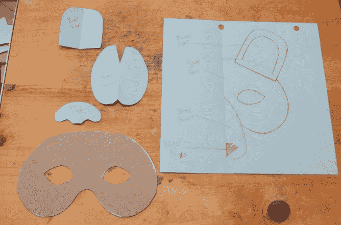

# 关于 Perl 模板处理的一些思考

> 原文：<https://medium.com/codex/some-thoughts-on-perl-template-processing-8aa81990cf2c?source=collection_archive---------6----------------------->

[*“制作一个 tem 板绘制 ing 以获得你的掩模的清晰视觉 ing”*](https://www.flickr.com/photos/28860935@N02/7281882846)*BY*[*Douglas R Witt*](https://www.flickr.com/photos/28860935@N02)*被许可在*[*CC BY-ND 2.0*](https://creativecommons.org/licenses/by-nd/2.0/?ref=ccsearch&atype=rich)

模板处理器和引擎是那种似乎每个开发者都想控制轮子的软件。天知道，在我的职业生涯中，我早就这样做过了。告诉我这听起来是否熟悉:

1.  您需要将数据混合到一个文档中，所以您从 Perl 的字符串插入开始，用`"`双引号`"`或`[sprintf](https://perldoc.perl.org/functions/sprintf)`括起来。(或者你投资了 ti 门`[format](https://perldoc.perl.org/perlform)` [s](https://perldoc.perl.org/perlform) ，但是…