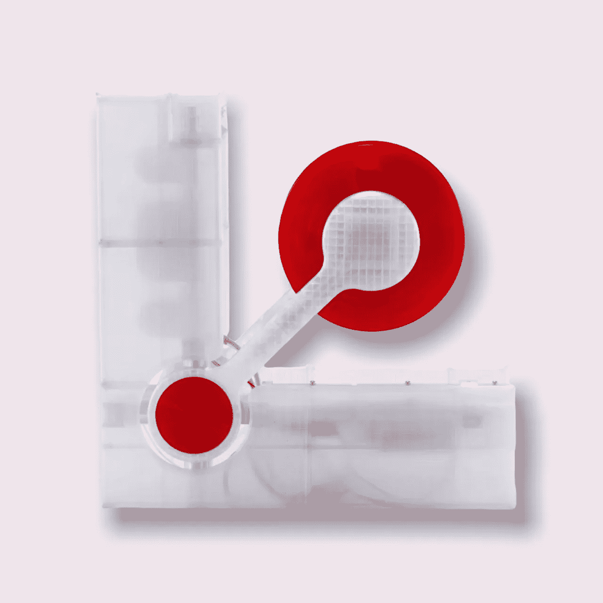

# 有人找到了重新利用塑料水瓶的方法！

> 原文：<https://medium.com/codex/someone-found-a-way-to-repurpose-plastic-water-bottles-45db8ebb264e?source=collection_archive---------20----------------------->

## 我们需要更多像这样的解决方案。

poly former(JC 媒体)

生活中最大的问题之一是，“我们将如何处理这些塑料？”。虽然这不是一个永远的解决方案，但 Reiten Cheng 已经开发出一种方法，可以重复利用水瓶来制造用于 3D 打印机的塑料细丝。与其购买更多的灯丝线轴来为 3D 打印机供电: