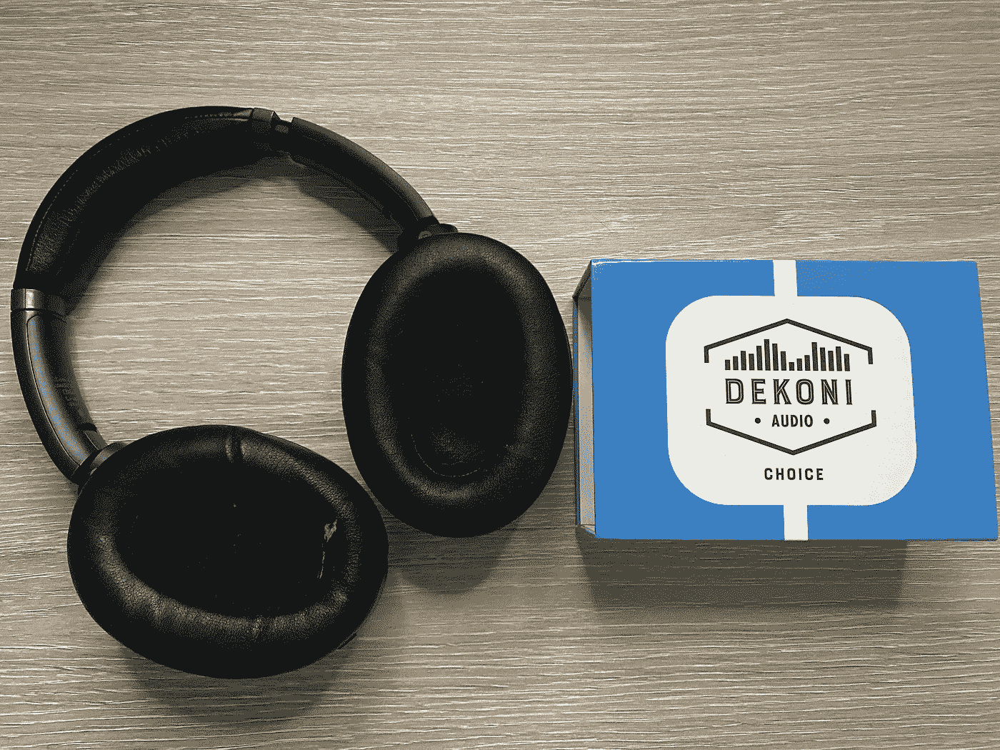

# 索尼 WH1000-XM3 由 DEKONI AUDIO 的替换耳垫续订

> 原文：<https://medium.com/codex/sony-wh1000-xm3-renewed-by-replacement-ear-pads-from-dekoni-audio-7a9bb17ca656?source=collection_archive---------10----------------------->

## 60 美元花得值吗？还是只是浪费钱？

Dekoni audio —耳机更换零件回顾—照片由 [Jakub Jirák](https://jakubjirak.com) 提供

前段时间开始左右为难，是买新耳机还是尝试更换耳塞。不幸的是，我对这个提议并不完全满意。

易贝到处都是备件，但没有一个具备这些特征。我甚至没有…