# 像 Tableau 仪表板中的专家一样对一个到多个维度进行排序

> 原文：<https://medium.com/codex/sort-one-to-many-dimensions-like-a-pro-in-tableau-dashboards-804d25c94179?source=collection_archive---------10----------------------->

## 一些画面

## 基于使用参数的多个度量对可视化中的嵌套维度进行排序的实用方法

> P.S .本文是我第一篇[自定义排序教程](/@sharonregina99/sort-charts-based-on-multiple-measure-choices-in-tableau-dashboards-9d4fc7af9e4d)的延续。

在这篇文章中，我将分享一个在 Tableau 中对一对多维度进行嵌套排序的教程。

**在完成本教程后，您将能够进行可视化，在其中您可以选择想要用来对嵌套维进行排序的度量，并在仪表板中仅显示前 N 个实例，如下所示。**

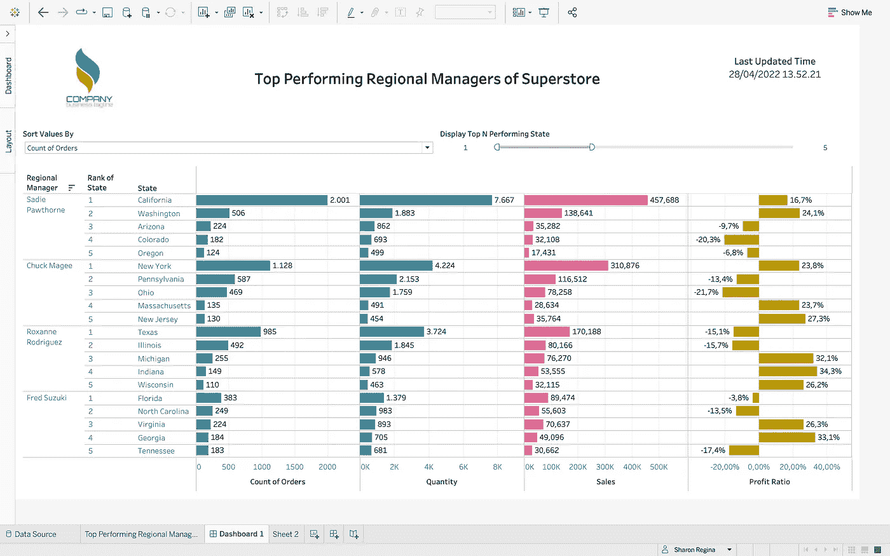

作者的可视化最终输出；[公司 Logo](https://www.freepik.com/vectors/color-logo) by [Patrickss](http://www.freepik.com/)

好了，教程开始！

与第一个教程类似，使用的数据集是 **Tableau 的 Superstore 数据集，根据 4 个指标(订单数、数量、销售额和利润率)来可视化 Superstore 表现最佳的区域经理及其前 5 名状态**。

每个区域经理可以有许多状态，定义了一个一对多的维度，这使得本教程不同于第一个教程，因为我们希望根据选择的度量对区域经理及其状态进行排序。

*附注:我使用了与第一个教程相同的工作表，因此，在截图中创建了计算字段。请注意，这里将再次介绍它们。*

1.  **将所需的度量拖至列，将维度拖至行。**

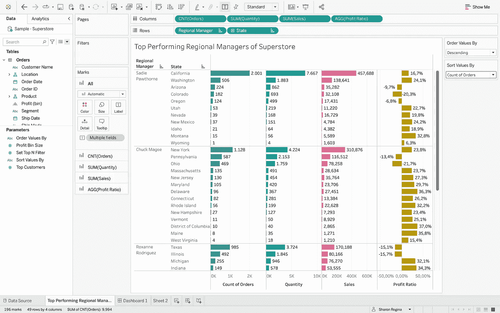

作者未排序的可视化

**2。创建一个字符串参数，按度量值对值进行排序。**

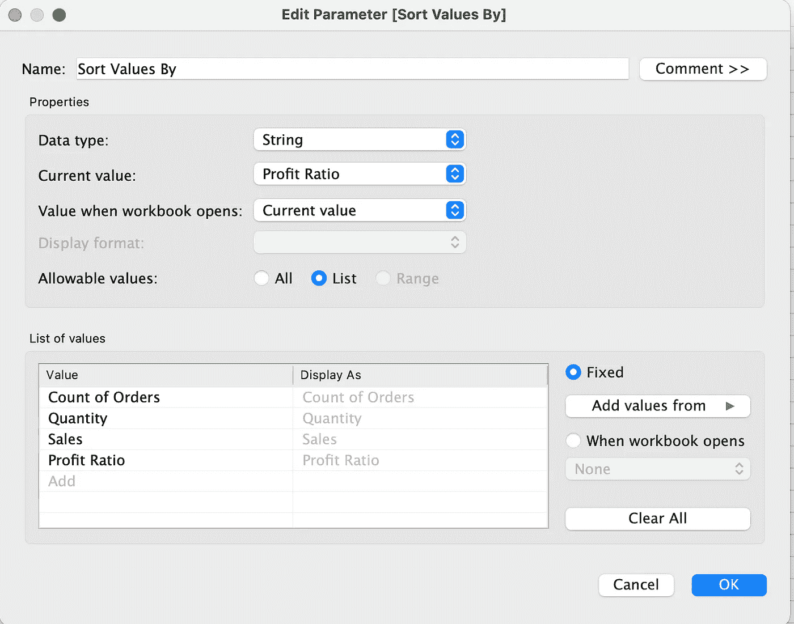

按作者按参数对值排序

**3。创建一个@sort-by 计算来定义参数(使它们工作)—我喜欢用' @ '来区分参数定义计算和其他计算。**

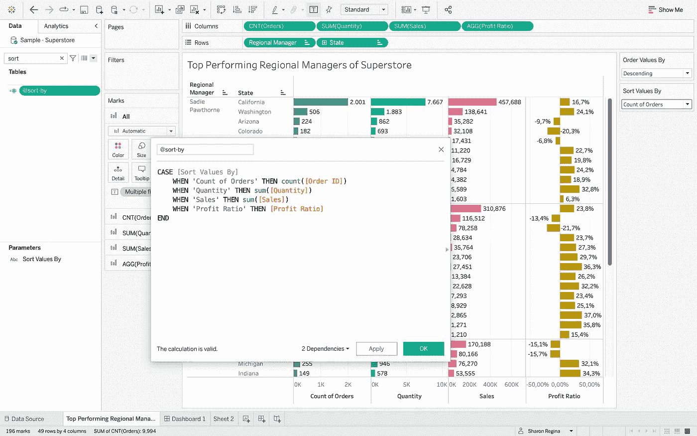

@按作者排序的计算

**4。右键-对维度排序(区域管理器&状态)，按@sort-by 计算排序，降序排序。**

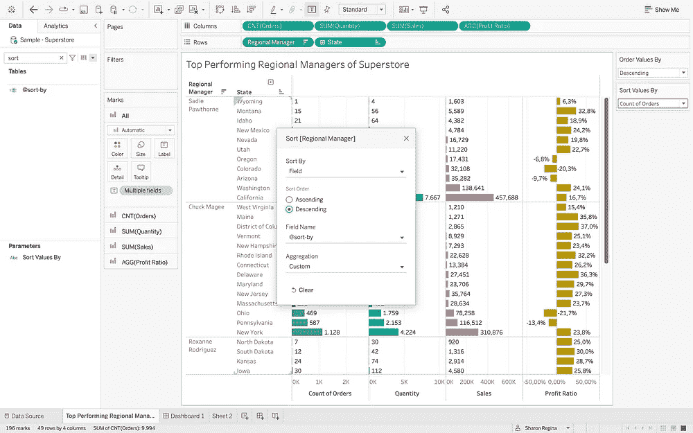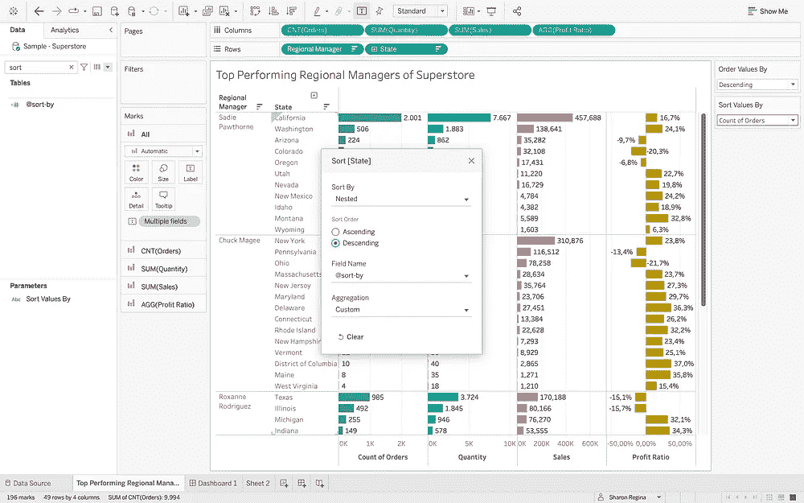

按作者排序编辑菜单

**5。这就是不同之处。**

**要对每个区域管理器的状态进行排序，请将@sort-by 计算拖到行中，并将其更改为 Discrete，这样就可以将其更改为 aggregation，RANK。**

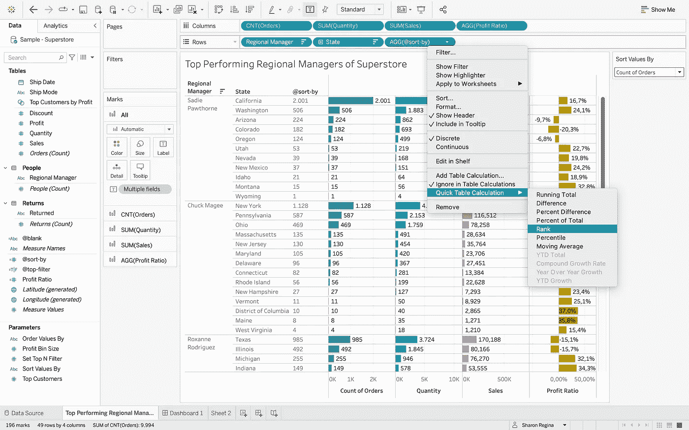

将@sort-by 计算改为按作者排名

**6。在将计算改为窗格(向下)之前，将@sort-by 蓝色药丸放在区域管理器和状态药丸之间。**请注意，排名是基于每个区域经理而不是整个表格进行重置的。耶！排序部分现在完成了！

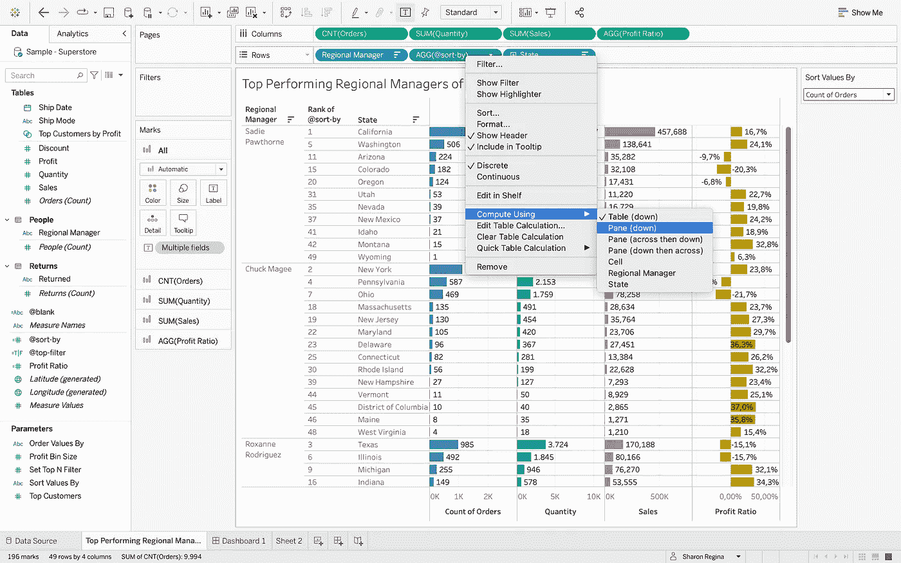

Compute @sort-by 使用窗格(向下)按作者排序

显示每个区域管理器的所有状态可能会很混乱。为了使其更加灵活，可以使用秩计算来制作前 N 个过滤器。

7 .**。将@sort-by 计算复制并拖动到过滤卡，并将其更改为 continuous。**

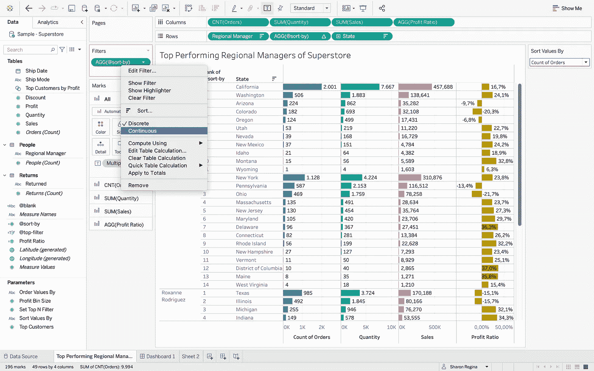

将@sort-by 计算拖到按作者排序的过滤卡上

**8。编辑过滤器，选择“值的范围”以启用滑块显示，并显示过滤器。**

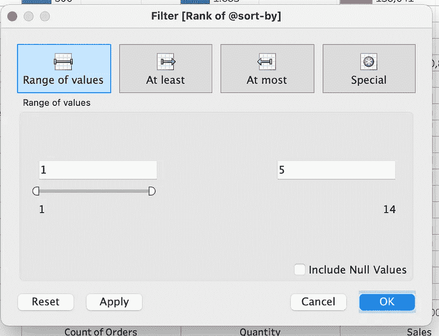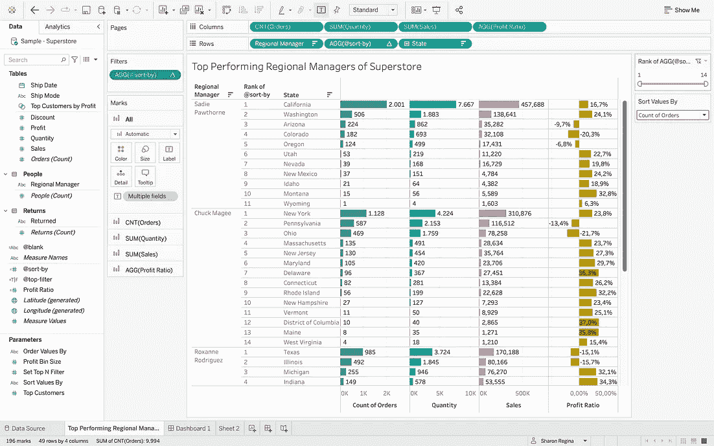

按作者排序的@sort-by 过滤菜单的等级

**9。将新的滑块过滤器重命名为“显示前 N 名执行状态”,以显示过滤器的用途。现在，您可以根据想要显示的前 N 个状态来自定义显示。**

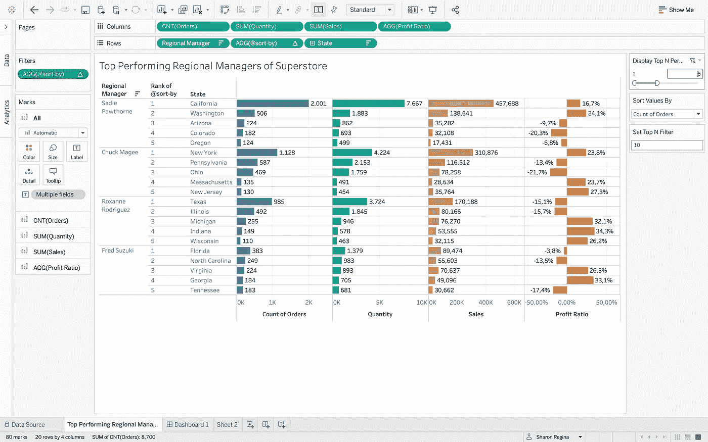

按作者列出的超市表现最佳的区域经理

10。设计仪表板并显示所有参数和过滤器。

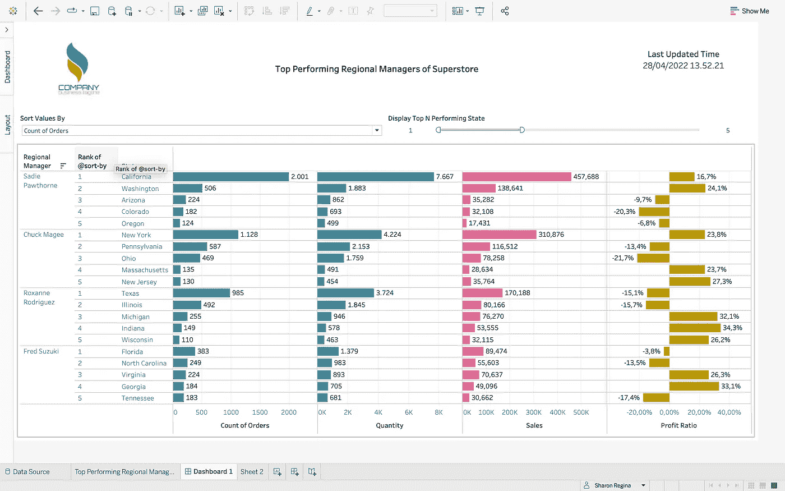

作者的初始仪表板设计；[公司 Logo](https://www.freepik.com/vectors/color-logo) by [Patrickss](http://www.freepik.com)

**11。请注意,“Rank of @sort-by”列名不够用户友好。因为不能直接重命名，所以有一个解决方法，就是创建一个浮动文本对象。**

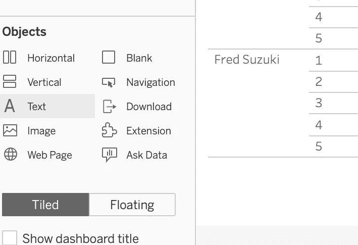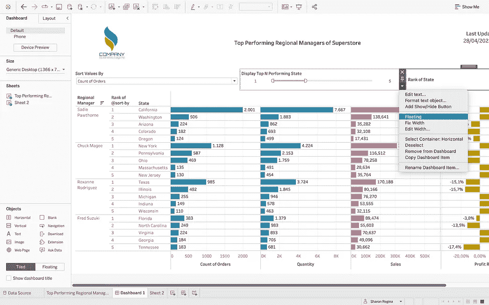

创建一个浮动文本对象，以便按作者重命名该列；[公司 Logo](https://www.freepik.com/vectors/color-logo) by [Patrickss](http://www.freepik.com)

**12。将背景颜色更改为白色以隐藏原始文本。**

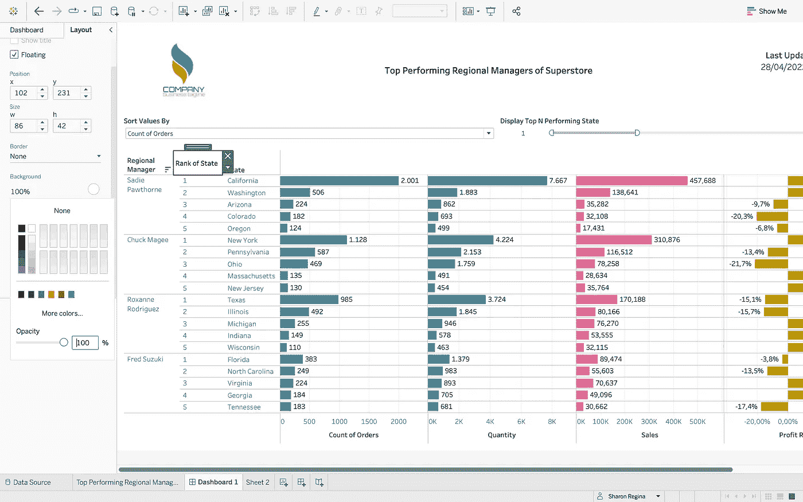

按作者隐藏原名；[公司 Logo](https://www.freepik.com/vectors/color-logo) by [Patrickss](http://www.freepik.com)

13。仪表板的最终外观！

作者的可视化最终输出；[公司 Logo](https://www.freepik.com/vectors/color-logo) by [Patrickss](http://www.freepik.com)

呜哇！对嵌套维度进行排序并不难，对吧？此外，您可以定制前 N 个实例的数量，以提高利益相关者对您的仪表板的可读性。

*如有任何疑问，可通过*[*LinkedIn*](https://www.linkedin.com/in/sharon-regina/)*联系我。希望本文可以帮助您通过在可视化中应用自定义排序参数来做出更有影响力的数据驱动决策:)。*