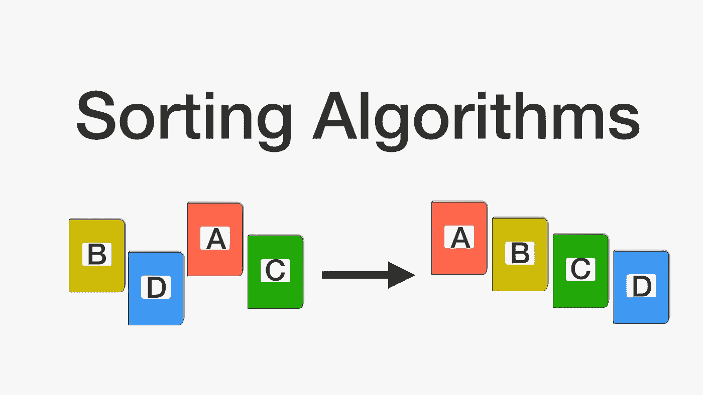
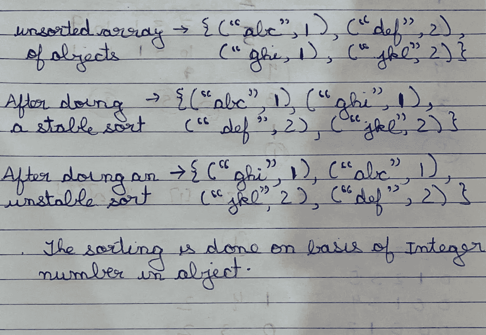
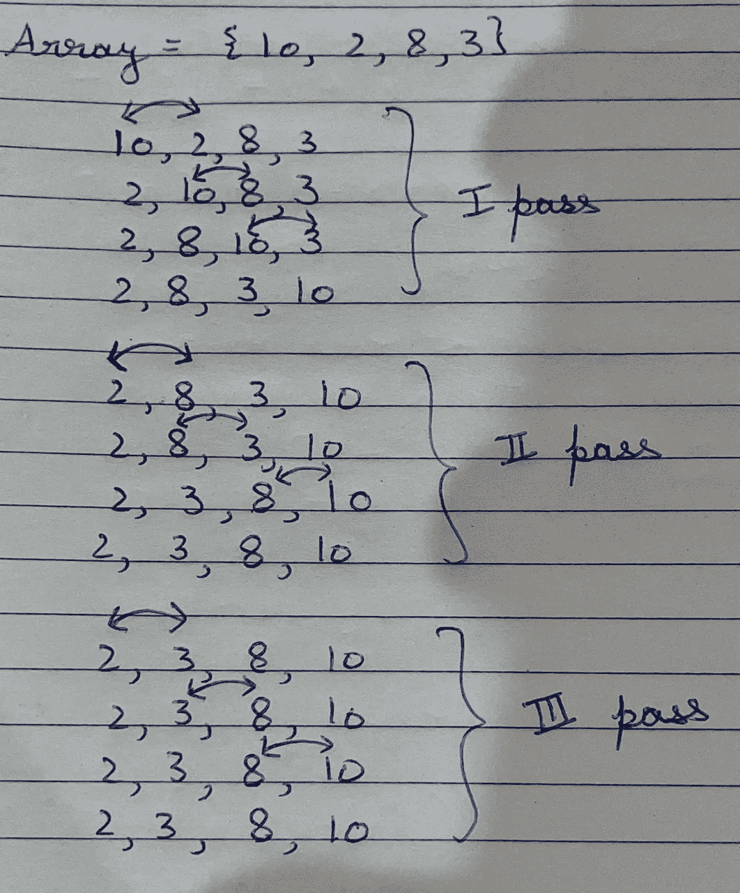
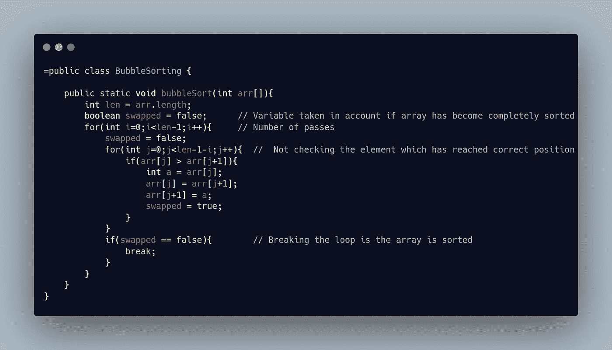
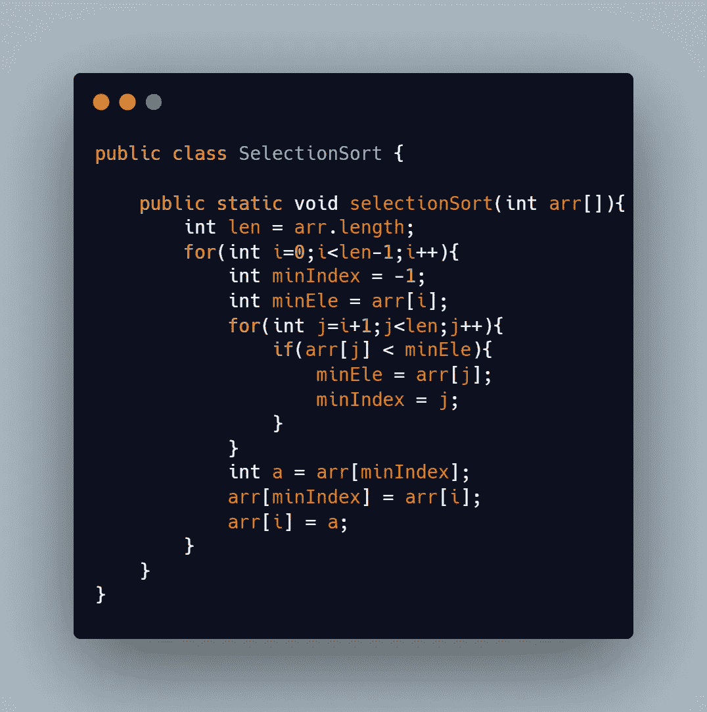
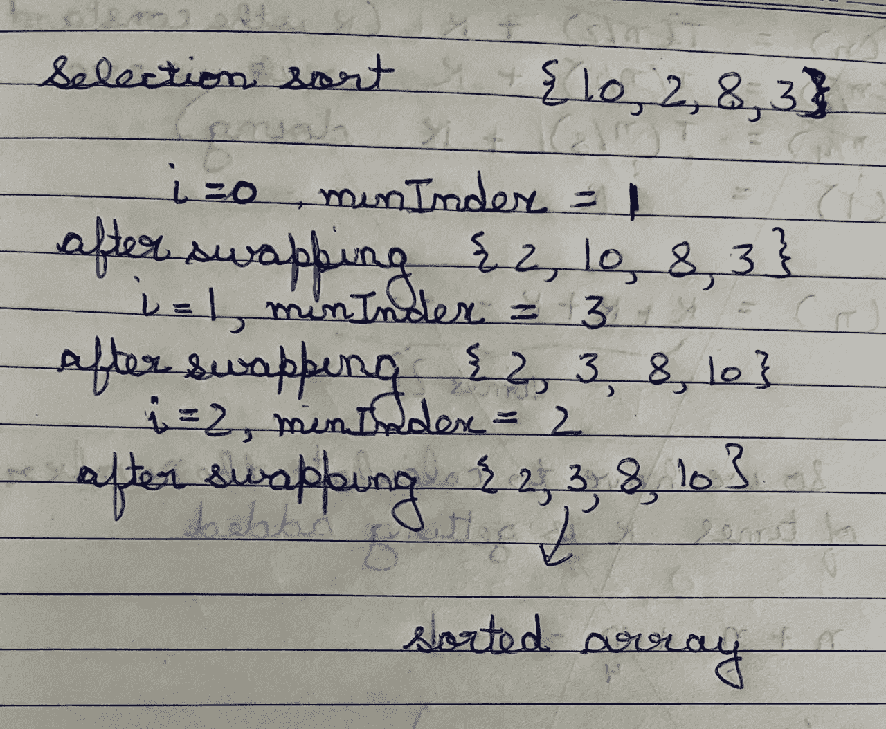
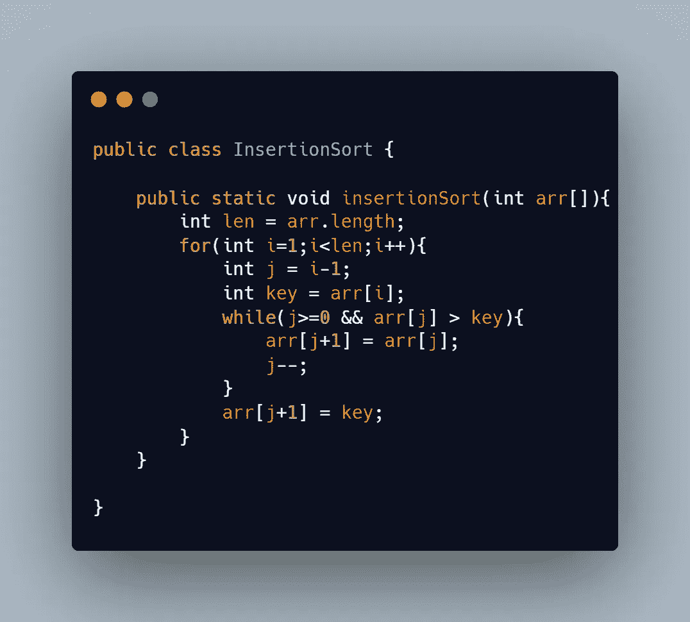
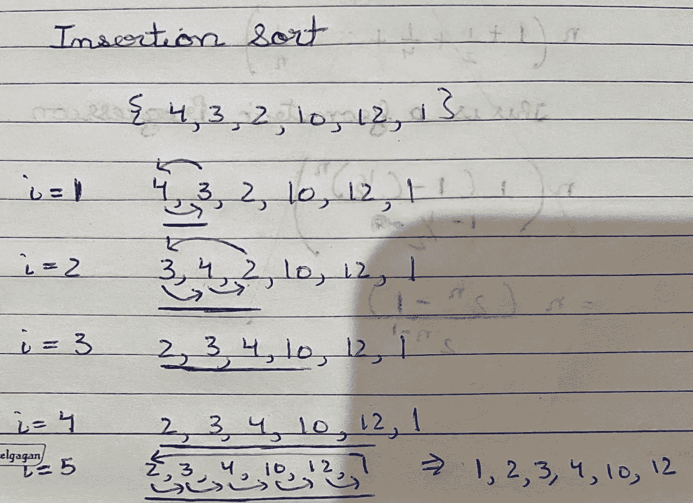

# 数据结构和算法中的排序第 1 部分

> 原文：<https://medium.com/codex/sorting-in-data-structures-and-algorithms-part-1-a2decc423168?source=collection_archive---------14----------------------->

排序意味着按照元素值的升序或降序排列元素。讨论排序算法时的一个基本概念是它们的稳定性。

# 排序算法的稳定性/不稳定性

稳定性可以定义为，如果一个未排序的数据结构中存在两个或更多的对象具有相同的值，那么它们应该以相同的方式以排序的方式出现。不稳定性与此正好相反，因为在这种情况下，元素可能会改变它们的位置。让我们借助一个例子让它变得更加透明:

当我们对一个数组或一个对象列表进行排序时，排序算法的稳定性变得非常重要，但当我们对一个简单的数字、字符串或字符等集合进行排序时，这一点并不重要。

***稳定排序算法:*** *冒泡排序、插入排序、归并排序*

***不稳定排序算法:*** *选择排序、快速排序、堆排序*

*在本文中，我们将讨论冒泡、选择和插入排序。*

# ***冒泡排序***

在冒泡排序中，我们比较相邻的元素，将元素 ***a*** 与元素***b***if***a>b***互换。在每次冒泡排序中，我们都将最大的元素移到末尾。冒泡排序的时间复杂度为 O(n)。让我们借助一个例子来理解冒泡排序:

图中显示的元素比较是最幼稚的冒泡排序。有趣的是，对数组排序所需的次数是元素数-1 的 ***。我们可以通过记住两件事来优化冒泡排序:***

*   如果在一次传递中没有发生单个交换，则数组被排序，我们不需要进一步处理。
*   在每一遍中，数组都从末尾开始排序。

这种优化的冒泡排序的代码将是:

优化冒泡排序

# 选择排序

在选择排序中，我们从数组中选择最小的元素，然后把它放在正确的位置，然后，我们选择第二个最小的元素，把它放在正确的位置，这样，排序继续进行，直到整个数组被排序。选择排序的时间复杂度为θ(n)。与冒泡、插入、合并、快速和其他排序相比，选择排序的内存写入更少，但循环排序非常适合优化内存写入。

让我们看看选择排序的代码，然后使用一个示例来模拟运行代码:

选择排序

模拟运行选择排序

# 插入排序

在插入排序中，我们从头开始构建排序元素的子数组，并减少未排序元素的子数组，以使我们的数组完全排序。插入排序的最佳时间复杂度为 O(n)，最差和平均时间复杂度为 O(n)。对于小型数组，插入排序通常比合并或快速排序更可取，因为对于小型数组，递归调用堆栈在合并和快速排序中比在同一位置插入或选择排序花费更多的开销。

让我们看看插入排序的代码，然后使用一个示例来模拟运行代码:

插入排序

模拟插入排序