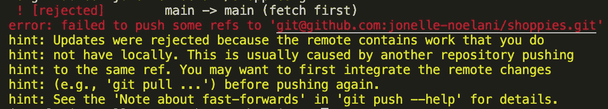
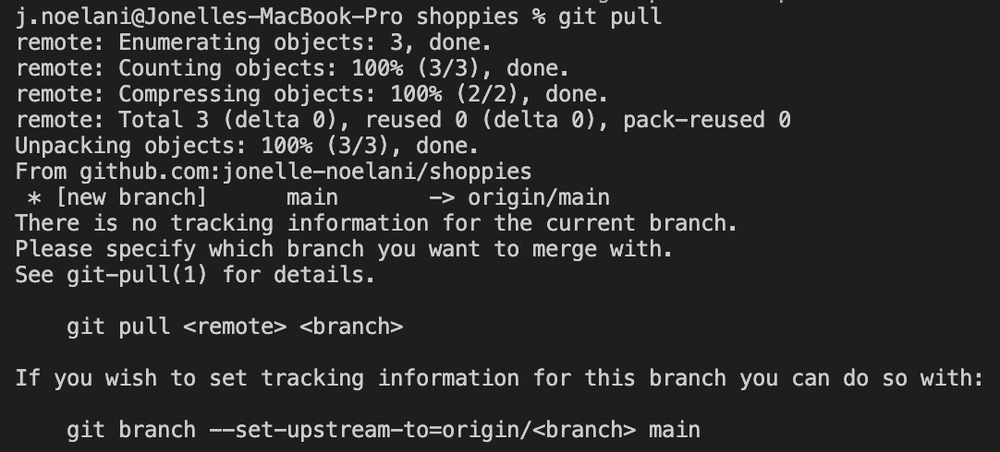
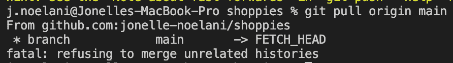
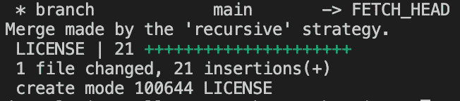
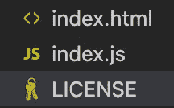
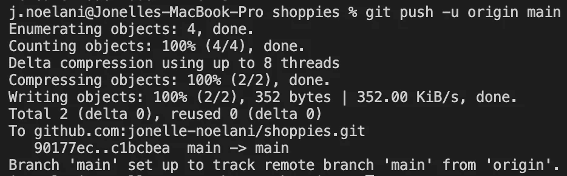
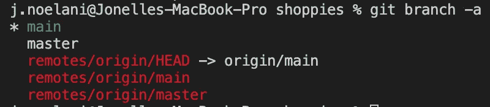
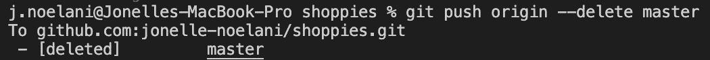
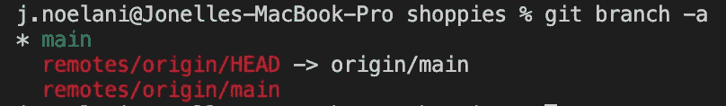

# 整理我的主要和主分支

> 原文：<https://medium.com/codex/sorting-out-my-main-and-master-branches-bcb0dc066586?source=collection_archive---------3----------------------->


雷蒙·克拉文斯在 [Unsplash](https://unsplash.com?utm_source=medium&utm_medium=referral) 上拍摄的照片

我像往常一样开始了一个新项目。用基本的 HTML 和 JavaScript 文件在本地创建了一个新目录。然后，去 GitHub 创建一个新的回购。吖哒吖哒吖哒…

我把这一天剩下的时间编码掉，全部推给了 GitHub。

第二天，我查看了我的 GitHub 个人资料上的热图，发现我的作品没有一个显示出来。没有绿色。我检查了回购协议，感谢上帝，都在那里。像往常一样，都在“主”分支上，但默认分支是“主”。这是怎么回事，我该如何解决？

嗯，我没有像平时那样做好每一件事。这一次我感觉更大胆，并在创建回购时添加了一个许可证。这个执照是这个主要分支上唯一的东西。同时，我所有的工作都在主分支上。

# 主对主

现在，当我读到 Git 的时候，我已经看到主分支的想法出现了几次，但是我只是认为有一个主分支而不是主分支是某种最佳实践。我也认为可能一些文本编辑器默认了一个主分支而不是主分支。我在 Git 上读到的这些文章没有一处提到它是强制性的，也没有人解释其背后的原因。

Main 和 master 本质上是可以互换的。或者更确切地说，它们都像任何其他分支一样运行，在那里您可以重命名、删除它们等。正如我的项目所证明的，你可以两者兼得！

对于我们这些收到消息比较晚的人来说，截至 2020 年 10 月 1 日，“GitHub 上所有新的 Git 仓库都将被命名为‘main’而不是‘master’。”

> 对我来说，这似乎只是在我创建回购时随机决定包含一个许可证时才发生的。否则，我的所有回购都默认为一个主分行。

[](https://www.zdnet.com/article/github-to-replace-master-with-main-starting-next-month/) [## GitHub 下月起将“master”替换为“main”

### 从下个月开始，所有在 GitHub 上创建的新源代码库将被命名为“main ”,而不是“master ”,因为…

www.zdnet.com](https://www.zdnet.com/article/github-to-replace-master-with-main-starting-next-month/) 

这是对 2020 年夏天黑人的命也是命抗议活动的回应，也是更大努力的一部分，以消除在“奴隶制”背景下对“主人”的提及，使其更具包容性。其他正在被淘汰的术语是我从未听说过在科技领域使用的:从属、黑名单和白名单。

[](https://www.theserverside.com/feature/Why-GitHub-renamed-its-master-branch-to-main) [## 为什么 GitHub 把它的 master 分支改名为 main

### 从一开始，Git DVCS 工具的默认分支名称就被设置为 master。每个饭桶…

www.theserverside.com](https://www.theserverside.com/feature/Why-GitHub-renamed-its-master-branch-to-main) 

# 我该如何解决这个问题？

在本地，我只有一个总分行。

另一方面，我的 GitHub repo 有一个带有许可证的主分支。当我将它与我的本地项目相链接并推送所有的更改时，它在我的 repo 中创建了一个主分支，包含我所做的所有提交/工作。

现在，我遇到了这个灾难，我的回购中的主分支比主分支提前了几个提交，但比主分支晚了一个提交。:困惑表情符号:

我从来没遇到过这种事。

两篇文章列出了一些简单易行的步骤来解决这个问题。

我将按照史蒂文·莫蒂默(Steven M. Mortimer)在 R-bloggers 上的这篇文章中的步骤，看看这一过程有多顺利。他说他用这五个简单的步骤在不到一分钟的时间里做出了必要的改变。

[](https://www.r-bloggers.com/2020/07/5-steps-to-change-github-default-branch-from-master-to-main/) [## 将 GitHub 默认分支从主分支更改为主分支的 5 个步骤

### R 社区是一个多元化和包容性的团体。大约一个月前(2020 年 6 月), GitHub 宣布将开始…

www.r-bloggers.com](https://www.r-bloggers.com/2020/07/5-steps-to-change-github-default-branch-from-master-to-main/) 

# 步骤 1 —将“主”分支移动到“主”

```
git branch -m master main
```

在运行这个命令之后，在本地，我现在只有一个主分支，其中包含来自主分支的提交历史。不再有主树枝了。这是一个很好的简单方法来“重命名”分支而不弄乱任何东西。

# 步骤 2 —将“主”推送到远程回购

```
git push -u origin main
```

这样会把主分支推到 GitHub 回购上。我相信“-u”(“上游”的简写)在 GitHub repo 中设置了对远程分支的跟踪，起到了“书签”的作用。

[](https://git-scm.com/book/en/v2/Git-Branching-Remote-Branches) [## Git -远程分支

### 远程引用是远程存储库中的引用(指针)，包括分支、标记等等。你可以…

git-scm.com](https://git-scm.com/book/en/v2/Git-Branching-Remote-Branches) 

**抢劫，这对我没用。**



未能推送一些参考

> 更新被拒绝，因为远程包含您在本地没有的工作。(远程主分支上那个该死的许可。).这通常是由另一个存储库推送到同一个引用引起的。在再次推送之前，您可能希望首先集成远程更改(例如，“git pull …”)。有关详细信息，请参见“git 推送——帮助”中的“关于快进的说明”。

所以，我尝试了`git pull`

> 错误:没有当前分支的跟踪信息。
> 请指定您想与哪个分支机构合并。



git 拉取错误

然后，我试了试`git pull origin main`



拒绝合并不相关的历史

好吧，它不喜欢本地 main(以前称为 master)和 GitHub remote main 有完全不同的提交历史。我会试着告诉它，允许不相关的历史是可以的。

```
git pull origin main --allow-unrelated-histories
```

[](https://www.educative.io/edpresso/the-fatal-refusing-to-merge-unrelated-histories-git-error) [## “致命的:拒绝合并不相关的历史”Git 错误

### “致命的:拒绝合并不相关的历史”Git 错误

“致命:拒绝合并不相关的历史”Git errorwww.educative.io](https://www.educative.io/edpresso/the-fatal-refusing-to-merge-unrelated-histories-git-error) 

通过“递归”策略进行合并

现在，我有了一个包含 HTML 和 JS 文件的本地许可文件。



HTML、JS 和许可证文件

如果现在一切都成功合并，我现在应该可以将这些更改推送到 GitHub。

再来一次…

```
git push -u origin main
```



分支“主”设置为从“起点”跟踪远程分支“主”

成功！GitHub 看起来很棒。一切都在那里。但是，我们还没有完成。

# 步骤 3 —将头部指向“主”分支

我要坦白一件事。在我忙乱地计算前一步中的 git pull 时，我滑入了一个…

```
git remote set-head origin main
```

我在这个堆栈溢出中发现了这个想法。

[](https://stackoverflow.com/questions/64249491/difference-between-main-branch-and-master-branch-in-github) [## Github 中主分支和主分支的区别？

### 我尝试在主分支上推送 git，但它只显示我有新的拉请求，但当我单击新的拉请求时…

stackoverflow.com](https://stackoverflow.com/questions/64249491/difference-between-main-branch-and-master-branch-in-github) 

另一方面，莫蒂默在他的文章中建议这个命令:

```
git symbolic-ref refs/remotes/origin/HEAD refs/remotes/origin/main
```

我不完全理解所有的细节，但是，我们基本上需要确保指针/头在 GitHub 的主分支上，这样一切都按照我们想要的方式排列。

检查并查看头部指向的位置:

```
git branch -a
```



树枝和头

# 步骤 4 —在 GitHub 站点上将默认分支更改为“main”

从主服务器转换到主服务器的关键是让“主服务器”成为默认分支。至此，GitHub 似乎在很大程度上自动做到了这一点。除非根据个人经验，在没有许可的情况下创建回购，导致“主”成为默认分支。

经过进一步考虑，现在我对所有这些有了更多的了解，如果我在初始化或推送任何东西之前，在本地将分支名称从“master”更改为“main ”,那么默认分支将是“main”。因此，在这种情况下，它实际上只取决于最初被推送到 GitHub 的分支的名称。

如果您需要或者想要更改您在 GitHub 中的默认分支，请随意遵循 Mortimers 的步骤:

[](https://www.r-bloggers.com/2020/07/5-steps-to-change-github-default-branch-from-master-to-main/#step-4---change-default-branch-to-main-on-github-site) [## 将 GitHub 默认分支从主分支更改为主分支的 5 个步骤

### R 社区是一个多元化和包容性的团体。大约一个月前(2020 年 6 月), GitHub 宣布将开始…

www.r-bloggers.com](https://www.r-bloggers.com/2020/07/5-steps-to-change-github-default-branch-from-master-to-main/#step-4---change-default-branch-to-main-on-github-site) 

# 步骤 5 —删除远程回购上的“主”分支

```
git push origin --delete master
```



删除的母版

永别了！



只有主枝保留了下来

# 最后的话

我完全赞同在一个主要分支上工作，并在我的工作流程中去掉“主”这样的术语。

也许我需要想办法让 main 成为我的 VS 代码编辑器的默认分支名。

否则，我只需要确保当我开始一个新项目时，我做的第一件事就是将分支名称从 master 改为 main。

活到老学到老！