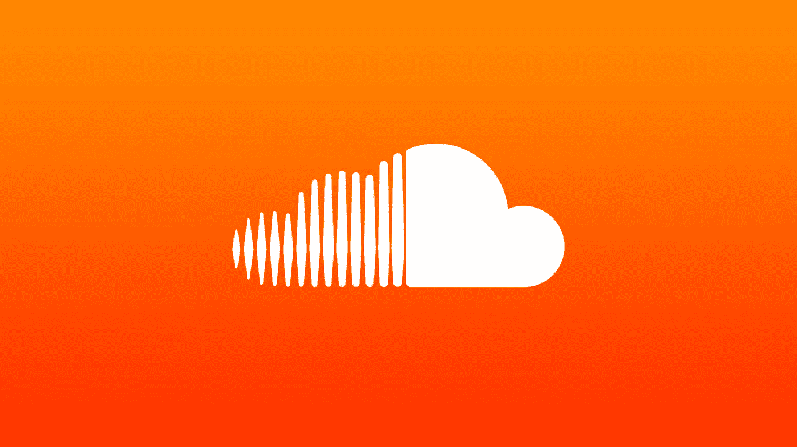

# SoundCloud 死了

> 原文：<https://medium.com/codex/soundcloud-is-dead-27122d277183?source=collection_archive---------1----------------------->

## [法典](https://medium.com/codex)

## 流媒体服务输给了 Spotify、YouTube 和娱乐行业的所有其他公司。

后知之明再清楚不过了，但我们的 SoundCloud 故事始于 2016 年。Spotify 有 4000 万付费用户，Apple Music 有 1700 万。现在，Spotify 拥有超过 [130 名付费用户](https://beebom.com/spotify-138-million-paying-subscribers-q2-2020/)，而苹果音乐拥有大约 [70 名](https://www.fool.com/investing/2020/04/07/counterpoint-apple-music-hits-68-million-paid-subs.aspx) …