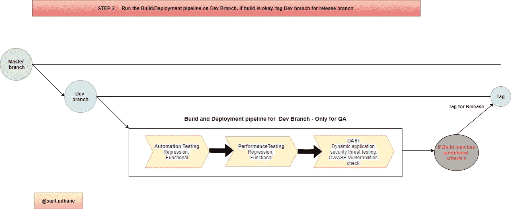

# CI/CD 不同阶段的源代码分支策略和 DevSecOps 管道

> 原文：<https://medium.com/codex/source-code-branching-strategy-and-devsecops-pipeline-at-different-stages-of-ci-cd-6e14f2cdf9c9?source=collection_archive---------10----------------------->

## 源代码分支命名约定

**主分支** —分支中维护的所有产品级/发布的源代码。标记为生产版本的标签。

**开发分支** —开发分支，拥有可用于 QA 测试的源代码。标记用于商业用户验证/测试的标签。

**特性分支—** 特性分支，由开发人员用于开发特性或修复非阻塞错误。在 Dev 环境上成功验证之后，分支应该与 Dev 分支合并，并且这个分支应该被删除。

**发布分支—** 标记开发分支，可用于业务验证。成功验证后，如果有任何修复，应该与主和开发分支合并。

**热修复分支—** 应该从标记的主分支分叉，主分支可用于修复关键的拦截器问题/错误。成功验证修复后，分支应该与主分支和开发分支合并。

开发人员的第一步管道，以验证他们的功能或修复

QA 的第 2 步管道，运行自动化套装来修复潜在候选发布的当前阶段。

第 3 步-为业务用户提供渠道，以验证待发布的候选人。

供应链管理分支和管道的大图。

关于管道中提到的步骤/阶段的简短介绍

**1。代码扫描仪**

静态分析工具，也称为代码扫描器，可以快速查看代码并找到导致安全漏洞的常见错误。这些工具识别常见的问题模式，提醒开发人员注意这些问题，并就如何修复这些问题提供建议。这些工具不会处理潜在的设计缺陷，但它们通常可以帮助开发人员在代码交付给测试人员或投入生产之前很久就避免代码中的许多安全缺陷。

工具

Java—sonar cube

JavaScript—sonar cube，LogRocket

NodeJS —深度扫描，日志火箭

## 2.棉绒/格式器

Linters 和 formatters 是有用的工具，允许您检查、检测错误和修改源代码，帮助您在开发团队中遵循编码模式。通过将 linter 工具整合到您的项目中，您可以获得清晰、易读、污染少且易于维护的源代码。

工具

Java — PMD，检查样式

JavaScript — ESLint，JSLint，JSHint

NodeJS — ESLint

## 3.SAST

SAST 是一种白盒安全测试。

发现源代码中的常见弱点枚举(cwe ),包括自定义代码、组件和库以及开放源代码和组件。

识别代码中的安全和质量缺陷，并提供补救建议。

通过识别这些标准中列出的特定漏洞，帮助确保符合各种嵌入式质量、可靠性和安全性标准。

工具

我)[https://www.synopsys.com/glossary/what-is-sast.html](https://www.synopsys.com/glossary/what-is-sast.html)

二)【https://docs.gitlab.com/ee/user/application_security/sast/ 

## 4.单元测试和测试覆盖率(代码覆盖率)

代码覆盖率是一种度量，它描述了程序的源代码被测试的程度。

代码覆盖率提供了关于应用程序的某些部分是否被执行以及执行频率的信息。它通常用于确定一个测试套件对一个特定代码库的测试有多彻底。

工具

Java — JUnit，Spring 单元。用于代码覆盖的 JoCoCo & Cobertura

JavaScript —玩笑，茉莉

诺杰斯——穆哈，柴

## 5.许可证扫描

一个典型的软件项目通常会重用数百个第三方包。许可证和原产地信息并不总是容易找到，也没有规范化。

工具

我)【https://snyk.io/product/open-source-license-compliance/】T4

ii)[https://github.com/fossology/fossology](https://github.com/fossology/fossology)

三)[https://github.com/nexB/scancode-toolkit](https://github.com/nexB/scancode-toolkit)

## 6.自动化测试

顾名思义。自动化测试采用软件测试活动，并通过自动化工具集或框架来执行它们。简而言之，这是一种测试，在这种测试中，工具以定义的模式自动执行一组任务。

它减轻了手工测试人员的压力，并允许他们专注于更高价值的任务——探索性测试，审查测试结果，等等。本质上，机器接管并执行平凡的、重复的、时间混乱的任务，例如回归测试。自动化测试对于在更短的时间内实现更大的测试覆盖率以及更高的结果准确性是至关重要的

**哪些测试应该自动化？**

在创建一个测试自动化策略之前，让我们看看哪些测试对于自动化来说是最可行的:

*   回归测试:回归套件越来越多，需要多次填充相同的变量，以确保新特性不会篡改旧功能。这很容易实现自动化。
*   复杂功能的测试:自动化所有需要复杂计算的测试，这很容易出现人为错误。
*   冒烟测试:运行自动化套件来验证主要功能的质量。这通过提供对构建是否需要更深入测试的快速分析来节省时间。
*   数据驱动测试:自动化测试以验证必须用大量数据集重复测试的功能。
*   性能测试:在不同环境下监控软件性能的自动化测试。手动完成这项工作将非常费力和耗时。
*   功能测试:每次开发人员提交 PR 时，功能测试需要快速执行并提供即时反馈。如果没有自动化，这是不可能实现的，尤其是当组织规模扩大时。

工具

我)[https://www.selenium.dev/](https://www.selenium.dev/)

二)【https://cucumber.io/ 

iii)【https://rest-assured.io/ 

## 7.性能试验

虽然负载测试在生产环境中是必不可少的，但是将它与 CI/CD 管道集成可以大大减少性能测试所需的时间和精力。必须以最真实的方式编写所有可能的事务脚本，并针对不同的负载场景测试它们。

您的构建可能通过了所有的功能测试，但是性能呢？如果你在没有执行负载测试的情况下发布代码，可能会产生负面影响，当高流量到来时，会使你的网站陷入困境。就整体性能而言，部署具有 CI/CD 管道的构建只是完成了一半的工作——您的构建还应该能够满足自发布以来您一直维护的所有性能标准。如果你是在部署之后做的，你就错过了最重要的部分:你的用户体验。

了解您的应用程序在生产环境中的行为需要您执行负载测试，以全面了解您的应用程序在压力下的性能。这是任何成功应用的关键。

工具

我)[https://jmeter.apache.org/](https://jmeter.apache.org/)

## 8.DAST

DAST，有时被称为 web 应用程序漏洞扫描器，是一种黑盒安全测试。它通过在应用程序运行时模拟对应用程序的外部攻击来寻找安全漏洞。它试图通过检查应用程序暴露的接口的漏洞和缺陷来从外部渗透应用程序。

DAST 名字的动态部分来自于在动态环境中进行的测试。与 SAST 不同，它在应用程序静止时逐行扫描应用程序的代码，DAST 测试在应用程序运行时执行。这并不是说测试是在应用程序处于生产状态时进行的。虽然 DAST 可以用于生产，但测试通常在 QA 环境中进行。

DAST 非常善于发现外部可见的问题和漏洞。这包括 OWASP 十大安全风险中的许多风险，如跨站点脚本、SQL 注入或命令注入等注入错误、路径遍历和不安全的服务器配置。

DAST 的优势之一是其识别运行时问题的能力，这是 SAST 在静态时做不到的。DAST 擅长发现服务器配置和认证问题，以及只有在已知用户登录时才可见的缺陷。

工具

我)[https://www.synopsys.com/glossary/what-is-dast.html](https://www.synopsys.com/glossary/what-is-dast.html)

二)【https://www.acunetix.com/product/acunetix360/ 

## 9.烟雾测试

*   建筑中的所有演出布景挡块将通过执行冒烟测试来识别。
*   冒烟测试是在构建发布给 QA 或业务用户之后进行的。在冒烟测试的帮助下，大多数缺陷在软件开发的初始阶段就被识别出来。
*   通过冒烟测试，我们简化了主要缺陷的检测和纠正。
*   通过冒烟测试，QA 团队可以发现新代码可能暴露的应用程序功能缺陷。
*   冒烟测试发现主要的严重缺陷。

这可以是自动化中使用的测试用例的子集。

## 10.IAST

交互式应用程序安全测试解决方案使用动态测试(通常称为运行时测试)技术，帮助组织识别和管理与运行 web 应用程序中发现的漏洞相关的安全风险。IAST 通过软件工具工作，或者在应用程序运行时使用工具来监控它，并收集关于它做什么和如何执行的信息。IAST 解决方案通过在运行的应用程序中部署代理和传感器来检测应用程序，并持续分析由手动测试、自动测试或两者结合启动的所有应用程序交互，以实时识别漏洞。

工具

我)【https://www.synopsys.com/glossary/what-is-iast.html】T4

ii)[https://www.acunetix.com/product/acunetix360/](https://www.acunetix.com/product/acunetix360/)

如果觉得文章有用，请鼓掌。谢谢你。