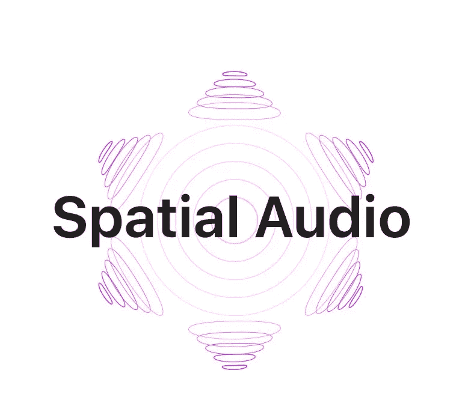
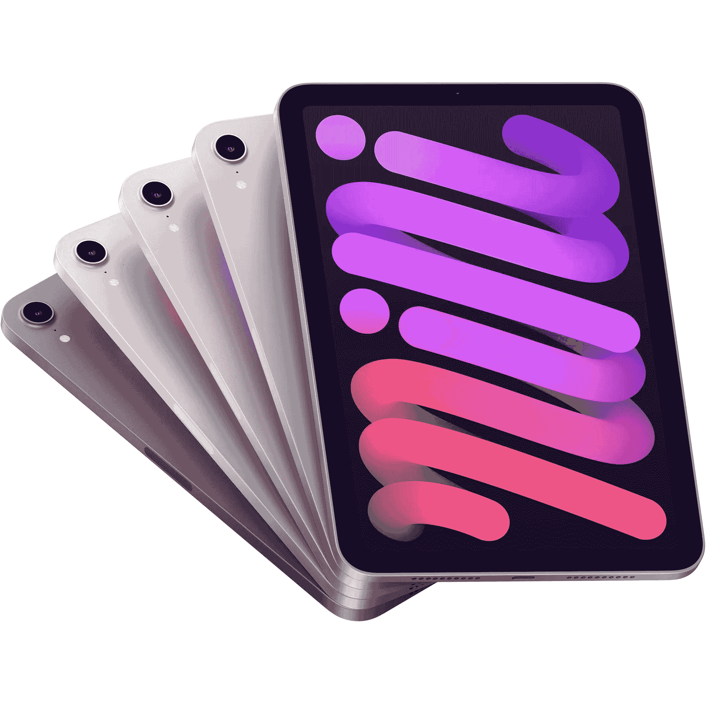
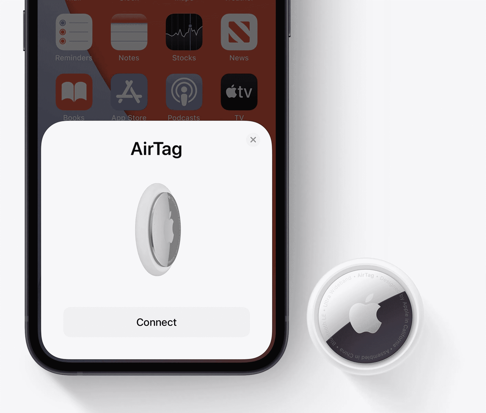
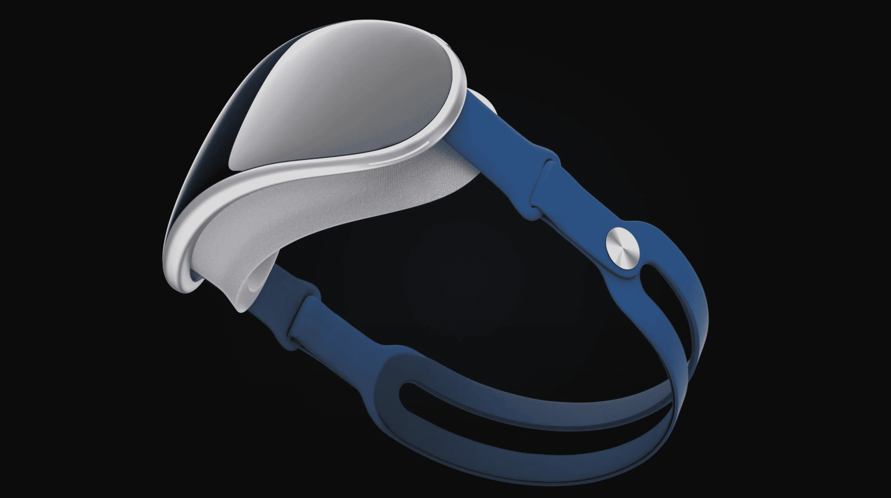
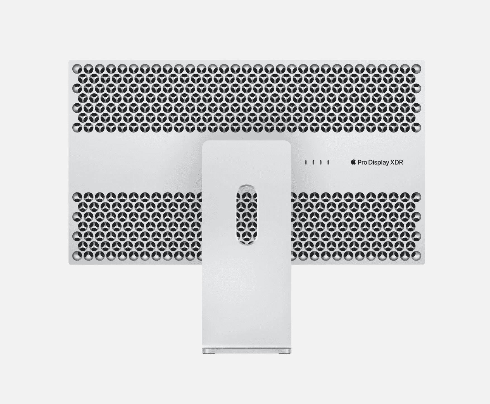
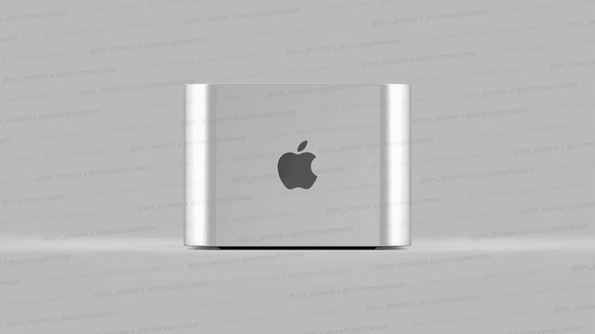
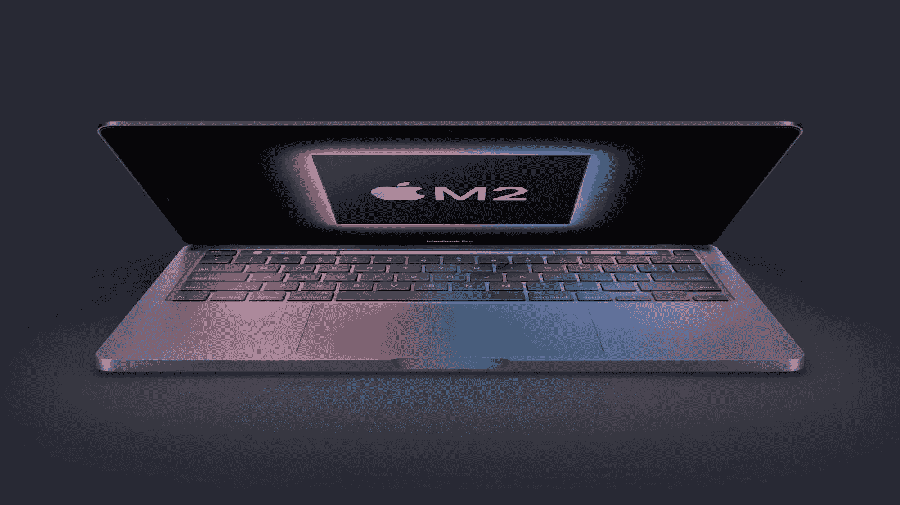

# 空间音频是一个打击和果冻卷轴仍然是一件事！

> 原文：<https://medium.com/codex/spatial-audio-is-a-hit-and-jelly-roll-is-still-a-thing-f24532dbdb5a?source=collection_archive---------8----------------------->

## 本周的苹果综述。一切尽在一口大小的博客！(2 月 14 日至 2 月 18 日)

## 空间音频

当苹果公司去年将这一功能添加到他们的音乐应用程序中时，有人怀疑这一功能可能会被采用。嗯，几个月后，就像苹果碰过的任何东西一样，它变成了金子！

苹果公司最近接受了美国著名音乐杂志《公告牌》的采访。在这篇文章中，他们揭示了自 9 月份以来，空间音频收听增加了 50%,并且这个数字还在快速增长。超过一半的 Apple Music 听众现在在听空间音频，采用率甚至超过了他们最疯狂的预期。艺术家们也看到了听众人数的上升。例如，泰勒·斯威夫特(Taylor Swift)自从在 Spatial 重新发行专辑以来，增长了 50%以上。据报道，苹果现在正与杜比合作，试图在汽车中重现空间感。

## 苹果音乐回放

你可能熟悉 Spotify 的“Wrapped ”,你可以在其中查看自己过去一年的收听统计数据和习惯。好吧，为了尝试加入一些分析动作，苹果花了一些时间给他们的同类产品注入新的生命，那就是 *Replay。* Replay 将向您显示各种统计数据，如您的总收听时间、最喜爱的艺术家和专辑。要查看您的统计数据，请前往音乐应用程序中的*立即收听*标签，或者，如果您愿意，也可以在 Safari 上访问[replay.music.apple.com](replay.music.apple.com)，更深入地了解您的收听习惯。虽然不完全是 Spotify 的 Wrapped 的用户体验，但这肯定是一个进步。而且，与 Spotify 不同，你也可以在一年中的任何时候这样做。

 [## 大小真的很重要

### 我的 16 英寸难题

medium.com](/codex/size-really-does-matter-3782df55faf6) 

## 果冻卷轴——不断给予的礼物

让我们参观一下加利福尼亚。在那里，针对苹果的集体诉讼已经被提起。这与去年苹果 iPad Mini 显示屏上被称为*果冻卷*的奇怪现象相反。虽然苹果公司坚持认为这是“正常的迷你液晶屏幕行为”，但他们的客户对此并不十分确定，并购买了针对该公司的集体诉讼。在索赔中，原告称“展示箱扭曲、变形和模糊到无法使用的程度”。当然，人们会寻求经济赔偿(真是令人惊讶)，但通常情况下，这些集体诉讼都以失败告终。注意这个空间。

## 更多 AirTag 问题

随着更多不必要的关注，苹果公司最近宣布了进一步的安全措施。纽约州总检察长莱蒂夏·詹姆斯(Letitia James)本周发出了一份消费者警告，提出了“安全建议”，以“保护”纽约人免受‌AirTags.病毒的侵害在她的建议中，有许多是苹果自己提出的相同观点。这些措施包括让你的 iPhones 保持最新的操作系统，听任何不熟悉的蜂鸣声，并检查任何屏幕上的信息，表明设备就在你身边。警惕人们。

 [## 网站难题

### 试图找出最佳路线

medium.com](/codex/the-website-conundrum-e8a309163f43) 

## AR/VR 耳机更新

那么，这款备受期待的耳机的发布进展如何呢？正如我上周所写的，我们现在知道这款 VR/AR 耳机将拥有自己的操作系统。在 App Store 上传日志中发现的细节表明，该操作系统将主要针对*“游戏、媒体消费和通信”。*这个设计看起来将会有一个带网眼的弧形护目镜，可以贴在脸上。它将完全覆盖眼睛和上脸，带来身临其境的体验。预计头带将是可更换的，让人想起 Apple Watch 运动表带。音频将成为耳机诱惑的重要组成部分，将与空间音频和环绕声打包在一起，后者通过头带传送。将有两个每英寸 3000 像素的索尼高分辨率 4K 显示器，以及两个跟踪大量身体运动的光学相机。人们确实希望降低重量，苹果的精英团队的目标是将其保持在 200 克以下——远低于 503 克的 Metaquest 耳机。价格？嗯，它们是最高端的，价格在 2500-3000 英镑之间。我希望你是一个狂热的游戏玩家！原本打算在今年夏天发布，马克·古尔曼现在似乎认为发布时间会推迟整整一年。苹果渴望在一次面对面的活动中推出这款产品。WWDC 2023 是目前的目标。

## 你看到的，就是你得到的

显示器和 Mac Minis 似乎正朝着我们这一天造地设的婚姻前进。彭博报道称，苹果可能会与 LG 合作，推出三款新显示器。看起来，一款全新的 24 英寸和 27 英寸显示器即将推出，32 英寸显示器也将取代现有的 ProDisplay XDR，并将具有更高的对比度和亮度。他们预计有推广和 120Hz 刷新率。人们对它们的设计线索知之甚少。他们会效仿现有 ProDisplay XDR 华丽的工业外观吗？只有时间能证明一切。早期的建议是价格将在 1500-5000 英镑左右。

当然，新的苹果显示屏的完美伴侣是新的 Mac Mini。在欧亚数据库上，可以找到三种新的 MAC 电脑 A2615、A2686 和 A2681。其中两个指定是台式机，所以看起来我们今年将获得两个 Mac Minis。一个是基本款，带有即将发布的 M2 苹果硅胶，另一个将内置 M1 Max。两者的设计都将更新，有机玻璃玻璃顶部和两侧的带子，类似于 iPhone。

 [## 看着我！我是块茎！

### 优步的生活

medium.com](/@Davidtalkingtech/staying-home-and-looking-at-yourself-all-day-2ca10ddf5e17) 

## 缺口泄漏者回来了

去年，只有一个“泄密者”说我们会在新款 MacBooks 上领先一步。当然，他(或她)被证明是完全正确的。同一个人又带来了更多独家新闻。他们表示，在 Mac 谣言看到的报告中，苹果将于下个月在更新的 13 英寸 MacBook Pro 型号中首次推出其最新的 M2 苹果硅处理器。根据之前可靠的消息来源，它将不会有重大的设计变化。13 英寸的 MacBook Pro 将保留与当前版本相同的设计，*包括*触摸栏，但是，它不会有凹口或宣传显示屏。如果是这样，这意味着新的入门级 MacBook Pro 型号的主要区别将是 M2 芯片。

## 新专利

最后，美国专利商标局本周正式公布了苹果公司 36 项新授予的专利。值得注意的是，这些专利包括用 Apple Watch 解锁 Mac 和 Apple Watch Series 7 最小化的显示屏边框。你先在这里听到的。

**下周*更***

## 如果你喜欢这个博客

那么为什么不在这里阅读更多关于介质[的内容。我是付费会员，这确实是我经营的最好的订阅之一。现在试试吧。](https://medium.com/membership)

## 在你走之前

[**加入我的幕后邮件列表**](https://www.talkingtechandaudio.com)

**原载于 2022 年 2 月 18 日 https://www.talkingtechandaudio.com/blog******。****

****

**查看并订阅我的负十六播客。每两周在 Spotify、苹果播客和谷歌播客上发布新剧集。[https://podcast . apple . com/GB/podcast/the-MINUS-16-podcast/id 1608899642？i=1000550310853](https://podcasts.apple.com/gb/podcast/the-minus-sixteen-podcast/id1608899642?i=1000550310853)**