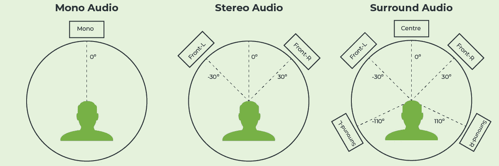
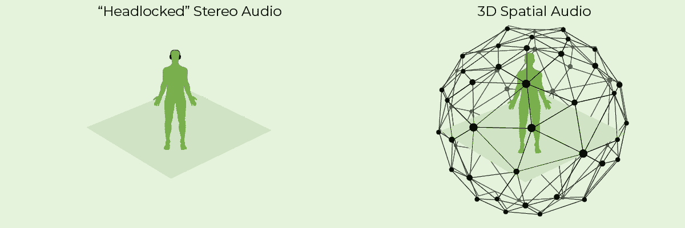

# 面向企业虚拟现实应用的空间音频技术

> 原文：<https://medium.com/codex/spatial-audio-techniques-for-enterprise-vr-applications-1da31c573ab9?source=collection_archive---------30----------------------->

虚拟现实是一项迅速崛起的技术，它有潜力改变我们与世界和彼此互动和交流的方式。随着 AR 和 VR 的全球市场预计到 2022 年将超过 2090 亿美元，具有前瞻性的科技公司开始在这一新兴技术上加大投资也就不足为奇了。

传统上，虚拟现实的大部分注意力都集中在创造视觉上身临其境的体验上，让大脑能够像看待现实世界一样看待虚拟世界。然而，虚拟现实的视觉挑战只是沉浸体验的一个组成部分。音频扮演着同样重要的角色。如果声音与视觉效果不同步，可能会对大脑造成不协调，扰乱用户的沉浸感和整体体验。这就是 3D 空间音频发挥作用的地方。

# 让我们讨论空间音频

尽管“空间音频”在虚拟现实社区中有点时髦，但空间音频的概念实际上已经存在了很长一段时间，包含了许多不同的音频类型。

最基本的是，空间音频只是任何非单声道的音频(即，从一个通道发出)。因此，立体声音频(即在单独的左右声道中录制和混合的音频)可以被视为空间音频。本质上也可以被视为“空间”的其他音频形式包括环绕声和双耳音频。

虽然这些类型的音频确实增加了听者在典型的“锁头”环境(如电影院)中的沉浸感，但不足以获得虚拟现实体验。这是因为当你在虚拟世界中时，你会像我们在现实世界中一样四处走动和观察。如果你听到一只鸟在你左边的树上啁啾，你应该通过你的左耳听到最大的声音。但是如果你把头转向直接看着那只鸟，声音在双耳中会变得同样平衡。这是开发人员在为他们的虚拟现实应用程序创建空间音频时面临的挑战。如果听觉水平和方向不会随着头部位置的微妙变化而改变，它会深刻地影响用户体验。

# 让我们讨论三维空间音频

3D 空间音频的目标是令人信服地将声音放置在三维空间中，以便用户在他们的虚拟现实体验中感觉到声音来自真实的物理物体。虽然在虚拟现实中，你只能看到你正前方的物体，但是空间音频可以在视觉上告诉用户上面、下面、后面和侧面发生了什么。

在空间音频中，与立体声音频不同，声音被锁定在空间中，而不是锁定在您的头部。这允许你在房间里走动，声音将保持锁定在你周围的空间。为了生成空间音频，您必须能够将音频与坐标数据相结合，以提醒系统感知细微的头部运动。

# 想要优势？

实现 3D 空间音频并不容易。然而，像 LiveSwitch 这样的公司提供了两个在你的 VR 应用中创建 3D 空间音频效果的关键优势。

## **优势#1:低级音频数据访问和转换实用程序**

这一优势允许应用程序开发人员通过 RTC 音频管道访问低级音频数据。开发人员可以在音频源中配置音频格式，以便设备能够以他们想要的格式生成数据。为了操纵或监控生成的音频数据，可以在每个音频处理步骤中注册事件处理程序，例如音频源、编码器、打包器、拆包器、解码器和音频接收器。此外，可以使用声音实用程序轻松更改采样速率和通道数，以支持大多数音频转换用例。

## **优势#2: WebRTC 数据通道发送坐标数据**

为了创建 3D 空间音频效果，您需要能够将音频(重新采样为正确的格式)与虚拟世界中用户头部位置的坐标数据相结合。 [LiveSwitch 的](https://www.liveswitch.io/) API 具有强大的数据传输能力，允许它传输任何类型的数据，包括坐标、网格数据(MPEG-4 FBA)、深度、颜色和元数据。该 API 不仅利用了 WebRTC 数据通道，还包含了通过 MCU 和 SFU 连接广播这些数据通道的能力，从而使您能够在多方 VR 通信用例中大大降低带宽和延迟。