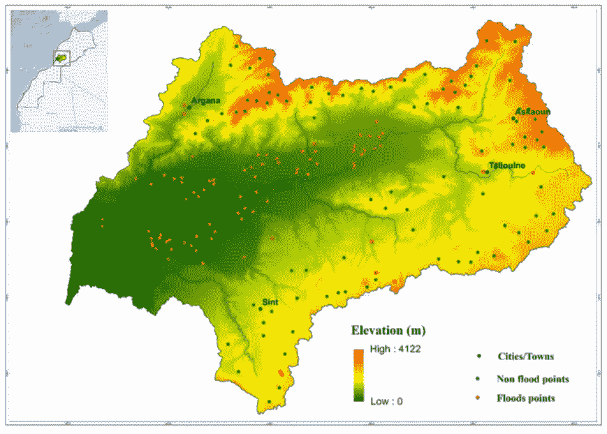
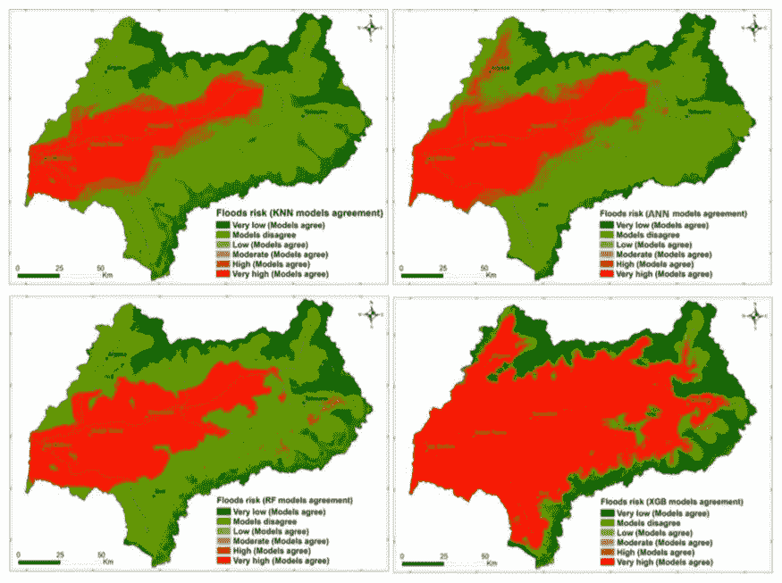
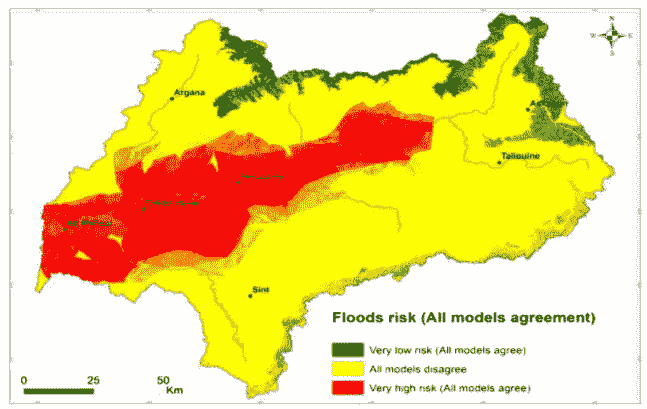

# 基于机器学习算法的洪水易发性空间建模

> 原文：<https://medium.com/codex/spatial-modeling-of-flood-susceptibility-using-machine-learning-algorithms-57a3682ea62c?source=collection_archive---------6----------------------->

图片来自 Unsplash

> 这项研究是我在摩洛哥区域科学协会实验室进行数据科学实习期间进行的，其结果发表在《阿拉伯地球科学杂志》上。
> 
> [在这里阅读发表的论文。](https://drive.google.com/file/d/10qsXjAt7ZzUEDBjjvKcURWKnETlKINOb/view?usp=sharing)

# 1.介绍

洪水是世界上最具毁灭性的自然力量之一。它们对经济有相当大的影响，并可能导致重大的生命损失。由于全球变暖、城市化、流域管理不善、森林砍伐和土地利用变化，摩洛哥洪水的频率和严重程度可能会增加。因此，政府和研究人员有责任确定和实施减灾战略，以减少洪水造成的损失。

一些策略，包括通过先进的数据分析方法进行的研究，已经被采用来抑制这种现象并最终限制伴随的损害。在这项研究中，基于机器学习(ML)算法的四个监督模型被用于绘制摩洛哥南部 Souss 流域的粮食脆弱性地图，该流域在过去十年中记录了无数次毁灭性的洪水。它们包括随机森林、x 梯度增强、k 最近邻和人工神经网络。

# 2.数据和洪水诱发因素

获取数据被认为是这类研究中最困难的方面。然而，多亏了 Souss-Massa 地区水力局(ABHSM ),流域内洪水点的清单数据得以提供。ABHSM 总共提供了 87 个历史食品点。另外 87 个非食物点是从坡度大于 50%的地区随机选择的。假设是，如果坡度大于 50%，它们就是非食物点，因为所有 87 个食物点的坡度都小于 50%。

通过查阅文献，已经选择了许多洪水诱发因素。本研究中确定的因素包括数字高程模型(DEM)、坡向、曲率、到河流的距离、排水密度、流量累积、流向、地质、土地利用、降水、坡度、土壤类型和地形湿度指数。

# 3.结果

评估模型的预测是基于 ROC 曲线的 AUC 值。本研究中采用的 ML 模型表现相当好。事实上，它们的 AUC 值大于 80%。然而，模型准确性和整体性能的差异仍然存在，正如这项研究中的情况。因此，必须对模型结果进行比较，以确定
一致点和不一致点。预测了相同食物易感性等级的地区，具有良好模型一致性的特征。相反，这些模型在预测不同类别的食物易感性方面存在分歧。当所有模型都一致时，结果的不确定性通常较低，而当它们不一致时，结果的不确定性较高。磁化率图被叠加以对模型结果进行空间比较。每个模型类型的四个模型(KNN、人工神经网络、RF、XGB)被叠加以比较它们的结果。

在比较模型结果之前，根据食品风险的概率，敏感性地图被分为五组，包括非常低(0-0.2)、低(0.2-0.4)、中等(0.4-0.6)、高(0.6-0.8)和非常高(0.8-1)。

每种模型的模型结果比较

此外，所有模型都进行了叠加，以确定一致和不一致的地方。

所有模型的模型结果比较

# 4.结论

洪水是世界上最具破坏性的自然灾害之一。在本研究中，比较了基于最大似然算法的模型(包括 KNN、人工神经网络、RF 和 XGB)在绘制苏斯流域食物易感性方面的性能。使用这些模型，充分描述了溢流和调节因素之间的关系。

这项研究的结果证明，摩洛哥的食物敏感性绘图项目有可能使用 ML 模型来完成。事实上，易感性地图可以作为食品管理和减轻这些事件在脆弱地区造成的损害的有用工具。

[在这里阅读发表的论文。](https://drive.google.com/file/d/10qsXjAt7ZzUEDBjjvKcURWKnETlKINOb/view?usp=sharing)