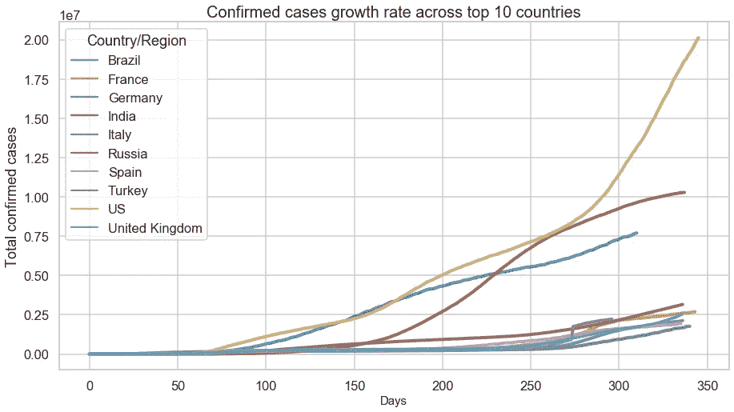

# 用图表说话—新冠肺炎数据

> 原文：<https://medium.com/codex/speaking-with-charts-covid-19-data-b4ea49c6f1a8?source=collection_archive---------14----------------------->

## **新冠肺炎世界数据的数据可视化**

来源: [pixabay](https://pixabay.com/illustrations/covid-corona-coronavirus-virus-4948866/)

自从疫情爆发以来，已经过去了将近一年。在这段时间里，我确信我们每个人都经历了许多变化，无论是个人还是职业。当我们进入新的一年(2021)，让我们希望事情会变得更好。

对于数据爱好者来说，时间越长，数据越多。现在我们有了一年的新冠肺炎数据，分析疫情在不同国家的表现会很有趣。俗话说‘一图胜千言’，让我们开始通过一些可视化图表来看数据。

我们将使用 Python 中的 seaborn & matplotlib 来创建绘图。下面添加了代码片段作为参考。请参考最后提供的 git 路径来访问完整的代码。

# **新冠肺炎字数据**

约翰·霍普金斯大学提供的数据用于本案例研究。细节在最后提供。对于本案例研究，数据是在 2021 年 1 月 2 日下载的。

# **数据预处理**

输入的 COVID 数据文件包含从 2020 年 1 月 22 日开始一个国家每天的病例数。这些档案被分为确诊病例、康复病例和死亡病例。

样本原始数据如下所示

表作者。原始数据——确诊病例

表作者。原始数据——确诊病例

下面的代码片段将读取这些原始数据文件并进行预处理。以下已完成

1.  读取原始数据文件
2.  仅保留所需的行和列
3.  根据这些数据创建简化的数据框架——按国家和日期排序。

在输入文件上运行代码后，创建了 3 个数据帧

样本输出:按国家排序的确诊病例(按作者排序的表格)

示例输出:按日期排序的确诊病例(按作者排序的表格)

示例输出:添加了总计数的原始数据(按作者列出的表格)

以上数据帧是确诊病例数据文件的样本。使用恢复和死亡数据文件创建类似的数据帧。然后将各个数据帧合并，以在单个数据帧中获得确认、恢复和死亡的数据。

一旦创建了简化的数据框架，我们就可以通过绘制一些数据可视化图表来开始研究数据了。

# **数据可视化**

## **哪个洲最安全？**

作者图片

欧洲确诊病例最多，占全球报告病例总数的 28.5%

澳大利亚目前看起来是最安全的地方，占报告病例总数的 0.1%

## 病例在国家间传播的速度有多快？

这里，根据报告病例总数确定了前 10 个国家。这些国家中每一个国家报告第一个病例的那一天被认为是第一天。

对这些国家的病例增长率进行了比较。

作者图片

如图所示，病例增长最快的是美国，其次是印度。对于德国、英国、西班牙等国家来说，病例增长的速度似乎得到了更好的控制。但这也可能是因为像美国和印度这样的国家人口较多。

# 前 10 个国家每月报告的病例

接下来，我们将比较前 10 个国家的病例逐月增长情况。

作者图片

在这里，我们使用案例数的对数归一化绘制了热图。这是因为前几个国家报告了大量病例，这使得我们无法分析其他国家的进展情况。使用对数标度使图表更具可读性。

从热图中可以看出，美国的增长率很高，其次是印度和巴西。

这周过得怎么样？

我们可以通过比较每天报告的确诊、痊愈和死亡病例数来分析上周的数据。

作者图片

## 北美还是拉美？哪里报告的病例更多？

分区一级有数据。分析这些数据可以了解病例在不同地区的分布情况。

作者图片

## 去年报告的案件

来自 3 个不同输入文件的数据被合并并按日期排序。这可用于获得每日和累计计数的案例概览。

作者图片

作者图片

峰值中看到的一些波动是由于发生的数据修正(例如:2020 年 12 月 14 日)

每日病例显示报告的计数有所上升和下降。根据一周中的某一天来检查是否有季节性是很有趣的。这也可能取决于每个国家如何报告病例数(每日或一周开始或一周结束)。

# 结论

使用可视化图表，可以从数据中获得多种见解。在本文中，我们介绍了一些基本的可视化。使用这些数据可以得出更多的分析和见解。

# 数据源和代码

数据定期更新，最新的数据集可以从下面的链接下载。

世界:[https://data . hum data . org/dataset/novel-coronavirus-2019-ncov-cases](https://data.humdata.org/dataset/novel-coronavirus-2019-ncov-cases)

*   time _ series _ covid 19 _ confirmed _ global _ iso 3 _ regions . CSV
*   时间序列 _ covid19 _ 死亡人数 _ 全球 _ iso3 _ 地区. csv
*   time _ series _ covid 19 _ recovered _ global _ iso 3 _ regions . CSV

请随意下载截至今天的最新数据集，并开始探索。

转换原始数据并生成上述图表的代码可从这里获得:[https://github.com/Lakshmi-1212/Covid19_EDA](https://github.com/Lakshmi-1212/Covid19_EDA)

# 放弃

本文的范围仅限于阅读原始数据并从中创建一些基本的可视化图表。这只是出于教育目的，并不打算对情况做出任何结论/预测。