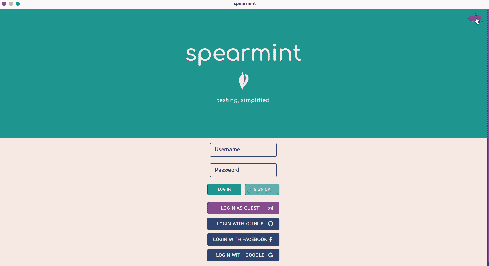
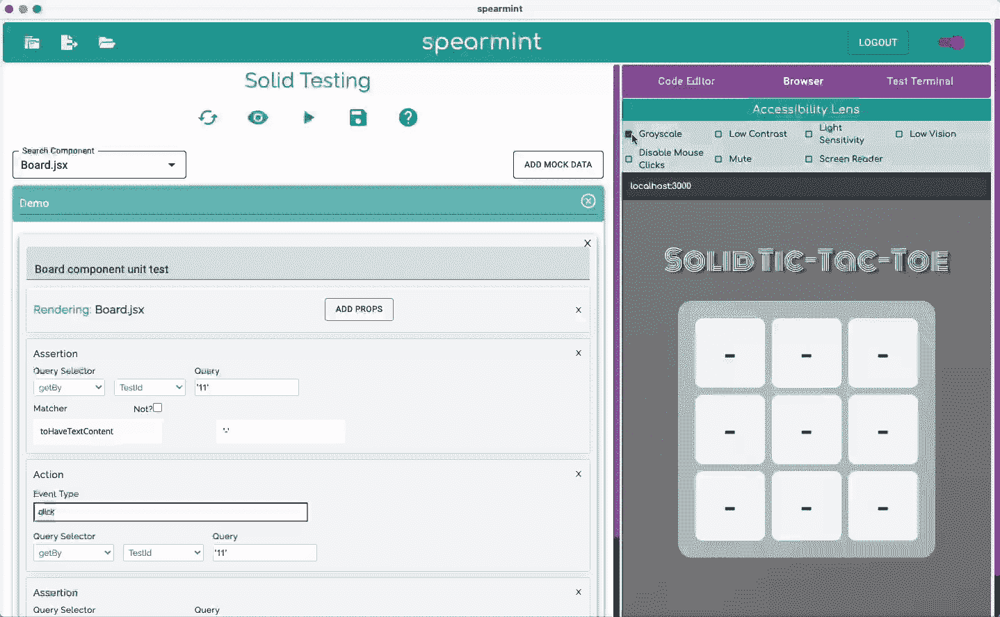
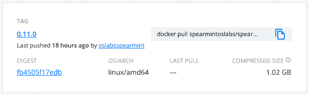
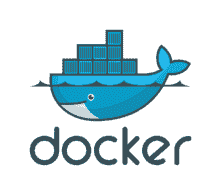

# Spearmint v0.11.0 具有 Solid.js 测试和 Docker 容器化功能

> 原文：<https://medium.com/codex/spearmint-v0-11-0-features-solid-js-testing-and-docker-containerization-40715327b4c1?source=collection_archive---------20----------------------->

*作者:Chacta Brice、李成、Yeunha Kim、Eric Komatsu、Anjanie McCoy*

***测试驱动开发***

测试驱动开发，通常称为 *TDD，*是软件开发过程中的一种方法，旨在预测、定位和修复新功能中的潜在错误或缺陷，然后再将任何冲突引入生产级代码库。通过预先捕捉错误，这个过程可以节省开发人员和公司的时间和金钱，但是实现可靠的和可重用的测试也是非常耗时和乏味的。因此，开发人员有时会放弃和拖延前期制作过程中的这一重要步骤。尽管测试不是创建应用程序最令人满意或最有趣的部分，但它确实为开发团队提供了急需的安心和保证产品可行性的可靠方法。

***留兰香 v0.11.0***

Spearmint 是一个开源的开发工具，它既了解测试的重要性，也了解开发人员使语义测试的实现快速、简单和一致的需求。Spearmint 通过为开发人员提供一个直观的 GUI 来实现这一点，该 GUI 可以帮助为您的应用程序快速创建各种各样的测试。以前版本的 Spearmint 提供了一个强大的各种测试套件平台，包括对 GraphQL、Svelte、Redux、可访问性、安全性、端点、木偶师、Vue、React 和 React-Hooks 的测试。随着 Spearmint 的最新版本 0.11.0 的发布，Spearmint 团队很高兴地宣布为 **Solid.js** 库引入一个新的测试套件。除了这个新特性，也许最值得注意的是，Spearmint v.0.11.0 更新还通过 Docker 的容器化解决了 Windows 和 Linux 用户以前的操作系统兼容性问题。这意味着在任何操作系统上工作的软件工程师现在都可以享受使用 Spearmint 作为开发工具的好处。

[https://www.spearmintjs.com/](https://www.spearmintjs.com/)

***Solid.js***

Solid.js 是一个声明性的前端 JavaScript 库，它与 React、Angular 和 Vue 有许多相似之处，但它的区别在于它没有虚拟 DOM。与 React 不同，Solid.js 抛弃了虚拟 DOM，直接与 DOM 交互。Solid.js 通过只渲染组件一次，然后只在明确指示时更新其依赖项来实现这一点。这种一次性渲染概念的结果是一个更轻量级的包大小和一个更高性能和反应性的应用程序界面。尽管 Solid.js 有许多很棒的特性，在用户群中也有很高的满意度，但它的用户和工具社区仍然相对较小，尽管在不断增长，这使得将 Spearmint 引入 Solid.js 生态系统是一项有意义的工作。随着 Solid.js 新加入到 Spearmint 平台，Spearmint 团队旨在帮助 Solid.js 作为主要 JavaScript 库的扩展，同时使从熟悉的 js 框架/库到 Solid.js 的过渡更加顺畅。

[https://www.spearmintjs.com/](https://www.spearmintjs.com/)

***码头工人***

在以前版本的 Spearmint 中，操作系统兼容性是一个主要的问题，因为 Spearmint 只有在 macOS 上运行时才可靠。因为不是所有的软件开发人员都在 MacOS 环境中工作，所以提供一个与 OS 无关的应用程序是很重要的。这一直是应用程序中的一个关键弱点，也是当前更新推出的焦点，这就是为什么我们很自豪地通过使用 Docker 容器化提供一个可以在 Windows 和 Linux 上运行的版本🐳通过 Docker 运行 Spearmint 的详细说明可以在我们的文档中找到。

[https://hub.docker.com/r/spearmintoslabs/spearmint](https://hub.docker.com/r/spearmintoslabs/spearmint)

2013–2021 Docker，Inc .保留所有权利。

***潜在未来更新***

在 Spearmint v0.11.0 上工作时，Spearmint 团队同意以下更新和改进将最好地改进 Spearmint 作为一个开发工具。

*   ***祖斯坦测试***

随着 Spearmint 的成长和继续成长，每次版本更新时，通常会向平台添加至少一个新的测试套件。通过此次更新和之前的更新，Spearmint 已经开始成为测试技术主食的一站式商店，如 React 和 Redux，但它也成为不太知名和更新的新兴技术的家园，如 Svelte 和 now Solid.js。这就是为什么引入 Zustand，Redux 的状态管理替代方案，将是 Spearmint v0.12.0 的完美选择。

*   ***在 TypeScript 中导出 JavaScript 文件***

随着 JavaScript 作为前端和后端编程语言的流行和使用的增加，实施强类型语言范式的需求也在增长。TypeScript 是这个问题的答案，因此，未来对 Spearmint 的更新和改进应该通过将 TypeScript 测试作为一个新特性来填补这个空白。

作为在技术加速器[操作系统实验室](https://opensourcelabs.io/)下开发的开源产品，我们欢迎并鼓励任何反馈或贡献。更多信息请访问我们的网站:[留兰香](https://www.spearmintjs.com/)|[GitHub](https://github.com/open-source-labs/spearmint)|[LinkedIn](https://www.linkedin.com/company/spearmintjs/)

***与兰香 v0.11.0 团队取得联系:*** Chacta Brice |[GitHub](https://github.com/StaticShock93)|[LinkedIn](https://www.linkedin.com/in/chacta-isaacs-brice-258636ba/)|
李成|[GitHub](http://github.com/delacour124)|[LinkedIn](http://linkedin.com/in/li-cheng-76890540)|
Yeunha Kim |[GitHub](https://github.com/yeunhakim93)|[LinkedIn](https://www.linkedin.com/in/yeunhakim93/)
Eric Komatsu |