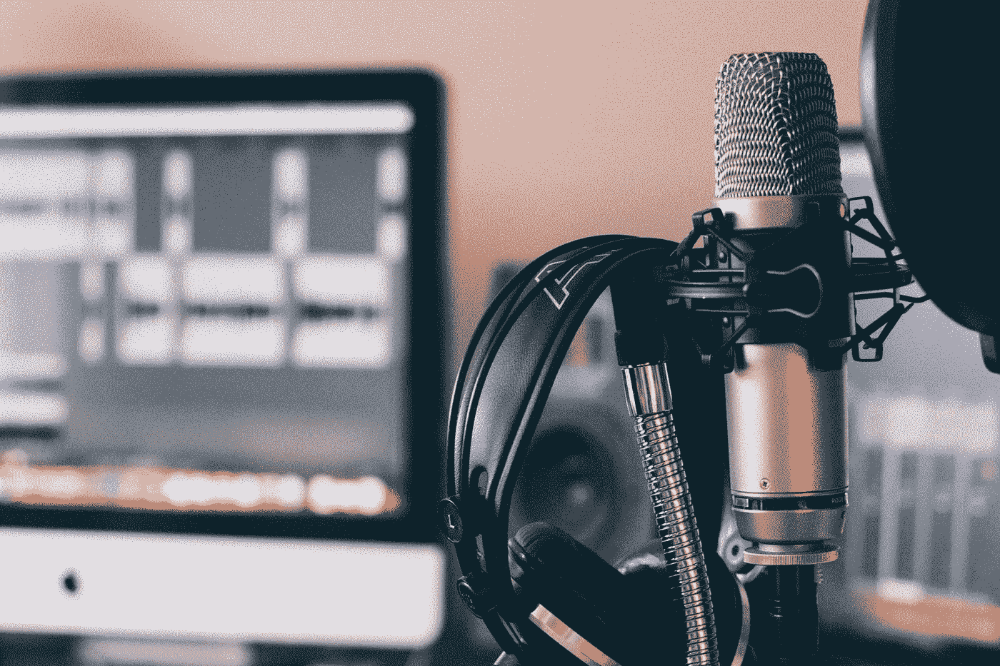
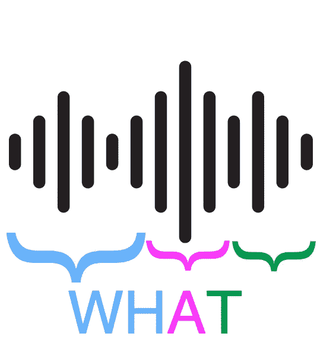
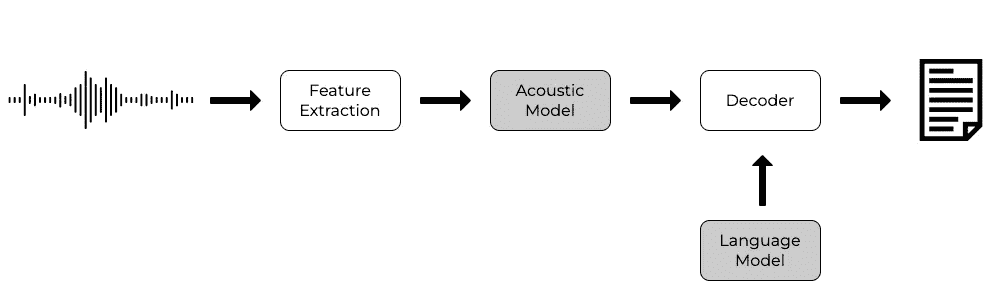

# 语音识别 101

> 原文：<https://medium.com/codex/speech-recognition-101-c739e0b40051?source=collection_archive---------8----------------------->

## 自动语音识别概念及其应用简介

威尔·弗朗西斯在 [Unsplash](https://unsplash.com/photos/ZDNyhmgkZlQ) 上的照片

使用语音资源的工具，如 Siri、Alexa 和谷歌语音，一直在改变人们与汽车、家庭和工作中的设备进行交互的方式。因此，这种增长也扩大了分析用户数据的可能性。

通过与设备交谈，发出命令，数据被收集，可能性是无限的，例如通过规定他们的年龄、性别和口音来理解与设备交谈的人，或者通过他们的声音或他们使用的词语来理解他们的情绪。

此外，有可能改进模型，以更好地理解所有类型的声音和词汇。[这个视频](https://www.youtube.com/shorts/D_d7P1eVDPk)是一个可以做出改进的明显例子。

我在这里试图表达的是，这种类型的数据非常有价值，可以帮助改善用户体验——通过更好地理解他们，甚至用让他们更舒服的回答来回答他们。

但是要做到这一切，最重要的是要理解语音识别算法如何处理音频数据(特征提取)，它们如何工作以及如何在现实世界中应用这些技术。

这是一篇介绍大型复杂主题的文章。

## 语音识别算法如何处理音频数据(特征提取)

首先，重要的是要理解音位的概念。音素，正如剑桥词典所定义的:

> "使一个单词不同于另一个单词的最小语音单位之一"

它是演讲的最小单位。为了理解语音，算法必须从语音中“切割”出音频波，以匹配其书面形式。在下图中，一个被切片的波形草图代表了计算机及其算法对此类数据的理解。

音素的表示[图片由作者提供]

在针对 Siri 的语音中，例如短语“明天天气如何？”，算法必须首先将这种波转换为它可以理解的东西，例如书面文本(使用其他算法来“理解”并响应它，但我们不在这里深入探讨)。

## 语音识别算法如何工作

在建立了音位的概念之后，重要的是要理解算法如何决定什么是正确的书写形式，以与形成语音的这组波形片段相联系。有两种主要类型的算法:一种基于一组规则(基于语言规则)，另一种基于神经网络。

在第一种算法中，基于一组规则，在特征提取(“分割音频”)之后，声学模型用于根据语言将音频特征映射到音素中——验证一个音素与前一个音素相邻的统计概率。之后，使用声学和语言模型，解码器搜索与输入特征最匹配的单词序列，同时验证由模型语言确定的统计概率。这样，输出就形成了一组匹配(或试图匹配)输入语音的单词。下图显示了该规则的管道。

这种算法需要声学模型和语言模型，这些模型必须根据语言的语法和规则预先建立。

统计语音识别模型[图片由作者提供]

第二种算法是神经网络。这种类型的算法是由大量的数据提供的，神经网络基本上从统计上理解了波形成为书面形式的概率。在这种情况下，数据越多越好。如今，这是获得最佳结果的算法。

## 如何应用语音识别技术

如您所料，在现实生活中，这些算法在应用程序中的实现和使用会变得非常复杂。从零开始构建算法非常有趣，但市场上有一些工具可以提供企业的必需品(也有一些免费选项)。我将在下面简要描述这些工具，根据我之前所做的工作，使用葡萄牙语的音频实例与当时(2022 年 3 月)的定价进行比较。

*   **wit . ai**:Meta 提供的开源免费自然语言处理服务。这个工具具有相对较高的质量，是免费的(即使是对企业)服务。用这个工具转录 10 秒的平均时间是 2，31 秒。
*   **亚马逊转录**:AWS 在其云端提供的付费服务。这个工具也有相对较高的质量，但它很贵(每小时转录 6.42 美元)。用这个工具转录 10 秒的平均时间是 17，56 秒。
*   **Azure 语音服务**:Azure 提供的付费服务。这是一项低价云服务——每小时转录 1.13 美元。此外，这种云为首次在其平台上测试其工具的人提供了预算——能够在一段时间内免费测试该工具。转录 10 秒，这个工具大约需要 2，14 秒。
*   **谷歌云语音 API** :谷歌云平台提供的付费服务。这个工具质量很好，但是最贵(每小时转录 6.57 美元)。这种云也为第一次尝试的人提供了一个免费层，可以免费测试服务。转录 10 秒，这个工具大约需要 2，25 秒。
*   **Vosk API** :这是一个开源的 python 库，包含了一些可用的统计模型(你也可以替换它们)。质量非常低(很大程度上取决于型号，我使用的是他们提供的葡萄牙语版本)。录制 10 秒音频的平均时间是 0.59 秒，但由于它是在本地运行的，所以很大程度上取决于硬件。

此外，对于这些工具/服务中的每一个，都有一个 python 库，而且还有一个将它们集中在一起的库:语音识别。我发现这个图书馆理解起来更快，但是比官方图书馆的文档更少。

在适当的环境下，所有这些工具都很棒。

在本文中，我介绍了一些基本概念来理解语音识别算法、基本模型以及如何应用它们。此外，还列举了一些工具及其优点作为应用语音识别技术的手段。

很快，我将写下我应用这些工具的经历，并描述如何衡量一个算法的成功。

*我是 Aline，这篇文章的作者。找到我* [*这里*](/@alinerguio) *和* [*这里*](https://www.linkedin.com/in/alinerguio/) *！*