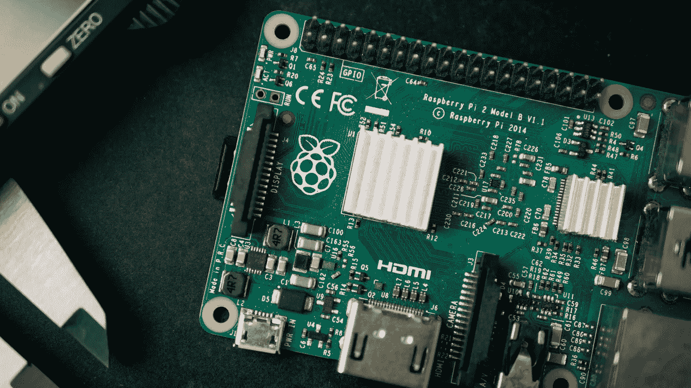

# 加快您的树莓 Pi 配置

> 原文：<https://medium.com/codex/speed-up-your-raspberry-pi-configuration-1de16f894de8?source=collection_archive---------6----------------------->

哈里森·布罗德本特在 [Unsplash](https://unsplash.com/s/photos/raspberry-pi?utm_source=unsplash&utm_medium=referral&utm_content=creditCopyText) 上的照片

# TL；速度三角形定位法(dead reckoning)

这篇博文描述了如何用一个简单的自动化配置工具来加速你的 Raspberry Pi 项目。

# 许多 DYI 项目的基础

在 Raspberry Pi 4 之前，每当我想在 Linux 机器上尝试一些东西时，我都会在我的小型英特尔 NUC 上创建一个虚拟机。这很容易，设置是…