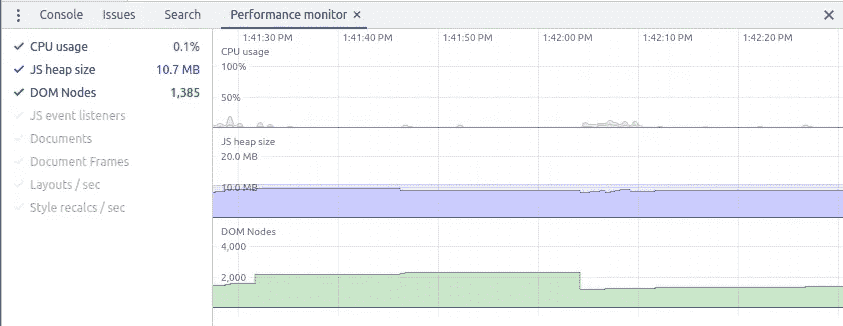
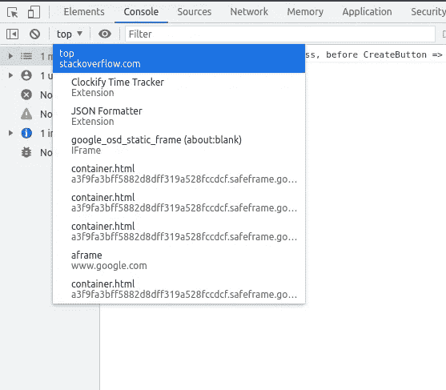

# 使用 Chrome 的性能监视器加速你的(js) React 应用

> 原文：<https://medium.com/codex/speeding-up-your-js-react-app-using-chromes-performance-monitor-8f77cdaecce9?source=collection_archive---------5----------------------->

由 [Jametlene Reskp](https://unsplash.com/@reskp?utm_source=medium&utm_medium=referral) 在 [Unsplash](https://unsplash.com?utm_source=medium&utm_medium=referral) 上拍摄的照片

W 我想在这里谈论的是谷歌 Chrome 的实时监控工具——[性能监控](https://developer.chrome.com/blog/new-in-devtools-64/#perf-monitor)，它的指标以及如何理解它们。尽管它已经出现了很多年，但我很少听到有人谈论这个有用的控制台小工具，这可能是因为我们需要对 javascript 有深入的了解，才能根据我们从这个工具获得的指标得出结论。

简而言之，Performance Monitor 为我们提供了一个监控界面，通过该界面我们可以很容易地看到

*   CPU 使用率，
*   我们当前的堆大小，
*   我们大教堂的大小，
*   事件侦听器的数量，
*   文档，
*   文档框架，和
*   每秒的布局数量和
*   每秒重新计算的样式。

但是这些指标到底告诉我们什么呢？没有上下文，数据是没有用的，所以我将试着检查下面的这些指标，希望对这个鲜为人知的、丰富多彩的界面有所启发。我主要是一名 React 开发人员，所以我将在适用的地方使用 React 世界中的例子。

# CPU 使用率

一个 javascript 应用不应该对你的 CPU 造成很大的负担。你的应用程序最有可能在互联网上找到，并且可以通过手持设备访问，所以如果在正常的应用程序使用过程中，你的使用率飙升，你可能在优化代码方面做得不好。

你可能正遭受着[内存泄漏](https://auth0.com/blog/four-types-of-leaks-in-your-javascript-code-and-how-to-get-rid-of-them/)的困扰，或者你可能试图一次制作太多的动画——如果你不是为了在[awwwards.com](https://www.awwwards.com/)上获得一个位置，你可能做得太过了。

从更具体的 React 方面来说，确保你已经对你的长长的数据列表进行了虚拟化，并寻找可以从挂钩中受益的地方。有时你会用不必要的重新渲染来触发布局和样式的重新计算(这会耗费 CPU 时间)。

关于`useMemo`和`useCallback`钩子——**确保你选择有性能优势的地方**，而不是一直使用它们，因为你可能会给代码增加不必要的复杂性，最终达到相反的性能提升效果。

# JS 堆大小

如果你查阅计算机科学对“堆”的定义，你会发现它是一个[优先级队列](https://en.wikipedia.org/wiki/Priority_queue)，用于运行时应用的**内存管理**。

基本上，你为你的对象分配一些内存，你使用分配的内存(读/写)，并且(在高级编程语言中)一个垃圾收集器释放那个内存地址供进一步使用。如果你觉得这很复杂，我有好消息告诉你。javascript 中的垃圾收集是完全自动化的，截至 2019 年，无法在您的 js 应用程序中显式触发垃圾收集。

*那么，我们为什么还要讨论这个指标呢？*

嗯，尽管我们的 v8 引擎的自动垃圾收集算法很好，但它不会保护我们免受内存泄漏的影响。如果您发现您的 [RAIL 模型](https://web.dev/rail/)不可靠或失败，请加快性能监视器的速度，找出是什么交互导致堆开始堆积。大堆和高 CPU 使用率必然会导致明显的糟糕用户体验。

这里可以直接完成的事情不多(特别是如果你已经进行了一些已经让 CPU 窒息的优化)，但是一些好的实践可以走很长的路，特别是在长时间运行的项目上。意识到你的变量和函数的生命周期。了解析构数组和对象做什么，了解如何深度复制一个对象以避免引用它(提示:这允许它从堆中被垃圾收集)，并了解什么是[作用域和闭包](https://github.com/getify/You-Dont-Know-JS/tree/1st-ed/scope%20%26%20closures)。哦，一定要很好地掌握应用程序中的异步活动。尽管你可以在不太了解这些东西的情况下完成大多数项目，但是当你进入企业级时，对细节的关注就会越来越少。*也就是说*，做这些微优化可能不会像在你的应用程序中寻找高级策略的替代方案那样有效(如何以及何时加载数据，多少 DOM 节点对你的用户体验是必要的，你正在使用哪些包，以及它们是否可以被替换或从流程中删除……等等)。

如果您想超越性能监视器，[创建堆快照](https://developer.chrome.com/docs/devtools/memory-problems/heap-snapshots/)是分析失控堆的一个好方法。

这里需要注意的一点是，大堆不一定是问题，堆的大小会被监控，看是否会持续增加。增长但随后收缩的堆是被垃圾收集的“健康”堆。**堆的稳定增长模式表示需要处理的内存泄漏**。

# DOM 节点

过大的 DOM 树大小将对您造成严重影响，最常见的是在网络效率和负载性能方面，其次是运行时和内存性能。

如果你正在使用 React，确保你使用像 [react-window](https://github.com/bvaughn/react-window) 这样的窗口库来虚拟化你的长列表(我们已经讨论过这个)或者考虑顺序加载你的数据(分页或者无限滚动)——**你不需要所有的 DOM，所有的时间**。你的 DOM 需要主动人群控制。

塞萨尔·卡里瓦里诺·阿拉贡在 [Unsplash](https://unsplash.com?utm_source=medium&utm_medium=referral) 上的照片

利用[代码分割](https://reactjs.org/docs/code-splitting.html)和/或考虑延迟加载 DOM 的一部分。

# JS 事件监听器

事件侦听器是将处理函数注册到与 DOM 元素的交互中的一种方式。除了像 *click* 、 *hover* 和 *keyup* 这样的几个最爱之外，你会惊讶有多少[事件监听器](https://www.w3schools.com/jsref/dom_obj_event.asp)可用。

你想要的是在你的页面上总是有最少的事件监听器，除了减少你的 DOM 大小，如果你正在处理 React，你可能想要利用`useEffect`钩子的清理功能。使用一个空数组作为`useEffect`钩子的依赖数组，在组件挂载时添加一个事件监听器，并且在清理函数中始终将`addEventListener`与`removeEventListener`配对。当一个组件被卸载时，在每次重新渲染之前运行清理功能(是的，这是一件好事)。

*说到事件监听器，向 DOM 节点的事件监听器添加异步任务肯定会导致内存泄漏……*

最后，考虑减少屏幕上 DOM 节点的数量，因为事件侦听器总是链接到元素。

# 文档

请求和呈现并仍保存在内存中的文档类型资源和 iframes 的数量(不进行垃圾收集)。如果您的堆很大，您可能需要研究一下这个问题。如果您发现文档的数量“不多”,您最好查看 DevTools 的时间线/性能面板，以确定您可能提前请求的资源，或者在使用后保留的资源。

你也可以使用 DevTools 下载[。har](https://en.wikipedia.org/wiki/HAR_(file_format)) 文档并在其中搜索“_ resource type”:“document”以详细命名和隐藏。这些。har (http archive)文件是浏览器与网站交互的详细记录，通常用于识别性能问题，如瓶颈和加载时间缓慢，以及页面呈现问题。

# 文档框架

页面中仍保存在内存中的文档框架数(不进行垃圾收集)。查看 DevTools 中的源代码面板或查看控制台的左上方…

控制台执行上下文下拉列表

…查看可用的文档框架。每个框架都是一个空间，您可以在其中加载新资源和执行脚本。很多时候，第三方服务会要求你在主文档中插入另一个框架。**确保你绝对知道哪些框架在你的页面上，出于什么原因**。这些是恶意用户执行潜在不安全脚本的绝佳场所。

# 布局/秒

运送一个框架到屏幕上。原图可以在[这里](https://developers.google.com/web/fundamentals/performance/rendering/avoid-large-complex-layouts-and-layout-thrashing)找到。

布局事件是浏览器读取页面及其附加样式并确定 DOM 元素的大小和位置的地方。将渲染帧传送到浏览器屏幕的这一步称为布局(不仅适用于 Chrome，也适用于 Opera、Safari 和 IE)。正如所料，**大量的 DOM 节点会影响你布局的速度**。您希望尽可能减少页面中的布局事件。

对元素的宽度、高度或位置(上、右、下、左)的更改将触发布局。

你最好使用 flexbox ，因为它比旧的布局方法更快。

就 Javascript 而言，请记住样式读取是在帧的开始处完成的。以编程方式添加一个类，然后读取(例如)DOM 元素的高度，会产生另一个通常不必要的布局。

另外，想象一下设置一组段落的高度。遍历 DOM 元素列表并为每个元素设置一个样式值将触发所谓的*强制同步布局*，**每个元素一次**。这叫做*布局去垃圾*。为了避免这种情况，你可以使用一个像 [fastdom](https://github.com/wilsonpage/fastdom) 这样的(框架不可知的)库，它通过批处理你的风格读和写来帮助你，有效地去除你要扔掉的布局。

# 样式重新计算/秒

该指标通常与每秒的布局数量无关。

> 通过添加和删除元素、更改属性、类或动画来更改 DOM，都会导致浏览器重新计算元素样式，并且在许多情况下，会重新布局(或重排)页面或部分页面。这个过程称为计算式计算。

正如上面 Paul Lewis[所说的，当你的样式每秒重新计算的速度高到足以阻塞 CPU 或 GPU，导致你的动画断断续续，整体用户体验低于可接受的阈值时，这些都是要注意的场景。不，“可接受的阈值”并不像你想的那样主观。我已经提到了](https://developers.google.com/web/resources/contributors/paullewis) [RAIL 模型](https://web.dev/rail/)——如果你正在处理用户界面的性能，它是非常值得探索的。

你可以从实现一些最佳实践开始，比如为你的 CSS 使用 [BEM 命名约定](http://getbem.com/naming/)并尝试修剪不必要的 DOM 元素——简化你的 HTML 将减少必要的样式重新计算。

# 结论

我在这里试图实现的只是对性能监视器跟踪的内容的简单概述，以及一些基本的常识性见解，可以帮助您开始实际使用它。知道每个指标代表什么只是问题的一半。在全面的应用环境中，知道如何做是另一回事。阅读 Chrome 提供的所有不同工具——了解你的浏览器如何工作，以及一些常见类型的 npm 包利用什么是真正控制你的应用程序架构并做出明智决策的唯一方法。老一套的“我以前这样做过”本身就是一个拙劣的论点。做你的研究。

由 [Lucas Vasques](https://unsplash.com/@luvqs?utm_source=medium&utm_medium=referral) 在 [Unsplash](https://unsplash.com?utm_source=medium&utm_medium=referral) 上拍摄的照片

*此外，如果您认为您对我可能遗漏或误解的性能监控指标有一些见解，请在评论中自由讨论——这个主题非常广泛，可以通过多种方式进行讨论。如果你想拓展人脉或者只是扩大人脉——你可以在*[*Twitter*](https://twitter.com/SNimcevic)*和*[*LinkedIn*](https://www.linkedin.com/in/sini%C5%A1a-nim%C4%8Devi%C4%87-5b438996/)*上找到我。*