# Splunk:使用 Splunk Enterprise 创建分析仪表板

> 原文：<https://medium.com/codex/splunk-creating-analytical-dashboards-with-splunk-enterprise-7b2f14ce1ed7?source=collection_archive---------7----------------------->

## 使用 CSV 数据在 Splunk 中执行快速 EDA 和构建优雅仪表板的初学者指南


杰斯·贝利在 [Unsplash](https://unsplash.com?utm_source=medium&utm_medium=referral) 上的照片

这是商业世界中分析仪表板的全盛时期，每个正式或非正式的演示都从令人愉悦的视觉效果中受益匪浅。然而，处理大量的数据，甚至从统计学的角度探索数据，都是一件费时费力的事情——更不用说从数据中创建可视化了。尽管有其他更受欢迎的替代产品，Splunk 为那些不希望浪费时间学习新框架或编程语言的人提供了一个体面而简单的工具，因为他们可以制作漂亮的仪表板并获得令人印象深刻的见解。

Splunk 在日常使用中并不是很多人熟悉的东西。然而，在使用它之后，很容易看到它的数据连接性、简单易用的 UI 和基本的分析工具对于一些快速的数据分析是多么有用。

## 为什么选择 Splunk？

在创建正式报告或在数据分析和可视化方面具有更大灵活性时，Python 和 Tableau 肯定更受欢迎。Tableau 提供了快速的数据处理和交互式 ui，而 Python 中的 Seaborn 或 Plotly 等库在图形实用程序方面提供了更多的灵活性。另外，后者可以很容易地与基于 Python 的 web 应用程序集成。

然而，对于许多人来说，如果您还没有在几个项目中使用过这两种工具，那么它们都需要大量的反复试验。此外，Splunk 是希望有更多选项直接从 TCP/UDP 端口、云平台、本地数据库或 API 加载数据集的企业的理想选择。除此之外，它支持大量的文件格式直接上传。这些功能有助于简化数据管理过程，而不会占用昂贵的内存资源。

# Splunk 企业版

开始使用 Splunk 的最简单方法之一是使用 Splunk Enterprise。Splunk Enterprise 是 Splunk 提供的产品之一，用于加载、搜索、分析和可视化个人数据。使用 Enterprise 的一个主要优点是它支持从各种资源加载数据，并且对于一些业余分析和仪表板生成来说很简单。

[从此链接安装 Splunk Enterprise】。在此页面上，您必须:](https://www.splunk.com/en_us/download/splunk-enterprise.html)

1.  创建 Splunk 帐户
2.  根据您的操作系统下载软件包

对于本教程，我们使用 **Splunk 8.2.6** 。在 Windows 10 操作系统上。

值得注意的是，Splunk Enterprise 是一项付费服务。虽然不建议为这样的服务付费，除非对你的组织绝对必要，但经历试用期以完成你的短期项目是值得的。默认情况下，激活期间会激活免费试用选项，但是安装 Splunk 后，您可以将其更改为免费层。

接下来，默认安装可能会要求您为 web 服务器创建登录凭证。对于 Splunk 企业版(非 Splunk 免费版)，您将在每次打开 Splunk 企业版时使用它登录到 Splunk 本地服务器。正如 Splunk 免费网页上提到的，Splunk 免费不会创建不同的用户，因此它不需要个性化的凭据来访问本地服务器。

安装完成后，您可以直接启动 Splunk web 服务器。或者，对于 Windows，您可以从“开始”菜单转到“服务”，查找“Splunkd 服务”并从那里启动它。该服务通常运行在本地主机 8000 上。

# 使用 Splunk 企业版

主页看起来会像这样

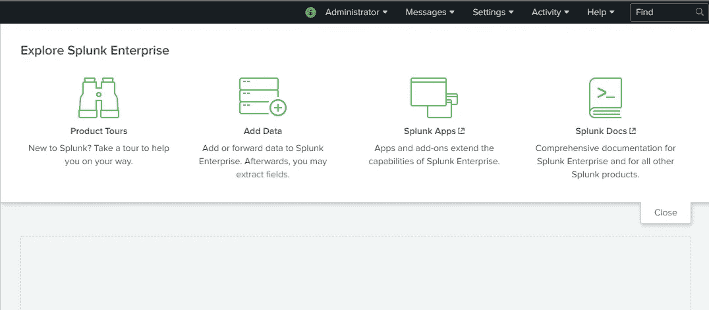

作者图片

任何数据分析项目的第一步总是加载和探索数据。

为了简单起见，我们将只探索从您的计算机上传数据文件的选项。或者，为了熟悉 Splunk，您也可以使用 Splunk 提供的许多默认数据集之一。

## 使用默认数据集

从登录页面转到“搜索和报告”窗口。

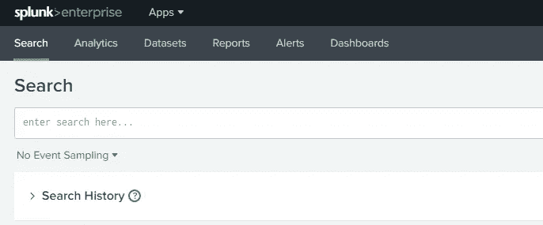

作者图片

切换到*数据集*选项卡，查看可用的数据集。这个版本的 Splunk 有 33 个数据集，我们将从中选择芝加哥犯罪数据集( *chicago-crime.csv* )。选择它将加载数据集的预览，如下所示。

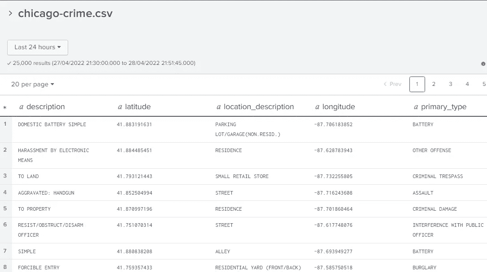

作者图片

从右上角开始，进入搜索中的探索->调查，开始分析过程。

## 从您的计算机加载数据集

您可以从登录页面的“添加数据”部分访问此选项。

为了保持这个博客的一致性，我从官方网站下载了更大的芝加哥犯罪数据集: [Crimes — 2001 年至今](https://data.cityofchicago.org/Public-Safety/Crimes-2001-to-Present/ijzp-q8t2)。你可以去 data.cityofchicago.org[网站](https://data.cityofchicago.org)找到“公共与安全”下的犯罪数据集。前一个数据集的 CSV 文件大小约为 39MB。根据您选择的数据，我建议删除列标题中的空格，以使查询更容易。

1.  上传文件，然后点击“下一步”。
2.  在“设置源类型”部分，将源类型设置为“csv ”(如果尚未设置)并在“时间戳”下将提取设置为“当前”。确保“另存为”并设置任意名称。
3.  在下一节中，通过设置一个简单的索引名(如“chicagocrime ”)来创建一个新索引。
4.  审核并提交。

# 查询数据集

从现在开始，我们将使用 Splunk 中提供的默认 *chicago-crime* 数据集。选择“在搜索中调查”后，我们会看到如下所示的搜索&报告屏幕。

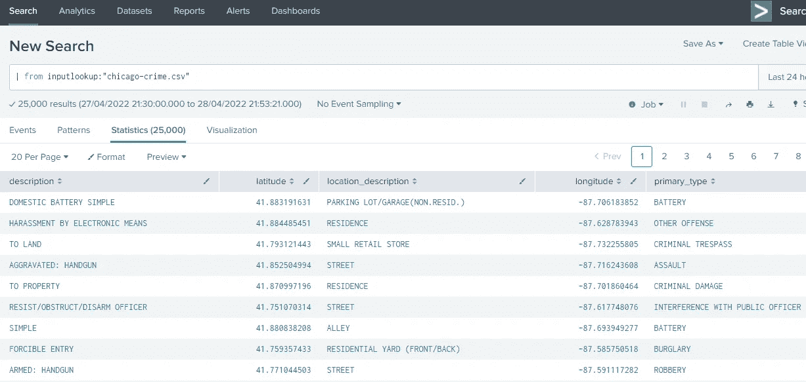

作者图片

在这个屏幕上，有一个搜索栏来编写查询，下面的一组窗格显示结果。用于聚合、选择、过滤等搜索查询。结果将显示在统计窗格中。为了简单起见，我们不要探究事件或模式窗格。

关于查询关键字的快速指南，请参考这里的[文档页面](https://docs.splunk.com/Documentation/SplunkLight/7.3.6/References/Listofsearchcommands)。我们现在将探索一些基本的查询。

**显示整个数据表**

对于默认数据集(注意开头的管道“|”):

```
| from inputlookup:”chicago-crime.csv”
```

对于上传的数据集，只需提及您在数据加载阶段设置的索引的名称:

```
index="chicagocrime"
```

这两个查询都将以表格形式显示全部数据:

**选择子集**

```
| from inputlookup:"chicago-crime.csv" | table description, primary_type | head 500
```

**table** 关键字将获取一个列名列表，并从整个集合中选择那些列。同样，使用 **head n** 将选择集合中的前 n 行。在添加管道“|”之后，需要追加每个新的命令或实用程序。

**获取统计数据**

让我们看几个基本查询来探索数据集，并了解如何编写它们。

在写查询之前，我们必须清楚我们想要产生的结果。例如，如果我们想要查看在每个唯一的位置报告了多少起犯罪，我们可以简单地计算在 *location_description* 列中每个唯一值的出现次数。

对于 sum、count、mean、 *first* 或 range 等聚合操作，我们在 Splunk 查询中使用 **stats** 关键字。 **stats** 后跟操作的关键字(在我们的例子中， ***count by*** )，列名将创建一个名为“count”的列，它将对应于 location_description 列中的每个惟一值。

此外，我们将*按照计数的降序对*结果进行排序，并使用 ***head*** 显示前 10 个值。查询如下所示:

```
| from inputlookup:"chicago-crime.csv" | stats count by location_description | sort - count | head 10
```

这是结果表:

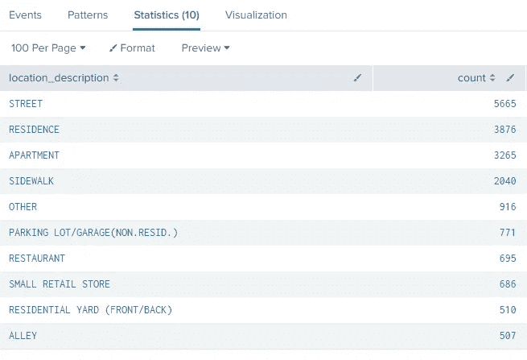

作者图片

在该数据集中，位置“街道”的犯罪数量最多。

由于我们已经执行了聚合操作，并且有两个相关的列(位置描述对应于指示计数的数值)，我们可以查看当前统计窗格旁边的可视化窗格。它将根据当前结果生成一个快速图表。

例如，饼图

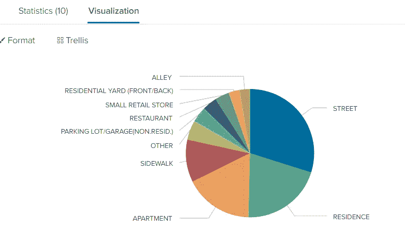

作者图片

您也可以将图表类型更改为其他类型，如水平条形图或折线图。

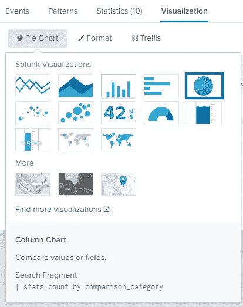

作者图片

接下来，让我们深入了解“街道”这个位置，看看那里最常见的犯罪类型。为此，我们需要选择 location_description 下包含 STREET 的行，然后统计 primary_type 列的唯一值的出现次数。

因此，与前面的查询相比，我们需要做的所有结构性改变就是添加使用 **search** 关键字的过滤操作。

```
| from inputlookup:"chicago-crime.csv" | search location_description="STREET" |stats count by primary_type | sort - count | head 10
```

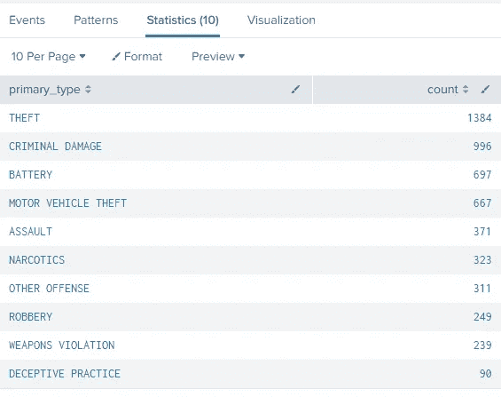

作者图片

盗窃是街上最常见的犯罪。

同样，我们可以绘制结果，因为我们有相关的列

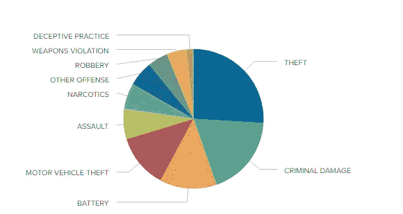

这些将是我们将包含在仪表板中的图表类型。

通过这种方式，您需要在表视图阶段查看数据集和浏览要素，以确定可以从其列中提取哪些类型的信息。

另一个直观的问题是，特定的犯罪通常发生在什么样的地方？考虑犯罪描述“国产电池简单”。根据描述，我们应该预计最常见的位置包括家庭或室内空间。

```
| from inputlookup:"chicago-crime.csv" | search description="DOMESTIC BATTERY SIMPLE" | stats count by location_description | sort - count | head 10
```

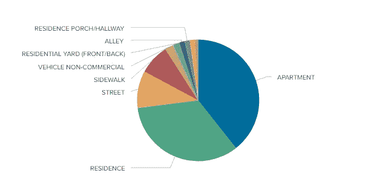

是的，我们的假设是正确的，数据也支持它。你可以回答类似的问题，并使用数据分析来支持或反驳你的假设。

# 创建地图

我们的数据集中有两列包含这些犯罪的位置坐标，这些数值作为数字无法用于数据分析，但是 Splunk 提供了附加应用程序来在地图上绘制这些坐标！

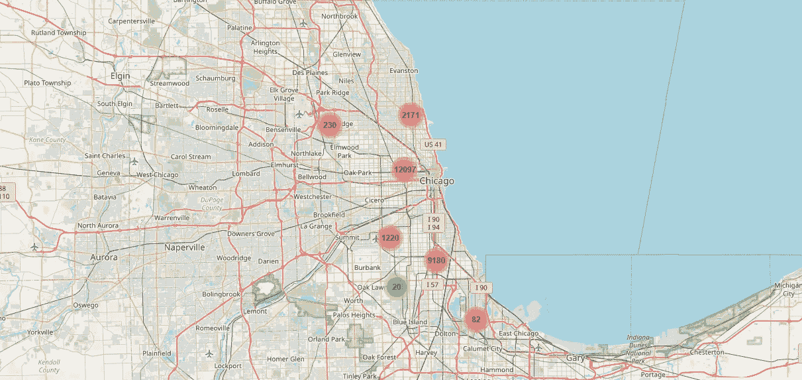

Splunk 应用程序的 Maps+对位置坐标进行聚类，并显示该聚类中的实例数量。基本上，我们可以看到芝加哥大多数犯罪发生的地区。放大这张地图，随着我们越来越近，星团变得越来越细，并分成多个部分。

要安装 Maps+ for Splunk，请转到应用->查找更多应用并搜索此附加工具。输入您为 splunk.com**创建的凭证(不是本地主机登录)并安装它。**

安装后，返回搜索并输入以下查询。**表**关键字从当前表中创建一个子表。

```
| from inputlookup:"chicago-crime.csv" | table latitude, longitude
```

Maps+只需要表中有两个分别名为纬度和经度的列。我们的表只有这两列，所以 Maps+将只显示计数作为它的分类。

进入可视化面板，从选择可视化菜单中选择地图+选项，一幅地图将会出现！

# 创建仪表板

一旦您形成并测试了所有的查询并预览了它们的可视化效果，请从搜索上方的菜单栏转到仪表板栏。

选择*创建新仪表板*，设置标题，并继续经典仪表板选项。

现在，您可以添加面板，选择要在该面板中显示的图表，并添加仪表板将执行以生成所需图表的查询。例如，在饼图选项中输入我们创建的第一个查询:

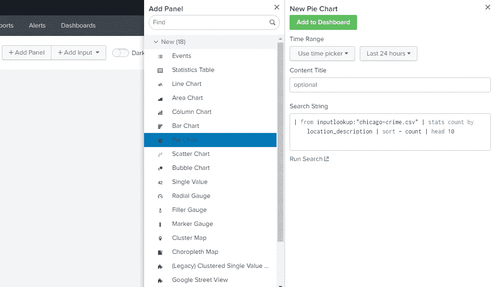

作者图片

单击 *Add to Dashboard* ，您会看到一旦查询执行完成，图表就被添加了。

类似地，您可以添加我们在这里讨论的所有查询，并生成相应的图表。

您也可以拖动和移动图表，将它们并排放置。

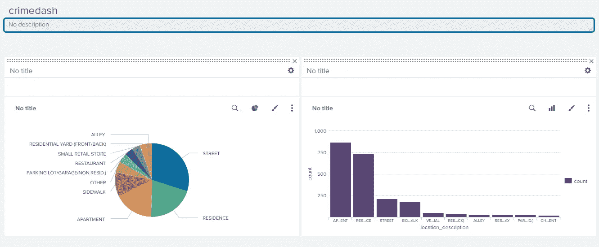

作者图片

现在，您终于可以使用 Splunk 快速制作美观的仪表盘了！保存仪表板后，您可以将其导出为 PDF 格式，以便与同事共享。

但是，要将此交互式仪表板作为 Splunk 源共享，您可以在仪表板屏幕上切换到“源”而不是“UI”。在这里，您将看到这个仪表板的 HTML 源代码。将此代码与数据集共享(默认情况下不需要)将允许其他人在其 Splunk 企业应用程序中复制图表。这是我们今天创建的图表的代码。

## 结论

在本文中，我们了解了 Splunk 如何使用基本的查询语言和 Splunk 自动生成的其他统计数据来执行基本的数据分析。我们还了解了如何根据这些查询的结果快速创建仪表板，以便从大量数据中获得洞察力。

非常感谢您的阅读！