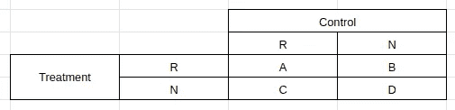
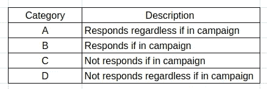
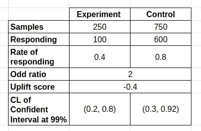
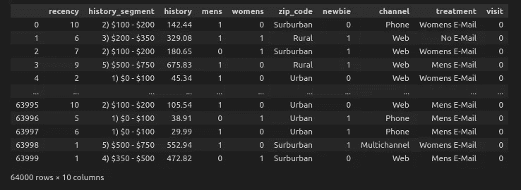
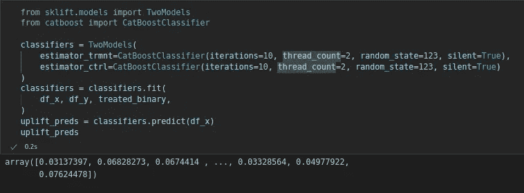
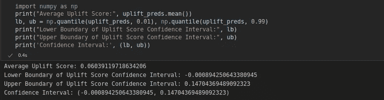
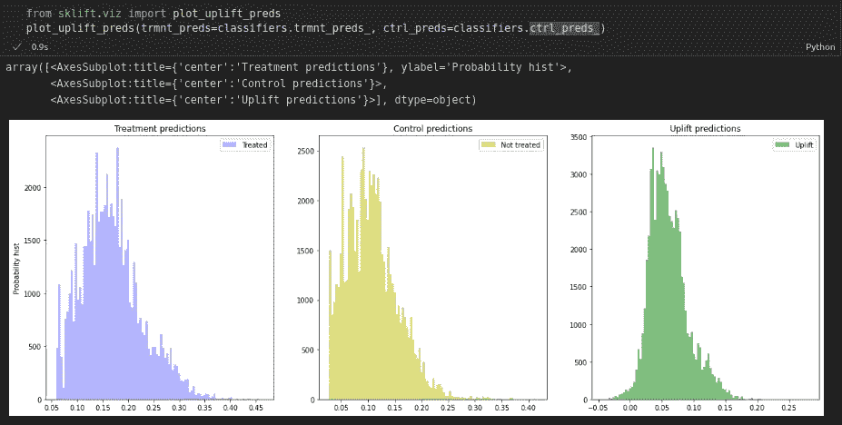
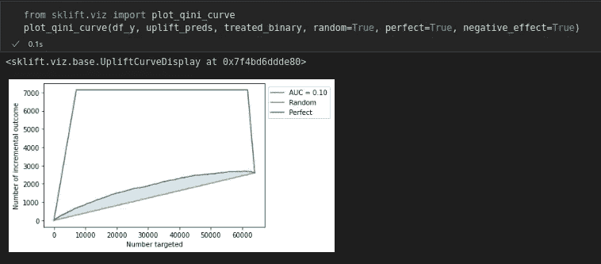

# 为你的营销策略找到正确的目标

> 原文：<https://medium.com/codex/spotting-the-right-targets-for-your-marketing-strategies-37472ae09496?source=collection_archive---------8----------------------->

## 提升模型——一种预测模型，用于识别最有可能购买的目标，因为他们是有针对性的，不同于客户细分和倾向建模的喷洒和祈祷营销策略。


前一篇[帖子](/p/93aa4c79f7a7)讨论了 RFM 分析的客户细分，其中相关的营销策略将是所谓的喷洒和祈祷方法。我们从基于最近、频率和货币价值三个指标的基本交易数据中，识别出具有特定消费行为的客户群体，作为营销推广的目标。目标群体可能是老顾客、新顾客或类似商品的常客。这种策略的缺点是，我们不知道谁会对内容做出反应，有些人甚至不会打开邮件，比如我？与过去的目录营销相比，电子邮件营销和社交媒体营销等数字营销是当前行业的主流。用不相关的促销信息淹没客户的邮箱可能会让他们感到沮丧，从而降低内容浏览的倾向。

提升模型不是通过预测谁可能会购买来搜索营销目标，而是预测谁会购买，因为营销活动是针对他们的。换句话说，他们购买是因为营销努力，所以你的业务支出/投资更有利可图(更高的投资回报率)和创造价值。隆起模型的优点:

*   改善客户体验(减少大量不相关的促销电子邮件。)
*   提高营销策略的效率(提高营销投资的回报。)
*   避免过度使用或沉迷于促销

在谈论提升模型之前，我们先简单介绍一下另一个流行的营销模型，倾向模型。更简单地说，倾向模型实际上是一个经典的监督机器学习模型，但预测后的特定问题陈述和程序赋予了它这个名称。倾向模型也可以用最少的 RFM 数据来应用，但随着企业收集的数据在宽度和深度方面的增加，该模型可以更广泛或更好地执行。从过去的营销活动中，我们可以得到目标变量(二元变量),即每个客户是否会做出购买反应。它的工作原理如下:

1.  关于营销活动和接受促销的客户的数据收集。
2.  数据预处理，包括清洗、特征合成、数据归一化等。
3.  建模。
4.  具有最高 top-k 响应概率的客户将利用可用配额。

与倾向模型相比，提升模型给出了更具可操作性的预测。提升模式不是被动地向潜在回应者发送宣传手册，让一切听天由命，而是通过探索我们的干预将如何增加预期结果的可能性，让企业处于更主动的位置来影响结果。为什么选择提升型号？我用另一个问题来回答这个问题。

“你会在最有可能购买的人身上多花一美元，还是会说服他改变主意购买？”

提升模型从两个不同的数据收集、控制和处理设置开始。如果你还记得你的科学课，控制是所有条件保持不变的设置，换句话说，控制组中的样本没有被处理。两个不同的数据集使我们能够计算采取行动的不同优势。此时，您可能会感到困惑，或者想知道隆起建模是如何完成的。本文将简要讨论两种模型方法。隆起模型的目标变量可以是数字的或分类的，它决定了要在控制和处理数据集上训练的模型。与倾向模型类似，它实际上是一个监督建模问题，稍微复杂一些，因为它同时涉及两个独立的数据集。

然而,“两种模式方法”这个名称应该已经暗示了如何处理这个问题。下面的 2x2 矩阵让您直观地了解我们在寻找什么。



r:响应；没有反应



如果你对黑客帝国有第二个想法，瞄准**和**并没有什么不同，因为无论他们是否被瞄准，他们都会做出反应。为什么不把营销费用省下来更好用呢？我们正在寻找在 **B** 的客户群作为活动目标，并努力避免向那些在 **C** 的客户群发送活动，以避免我们营销工作的负面影响和可能的客户流失。两个模型分别在对照组和治疗组进行训练， **MC** 和 **MT** 。然后计算提升分数，以评估所给予治疗的影响。

```
**Uplift_Score = MT(X) - MC(X)**
```

在某些情况下，这里提到的 Uplift_Score 也被称为个体治疗效果。分数的符号取决于我们要寻找的目标变量的性质。特别是，

*   如果预测搅动概率，我们预计搅动概率会下降，因此 *MT(X) < MC(X)* ，负分是优选的。
*   在预测购买概率时，我们预计购买概率会增加，因此 *MT(X) > MC(X)* ，正数得分更好。

下一步是回答你应该在分析的最开始就决定的分析目标。您是否打算在个体水平的更高粒度上进行群体水平的分析或预测。对于群体水平分析，我们将关注平均提升分数及其置信区间。如果包括零分，根据分数的总体分布，治疗效果可能被认为不显著。通过进行 A/B 测试，隆起模拟可以作为在可用处理范围之间进行选择的中间步骤。就个人层面而言，如前所述，我们能够通过为我们的营销活动打分来确定正确的目标，从而实现投资回报最大化。我希望上面的讨论作为抬升模型的介绍足够简短，这将激发进一步探索这个主题的兴趣和好奇心。

# **例子**

考虑一个零售商，他想通过提供 20%的折扣来销售新产品，从而进行促销分析。从客户数据库中随机选择 1000 名客户进行实验。每一次营销活动都有相关的成本，因此合理的想法是采用较小的治疗方案。这里提到的成本会降低利润率。

实验集:从 1000 名顾客中随机挑选 250 名。

控制组:剩余的 750 个客户。



分别有 100 名客户(40%的回复率)和 600 名客户(80%的回复率)通过订购治疗组和对照组做出响应。给予的治疗的总体提高分数为-0.4，显示出不利影响。99%的置信区间是使用个体提升分数从对照组计算的。绘制提升分数的直方图，以可视化分布并从统计角度得出见解，如分布函数、值的范围、零的位置、偏斜度等。

# **扬升模型的实现**

让我们通过使用一个简单的 python 库来应用提升模型，该库具有简单的实现、评估和可视化，即 sci kit-elevation。



数据集。



两种模式接近训练。



预测的平均上升及其置信区间为 99%。



隆起预测的分布。



评价隆起模型的 Qini 曲线。

上面显示的实现是提升模型的最基本应用。这里选择 scikit-uplift 是因为我认为从一些基本的东西开始是一个好主意。这种双模型方法有一些缺点，因此引入了单模型方法，现在还有更高级的元学习器算法。其他优雅而复杂的 python 库也可以用来构建性能更好的模型。如果你有兴趣去更远更深地探索它！

# **总结**

建模算法、存储和计算硬件的先进发展使得数据应用或数据驱动的决策制定更加无缝，前提是您拥有足够多的高质量数据。意识到为过去事件捕获的数据不足以供模型学习总是太晚了。例如，在上面讨论的情况中，企业可能考虑不仅存储客户数据，还存储活动数据。数据始终是良好数据解决方案的基础。

无论您选择哪种营销模式，改善客户关系管理(CRM)都是最终目标，通常用于追加销售、交叉销售、客户保留(新收购的高成本)、促进销售周期等。提升模型调查行动/处理的因果效应，以实现有效的资源分配，提高客户转化率，并将营销活动的负面影响降至最低。虽然我们关注的是业务应用，但是提升模型也适用于其他行业的用例，只要我们的主要目标是对一个动作的增量影响进行建模。其与经典科学实验设置相同的建模设置揭示了其一般化程度。