# 让您的数据分析生活更轻松的电子表格公式

> 原文：<https://medium.com/codex/spreadsheets-formulas-that-can-make-your-data-analysis-life-easier-396b33b9cddb?source=collection_archive---------1----------------------->

> 电子表格是我们日常工作中不可或缺的工具之一，无论我们的工作领域是什么，不仅是数据人员，而且如果你来自产品、销售、市场营销、人事部门，甚至是主管或其他部门，也是如此！我想如果我能分享一些可能不常见的公式就太好了，但是当我们正确地将它们用于数据分析或数据管理时，它会有很大的作用。事不宜迟，我们走吧！:D

本文将介绍的公式有:

1.  迷你图
2.  使分离
3.  连锁的
4.  纵向查找函数
5.  “如果”的大家庭

# **迷你图** — *单个单元格内的微型图表*。

万一我们有很多你需要展示的数据，但我们不需要详细的可视化，这是我们最好的选择！让我们看看它是如何工作的:)

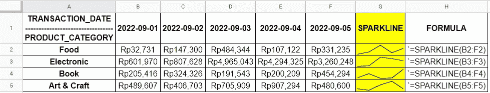

你可以在这里直接查看数据[。](https://docs.google.com/spreadsheets/d/1u0pd-Rai1JJQoKKBedvktWmQDER5N0DLC_PhHr0fn8M/edit#gid=0&range=A1:H5)

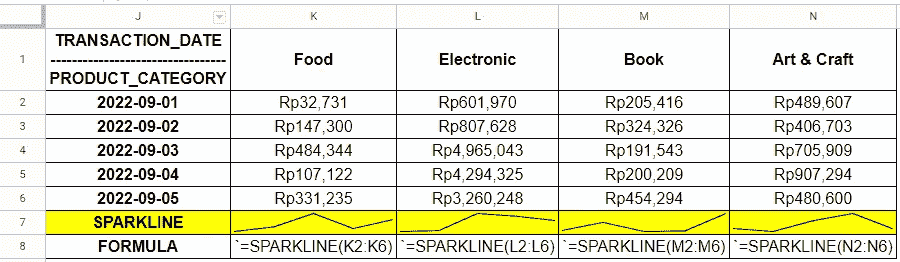

是的，你也可以垂直使用它！:D

依我拙见，比起使用渐变色来告诉我们的观众数据的趋势，我更喜欢迷你图，因为也许其中一个观众是色盲，但是的，我们可以使用从白色到灰色到黑色的渐变色，这将有助于我们色盲的观众，使用迷你图也使它更整洁！此外，如果您想要使用其他类型的图表，您可以将其添加到公式中。所以，对我来说这是一个双赢的解决方案，呜呜呜！我们来看下一个公式！

# **拆分** — *通过特定字符分隔符*拆分文本。

这次我想知道我的网站上注册用户使用最多的电子邮件地址域是什么。(本例中使用的奖金公式是 UNIQUE、COUNTIF 和“$”。)

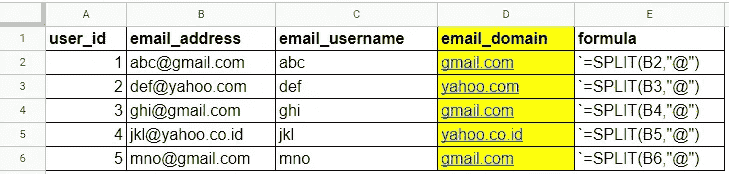

您可以在这里直接查看数据[。](https://docs.google.com/spreadsheets/d/1u0pd-Rai1JJQoKKBedvktWmQDER5N0DLC_PhHr0fn8M/edit#gid=1154672543&range=A1:E6)

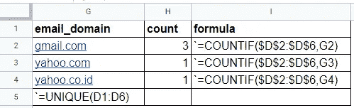

然后使用 UNIQUE 和 COUNTIF 来计算每个电子邮件域，耶，我们做到了！:D

正如我们在上面看到的，当使用 SPLIT 时，公式自动将我们的`email_address`拆分成两个值，我们命名为`email_username`和`email_domain`。对于第二部分，我们使用 UNIQUE 从`email_domain`列中获取不同的值，并使用 COUNTIF 公式对每个`email_domain`进行计数。

> 最后但并非最不重要的一点是，如果你们不知道美元符号“$”是干什么用的，那就简单地锁定你们的公式，这样当你向下拖动公式时，列和行索引就不会改变。如何做得更快，只需在数据区域的公式中按下“F4”按钮。自己试试吧！:D

# CONCATENATE —将字符串相互追加。

这个和我们刚刚讨论的分裂相反。让我们看看这个公式能做什么！

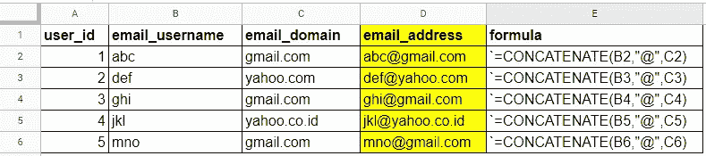

你可以在这里直接查看数据[。](https://docs.google.com/spreadsheets/d/1u0pd-Rai1JJQoKKBedvktWmQDER5N0DLC_PhHr0fn8M/edit#gid=628750124&range=A1:E6)

很简单，对吧？下一个走吧！

# VLOOKUP —垂直查找。

正如您所猜测的，HLOOKUP(横向查找)也是可用的，但是根据我的经验，大部分 VLOOKUP 涵盖了我需要的所有解决方案。这个公式可以帮助我们在一个范围的第一列中搜索一个键，并返回找到的行中指定单元格的值。

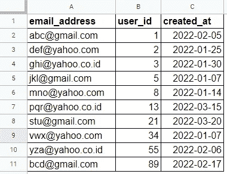

表 1。你可以在这里直接查看数据[。](https://docs.google.com/spreadsheets/d/1u0pd-Rai1JJQoKKBedvktWmQDER5N0DLC_PhHr0fn8M/edit#gid=535906324&range=A1:C11)

现在，问题出现了。我们想知道`email_address` 表 2 是否存在于表 1 中。如果是，我们需要得到`user_id`。看看我们下面的表格。

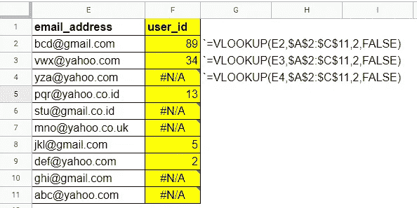

表二。我们问题中的 VLOOKUP 实现。

VLOOKUP 的公式怎么填？公式手册是这样写的:VLOOKUP(search_key，range，index，[is_sorted])。

1.  “search_key”表示我们要搜索的值。在这种情况下，我们使用我们的`email_address`。
2.  “范围”是指我们要搜索的地方。当决定“范围”时，第一列必须与“搜索关键字”相关。在我们的例子中，表 1 的第一列是`email_address`，所以它满足要求。
3.  “index”表示要返回的值的列索引，从“range”中我们已经知道，`email_address`的索引为 1。在我们的例子中，我想得到`user_id`，这就是我使用索引 2 的原因，因为`user_id`是表 1 中的第 2 列。
4.  “is_sorted”表示要搜索的列是否已排序。如果不是，我们可以写 FALSE，否则为 TRUE。在我们的例子中，它没有排序，这就是为什么我们用 FALSE 填充它。
5.  此外，不要忘记使用“$”来锁定我们的公式索引，这样我们就可以在不改变索引的情况下向下拖动公式。

我们可以看到一些值显示“#N/A ”,这意味着“不可用”或错误，因为您首先查找的联系人`email_address`不存在。如果我们想用另一个我们喜欢的值替换这个“#N/A”，例如“重试”，我们可以使用公式 IFERROR。来看看怎么用吧！:)

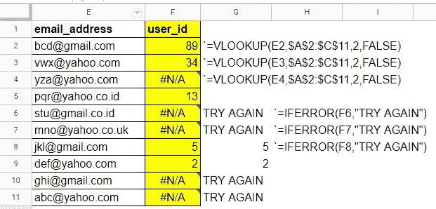

仍然是表 2，但是增加了 IFERROR 的实现。

# IF 大家庭

它可能是电子表格中最有用的公式。它以 IF 为祖先，其他家族成员如 IFS，IFERROR，COUNTIF，COUNTIFS，SUMIF，SUMIFS，IFNA，MAXIFS，MINIFS，也许还有一个 IF，我自己都不知道，哈哈！让我们看一遍每个公式，这样我们就能知道它的功能，来看看吧！

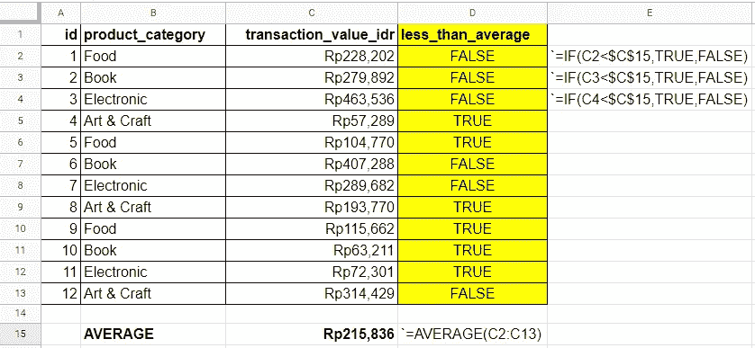

IF 和$同时使用。这里直接看数据[。](https://docs.google.com/spreadsheets/d/1u0pd-Rai1JJQoKKBedvktWmQDER5N0DLC_PhHr0fn8M/edit#gid=1047650737&range=A1:E15)

我们可以看到使用如果我们可以设置一个我们想要的要求，并根据是否满足要求自动设置值。

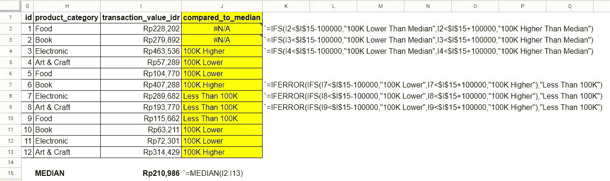

IFS、IFERROR 和$同时使用。这里直接看数据[。](https://docs.google.com/spreadsheets/d/1u0pd-Rai1JJQoKKBedvktWmQDER5N0DLC_PhHr0fn8M/edit#gid=1047650737&range=G1:Q15)

在这个例子中，我们使用 IFS，我们可以设置多个需求，并为每个需求设置每个值，我们还可以在外部添加另一个公式，如 IFERROR，以设置另一个需求，特别是当第一个公式的输出为 ERROR 或#N/A 时。

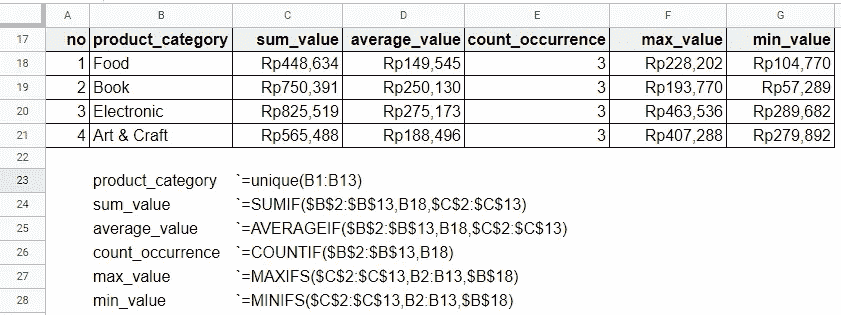

UNIQUE、SUMIF、AVERAGEIF、COUNTIF、MAXIFS、MINIFS 和$的用法。你可以在这里查看数据。

正如你在上面看到的，如何使用这些公式非常简单。并不是所有的聚合公式都有“IF”作为默认，MEDIAN 没有 MEDIANIF，所以我们必须在如何使用它的问题上稍微即兴发挥一下。你可以看看我以前的帖子[这里](https://ichkautzar.medium.com/basic-data-analysis-knowledge-you-have-to-understand-measures-of-central-tendencies-mct-4d4195a6859)知道如何创建一个 MEDIANIF 公式。

使用谷歌电子表格时，你应该了解的其他真正能让我们生活更轻松的功能有:

1.  ARRAYFORMULA、COUNTA、JOIN、AND、OR、FILTER、GROWTH、TRIM 等等。
2.  快捷键，如 F4、F2、Shift + Enter、Ctrl + Enter、快速向下填充、彩色范围等。
3.  插入>数据透视表-重新排列表格
4.  插入>图表—可视化您的数据
5.  数据>数据验证—在填充单元格之前制作选项列表
6.  这样的例子不胜枚举。

我想这总结了我们的职位，现在。我希望你喜欢它，请与你的同事分享，如果你认为他们可能必须阅读这一篇。对我来说，我将与我的非分析同事分享它，这样他们就可以在没有我的帮助下开始进行基本的数据分析，以实现数据驱动的环境:)。再次，如果你碰巧读到这篇文章，非常感谢你！

> 一如既往，不要犹豫给我你的意见和批评，这样我下次可以写得更好。再见。