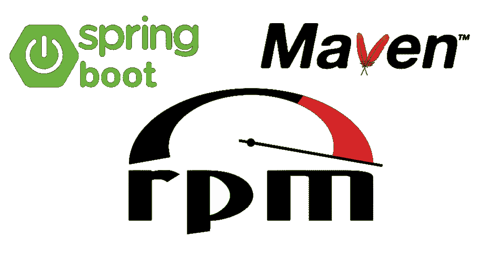

# Spring 应用程序和父 Maven Pom

> 原文：<https://medium.com/codex/spring-application-and-parent-maven-pom-a125fb888fc0?source=collection_archive---------1----------------------->



# 简介:

当我们想要使用 spring boot 创建一个新的 web 应用程序时，请确保我们需要使用 maven 来使用来自 maven 存储库的一些依赖项，并且 maven 在 Pom.xml 中表示，但是如果我们有一个来自十个或更多 web 应用程序的微服务应用程序，并且在某个阶段我们需要将一些依赖项更新到最新版本，我们需要访问每个项目并手动更新它，但是对于本文，您不需要这样做，因为所有的依赖项都在同一位置，称为根或父项目。

在父项目中，项目将放置每个项目中使用的所有依赖项，其他项目将看到它并使用父项目中的任何依赖项。

让我们去看看我们如何能做到这一点。

# 创建项目的步骤

## 构建根项目:

为了构建根项目，我们需要开放任何想法来编写我们的代码，之后，我们需要进入 Pom.xml，因为在本文中我使用 Maven，你可以用 Gradle 做同样的事情。我们可以在另一篇文章中用 Gradle 介绍 Root。

## 根项目(父项目):

父项目中只有一个文件 Pom.xml，在 Pom.xml 中会把所有的依赖项用到它的其他项目中，

> 我们需要创建没有任何文件的 Maven 项目，因为在这种情况下我们需要 Pom.xml 来处理其他项目中的所有依赖关系。

创建之后，我们可以看到一个空的 Pom.xml 文件。实际上，我将在 Spring boot 应用程序中使用父项目，在这种情况下，Pom 文件将有一个来自 Spring 框架的父项目来填充您的应用程序。

下面的代码片段代表父项目，具有 Spring 父依赖项。

```
<?xml version="1.0" encoding="UTF-8"?>
<project 
    xmlns:xsi="http://www.w3.org/2001/XMLSchema-instance"
    xsi:schemaLocation="http://maven.apache.org/POM/4.0.0 http://maven.apache.org/xsd/maven-4.0.0.xsd">
  <modelVersion>4.0.0</modelVersion>
  <!-- the parent project from spring-boot framework -->
  <parent>
    <groupId>org.springframework.boot</groupId>
    <artifactId>spring-boot-starter-parent</artifactId>
    <version>2.6.4</version>
    <relativePath/> <!-- lookup parent from repository -->
  </parent>
  <groupId>org.example</groupId>
  <artifactId>parent</artifactId> <!-- the project name we need it to linking parent project with other projects -->
  <version>1.0-SNAPSHOT</version>
  <packaging>pom</packaging>

  <properties>
    <maven.compiler.source>8</maven.compiler.source>
    <maven.compiler.target>8</maven.compiler.target>
  </properties>

  <dependencies>
    <dependency>
      <groupId>org.apache.maven.plugins</groupId>
      <artifactId>maven-install-plugin</artifactId>
      <version>2.4</version>
      <type>maven-plugin</type>
    </dependency>

    <dependency>
      <groupId>org.apache.maven.plugins</groupId>
      <artifactId>maven-deploy-plugin</artifactId>
      <version>2.7</version>
      <type>maven-plugin</type>
    </dependency>

  </dependencies>
</project>
```

现在父项目已经完成，我们将在创建 spring-boot 项目后添加其他依赖项。

## 简单的 Spring boot 项目

在本文的这一部分中，我们需要创建一个新的 spring boot 项目，以将其与父项目进行映射。

我认为你可以创建一个 spring boot 项目，如果你不会的话，你可以使用这个链接初始化 spring 项目【https://start.spring.io/[，然后打开它](https://start.spring.io/)

好的，在创建一个新项目后，将有一个新的 Pom.xml 用于这个项目，我们需要它来映射父项目。

在 Pom.xml 的简单项目中只需要放一个名为 <parent></parent> 的新标签，parent 标签会带几个参数来标识简单项目的父项，如下面的代码片段。

```
<parent>
    <groupId>org.example</groupId>
    <artifactId>parent</artifactId>
    <version>1.0-SNAPSHOT</version>
  </parent>
```

就像上面的代码一样，我把一些数据规范放在父项目中，比如项目名称、版本和包，你可以在父 pom.xml 中找到这些细节

我将从简单项目(Pom.xml)到父项目(Pom.xml)获取所有依赖项。

## 最终编码

最后，父 Pom.xml 将具有以下代码。

```
<?xml version="1.0" encoding="UTF-8"?>
<project 
    xmlns:xsi="http://www.w3.org/2001/XMLSchema-instance"
    xsi:schemaLocation="http://maven.apache.org/POM/4.0.0 http://maven.apache.org/xsd/maven-4.0.0.xsd">
  <modelVersion>4.0.0</modelVersion>

  <!-- the parent project from spring-boot framework -->
  <parent>
    <groupId>org.springframework.boot</groupId>
    <artifactId>spring-boot-starter-parent</artifactId>
    <version>2.6.4</version>
    <relativePath/> <!-- lookup parent from repository -->
  </parent>

  <groupId>org.example</groupId>
  <artifactId>parent</artifactId> <!-- the project name we need it to linking parent project with other projects -->
  <version>1.0-SNAPSHOT</version>
  <packaging>pom</packaging>

  <properties>
    <maven.compiler.source>8</maven.compiler.source>
    <maven.compiler.target>8</maven.compiler.target>
  </properties>

  <dependencies>
    <dependency>
      <groupId>org.apache.maven.plugins</groupId>
      <artifactId>maven-install-plugin</artifactId>
      <version>2.4</version>
      <type>maven-plugin</type>
    </dependency>

    <dependency>
      <groupId>org.apache.maven.plugins</groupId>
      <artifactId>maven-deploy-plugin</artifactId>
      <version>2.7</version>
      <type>maven-plugin</type>
    </dependency>

    <!-- for spring project -->
    <dependency>
      <groupId>org.springframework.boot</groupId>
      <artifactId>spring-boot-starter-data-jdbc</artifactId>
    </dependency>
    <dependency>
      <groupId>org.springframework.boot</groupId>
      <artifactId>spring-boot-starter-data-jpa</artifactId>
    </dependency>
    <dependency>
      <groupId>org.springframework.boot</groupId>
      <artifactId>spring-boot-starter-jdbc</artifactId>
    </dependency>
    <dependency>
      <groupId>org.springframework.boot</groupId>
      <artifactId>spring-boot-starter-web</artifactId>
    </dependency>

    <dependency>
      <groupId>org.springframework.boot</groupId>
      <artifactId>spring-boot-devtools</artifactId>
      <scope>runtime</scope>
      <optional>true</optional>
    </dependency>
    <dependency>
      <groupId>com.h2database</groupId>
      <artifactId>h2</artifactId>
      <scope>runtime</scope>
    </dependency>
    <dependency>
      <groupId>org.projectlombok</groupId>
      <artifactId>lombok</artifactId>
      <optional>true</optional>
    </dependency>
    <dependency>
      <groupId>org.springframework.boot</groupId>
      <artifactId>spring-boot-starter-test</artifactId>
      <scope>test</scope>
    </dependency>
  </dependencies>
  <dependencyManagement>
    <dependencies>
      <dependency>
        <groupId>commons-codec</groupId>
        <artifactId>commons-codec</artifactId>
        <version>1.15</version>
      </dependency>
    </dependencies>
  </dependencyManagement>

  <!-- for spring project -->
  <build>
    <plugins>
      <plugin>
        <groupId>org.springframework.boot</groupId>
        <artifactId>spring-boot-maven-plugin</artifactId>
        <configuration>
          <excludes>
            <exclude>
              <groupId>org.projectlombok</groupId>
              <artifactId>lombok</artifactId>
            </exclude>
          </excludes>
        </configuration>
      </plugin>
    </plugins>
  </build>
</project>
```

这个简单的项目(Pom.xml)会有下面的代码。

```
<?xml version="1.0" encoding="UTF-8"?>
<project  xmlns:xsi="http://www.w3.org/2001/XMLSchema-instance"
    xsi:schemaLocation="http://maven.apache.org/POM/4.0.0 https://maven.apache.org/xsd/maven-4.0.0.xsd">
  <modelVersion>4.0.0</modelVersion>
  <groupId>com.simpleproject</groupId>
  <artifactId>simpleProject</artifactId>
  <version>0.0.1-SNAPSHOT</version>
  <name>simpleProject</name>
  <description>simpleProject</description>
  <properties>
    <java.version>1.8</java.version>
  </properties>
  <!-- the parent project -->
  <parent>
    <groupId>org.example</groupId>
    <artifactId>parent</artifactId>
    <version>1.0-SNAPSHOT</version>
  </parent>

</project>
```

## 查看 GitHub 中的代码

您可以通过下面的链接在 Git Hub 上的 my Repo 中找到这段代码。

[](https://github.com/abdalrhmanAlkraien/Parent-Project-as-a-Maven) [## GitHub-abdalrhmanAlkraien/Parent-Project-as-a-Maven:这里我创建了一个父项目和一个简单的…

### 在这里，我创建了一个父项目和一个简单的 spring 项目，并通过 Pom.xml - GitHub 链接在一起…

github.com](https://github.com/abdalrhmanAlkraien/Parent-Project-as-a-Maven) 

# 结论:

如果我们从事微服务项目，我们需要使用许多依赖项，如果我们将项目拆分为 maven parent 和 web application as a service，有时我们需要将依赖项升级到最新版本。我们不需要访问每个微服务来改变依赖项的版本。

这里我们可以看到这种技术在拆分我的工作中的威力。

接下来是什么:

> 我将为此项目创建通用项目并使用它。

**别忘了在文章上鼓掌，每篇文章你可以鼓掌 50 次。还有你在这里找到我的**[**LinkedIn**](https://www.linkedin.com/in/abd-alrhman-alkraien-83a93a1b1/)

# 参考资料:

[https://medium . com/Java re visited/maven-multi module-project-a-detailed-view-e 03 a56 E0 d 43d](/javarevisited/maven-multimodule-project-a-detailed-view-e03a56e0d43d)

[https://spring.io/guides/gs/multi-module/#scratch](https://spring.io/guides/gs/multi-module/#scratch)