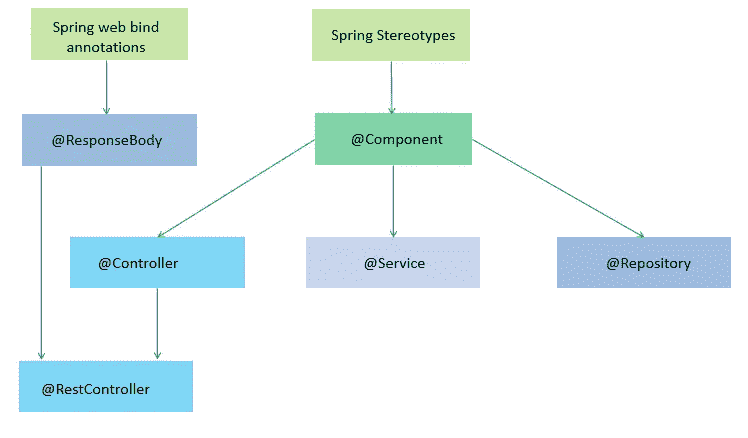

# 弹簧靴@控制器与@组件

> 原文：<https://medium.com/codex/spring-boot-controller-vs-component-c72814721fb7?source=collection_archive---------3----------------------->

Spring 针对不同的目的有不同的注释。构造型注释经常与保护伞@Components 注释相矛盾。让我们从基本定义开始，一个 [**组件**](https://docs.spring.io/spring-framework/docs/current/javadoc-api/org/springframework/stereotype/Component.html) 是任何 spring-managed bean 的*通用原型。它提供了一个可选的参数**值**为*字符串*类型，表示该组件的逻辑名称，在自动检测的情况下将被转换成一个 spring bean，比如通过 *@ComponentScan* 。*

弹簧[定型](https://docs.spring.io/spring-framework/docs/current/javadoc-api/org/springframework/stereotype/package-summary.html)和腹板[标注](https://docs.spring.io/spring-framework/docs/current/javadoc-api/org/springframework/web/bind/annotation/package-summary.html)