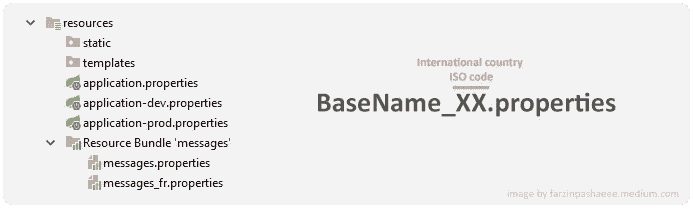

# Spring Boot 国际化— i18n

> 原文：<https://medium.com/codex/spring-boot-internationalization-i18n-d4a53494e7b9?source=collection_archive---------5----------------------->


# 配置

任何 web 应用程序的一个基本要求是能够支持多种语言并具有本地化的消息。为了在默认情况下实现这一点，Spring Boot 在类路径的根目录下寻找一个`messages.properties`资源包。



这些文件包含需要多语言支持的每个文本的一组键值行，如下例所示:

**message.properties**

```
**welcome**=Hello! this is a test message! **lang.change**=Change the language **lang.eng**=English **lang.fr**=French
```

**message_fr.properties**

```
**welcome**=Bonjour! Ceci est un message test! **lang.change**=Changer la langue **lang.eng**=English **lang.fr**=French
```

当然，有几个类似于`basename`的属性，您可以使用`application.properties`或`application.yaml`中的`spring.messages`名称空间来更改资源包配置。

```
**spring.messages.basename=**messages, i18n.list
**spring.messages.fallback-to-system-locale=**false
```

# 消息检索

有几种方法可以使用资源包文件中提供的键来获得正确的本地化消息。你可以明确地提到语言环境类型并使用`ResourceBundleMessageSource`，或者你可以使用一个更有效、功能更强的语言环境`LocaleResolver`。

## ResourceBundleMessageSource

从资源包中获取相关消息的最简单方法是使用`ResourceBundleMessageSource`。

```
@Component
**public class** ApplicationConfiguration {

    @Autowired
    ResourceBundleMessageSource **messageSource**;

    @PostConstruct
    **public void** init(){
        String **welcome = messageSource**.getMessage(**"welcome"**, **null**, Locale.***FRANCE***));
    }

}
```

上面的代码将导致在欢迎字符串中设置法语版的欢迎键消息。

## LocaleResolver

另一种确定当前使用的语言环境的方法是使用`LocaleResolver`。这个接口有不同的实现，根据会话、cookies、 *Accept-Language* 头或固定值来确定当前的语言环境。

**FixedLocaleResolver:** 该实现主要用于调试目的，您将总是在项目应用程序属性文件中设置一种固定的语言

```
@Bean
**public** LocaleResolver localeResolver() {
   FixedLocaleResolver lr = **new** FixedLocaleResolver();
   lr.setDefaultLocale(Locale.***US***);
   **return** lr;
}
```

**accepthederlocaleresolver:**对于 web 应用程序，其中一个选项是在请求上使用“accept-language”HTTP 头。这个实现将从 HTTP status 头中获取值并应用它。

```
@Bean
**public** LocaleResolver localeResolver() {
   AcceptHeaderLocaleResolver lr = **new** AcceptHeaderLocaleResolver();
   lr.setDefaultLocale(Locale.***US***);
   **return** lr;
}
```

web 应用程序的另一种方法是使用会话为访问应用程序的用户获取本地。在此实现中，该值将存储在会话中，并在会话的生存期内可用。

```
@Bean
**public** LocaleResolver localeResolver() {
    SessionLocaleResolver lr = **new** SessionLocaleResolver();
    lr.setDefaultLocale(Locale.***US***);
    **return** lr;
}
```

**CookieLocaleResolver:**Cookies 也是另一个可以实现的选项。它们存储在用户的机器上，并且只要浏览器 cookies 没有被用户清除，一旦被解析，被解析的区域设置数据将持续存在，甚至在会话之间。

```
@Bean
**public** LocaleResolver localeResolver() {
    CookieLocaleResolver lr = **new** CookieLocaleResolver();
    lr.setDefaultLocale(Locale.***US***);
    **return** lr;
}
```

**注意: **SessionLocaleResolver** 和 **CookieLocaleResolver** 的**我们需要一个拦截器来获取用户发送的首选语言的参数，并将其存储在会话或 cookie 中。多亏了 spring，这已经完成了，don，你可以使用`LocaleChangeInterceptor`，只需传递属性名来设置区域。

```
@Bean
public WebMvcConfigurer configurer(){
     return new WebMvcConfigurerAdapter() {
     @Override
     public void addInterceptors (InterceptorRegistry registry) {
        **LocaleChangeInterceptor l = new LocaleChangeInterceptor();
        l.setParamName("localeParmName");
        registry.addInterceptor(l);**
       }
    };
}
```

希望这篇文章对你有所帮助，请支持我，为这个故事鼓掌。如果你不知道事情是这样的:


或者在这里给我买杯咖啡[！](https://www.buymeacoffee.com/fpashaee)