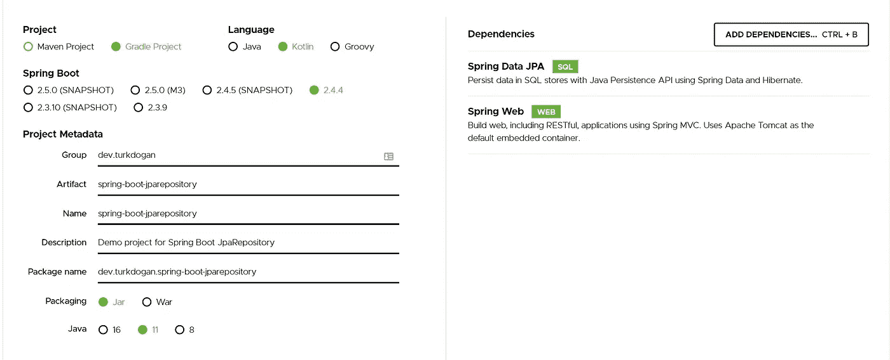

# Spring Boot JPA 仓库教程

> 原文：<https://medium.com/codex/spring-boot-jparepository-tutorial-bb0ce88cd45a?source=collection_archive---------7----------------------->

在这篇文章中，我们将深入 Spring 框架的 JPA 存储库实现。Spring 为数据库操作提供了强大的基础设施。它在后台生成必要的查询，以便对数据库操作进行抽象。除了 crud 操作之外，其他数据库特性(如分页)也可以在不编写任何查询代码的情况下实现。

在这篇文章中，我们将创建一个硬币模型来展示 JpaRepository 的一些特性，如查询、分页、过滤和删除。该项目的实施情况见[https://github.com/turkdogan/spring-boot-guide](https://github.com/turkdogan/spring-boot-guide)。

# 创建项目

Spring initializr 为 Spring Boot 项目提供了模板。让我们打开 https://start.spring.io/的[，从项目部分选择 Gradle 项目。作为一种编程语言，我们将在这篇文章中使用 Kotlin。最后，我们应该添加 Spring Web 和 Spring Data JPA 依赖项。选定的选项应如下所示:](https://start.spring.io/)



弹簧初始化 r

# 实体模型

现在硬币很流行，让我们用一个硬币模型来演示一下。虽然真实世界的硬币模型非常复杂，但我们将通过使用两个表来创建一个简化的模型:硬币和价格。硬币表保存硬币的基本信息，如名称和开始日期。价格模型用于保存每天每枚硬币的价格值。因此，我们可以说我们的模型是一对多的；每枚硬币都有许多价格值。

```
@Entity
class Coin { @Id
    @GeneratedValue
    var id: UUID? = null @Column(nullable = false, unique = true)
    var name: String = "" @Column
    var description: String = "" @CreatedDate
    var created = Instant.now() @LastModifiedDate
    var updated = Instant.now() @Column(nullable = false)
    var startDate: Instant? = null @OneToMany(cascade = [CascadeType.ALL])
    @JoinColumn(name = "coin_id")
    var priceList: MutableList<Price> = mutableListOf()
}
```

每个实体都有一个生成的 UUID 作为主键。我们使用 Spring 的内置特性来自动管理、创建和更新数据。

```
@Entity
class Price { @Id
    @GeneratedValue
    var id: UUID? = null @Column(nullable = false)
    var value: BigDecimal = BigDecimal.ZERO @Column(nullable = false)
    var date: Instant? = null
}
```

价格实体保存硬币的价格数据。假设我们每天都有一个数据值(对于真实世界的用例来说，这不是一个好的模型)。

# 日本硬币仓库

这是至关重要的部分。默认 JpaRepository 可用于以下目的:

*   带上所有硬币
*   凭身份证带特定硬币
*   删除硬币
*   更新硬币
*   . . .

除了前面的，通过定义一个简单的方法；通过实现 JpaRepository 可以执行以下操作:

*   将所有硬币按属性(如名称)分类
*   将所有硬币按属性排序(即按名称升序排序，按创建日期降序排序)
*   按给定的间隔和分类参数带来硬币的子集
*   带上所有具有某些属性(如名字)的硬币
*   . . .

例如，要检索硬币 5(名称值为硬币 5)，我们可以定义如下所示的方法:

```
fun findAllByOrderByNameDesc(): List<Coin>
```

Spring 在后台自动生成必要的查询，并以升序返回所有以名称为核心的硬币数据。让我们实现存储库。

```
@Repository
interface CoinRepository : JpaRepository<Coin, UUID> { fun findAllByOrderByNameDesc(): List<Coin> fun findAllByOrderByStartDateDesc(page: Pageable): List<Coin> fun findAllByOrderByDescriptionDescNameAsc(): List<Coin> fun findByName(name: String): Optional<Coin>
}
```

虽然结构很直观，但是让我们一行一行地分析这个文件。第一行是来自 Spring 规范的存储库注释。在初始化阶段，Spring 在 Spring 上下文中创建这个组件。从现在开始，其他的 Spring 组件(即服务)可以很容易地注入这个对象。第二行通过扩展 JpaRepository 的接口定义了一个 coin 接口。如前所述，魔力来自这个 JpaRepository。剩下的几行是从数据库中检索相关值的方法定义。

在定义查询方法时，必须遵循一些约定。例如，如果“title”在 Coin 实体中不存在，那么下面的方法定义将不起作用(实际上 Spring 在加载过程中给出了一个错误):

```
@Repository
interface CoinRepository : JpaRepository<Coin, UUID> { fun findAllByOrderByTitleDesc(): List<Coin> fun findByTitle(name: String): Optional<Coin>
}
```

# 初始化演示数据

为了检索硬币价格，我们需要演示数据。因此，在应用程序开始运行时，我们创建了 10 个硬币和每个硬币的 10 个价格信息(过去 10 天)。价格值是随机生成的，因此我们在日期之间没有任何相关性。

```
@Component
class CoinDataLoader : ApplicationRunner { @Autowired
    private lateinit var coinRepository: CoinRepository override fun run(args: ApplicationArguments?) {
        for (i in 1..10) {
            val c = Coin()
            c.name = "coin $i"
            c.startDate = Instant.now().minus(i.toLong(), ChronoUnit.DAYS)
            c.description = "Description" for (d in 1..10) {
                val day = Instant.now().minus(d.toLong(), ChronoUnit.DAYS)
                val value = Random().nextDouble() * 100
                val price = Price()
                price.date = day
                price.value = BigDecimal.valueOf(value)
                c.priceList.add(price)
            }
            coinRepository.save(c)
        }
        coinRepository.flush()
    }
}
```

每个硬币的描述值都是相同的，因此我们可以根据第二个值的顺序来查看结果。

# 检索数据

让我们设计一个 rest 控制器，这样我们就可以通过使用我们的存储库来查询项目。

```
@RestController
class CoinRestController { @Autowired
    lateinit var coinRepository: CoinRepository @GetMapping("/")
    fun getCoins(): List<Coin> {
        return coinRepository.findAll()
    } @GetMapping("/coinsSortedByNameDesc")
    fun getCoinsSortedByName(): List<Coin> {
        return coinRepository.findAllByOrderByNameDesc()
    } @GetMapping("/coinByName")
    fun getCoinByName(coinName: String): Coin {
        return coinRepository.findByName(coinName).get()
    } @GetMapping("/coinsByOrderByDescriptionDescNameAsc")
    fun getCoinsByMultipleSortParameters(): List<Coin> {
        return coinRepository.findAllByOrderByDescriptionDescNameAsc()
    } @GetMapping("/getFirstNCoins")
    fun getFirstCoins(count: Int): List<Coin> {
        return coinRepository.findAll(PageRequest.of(0, count)).content
    } @GetMapping("/getLastNCoins")
    fun getLastCoins(count: Int): List<Coin> {
        return coinRepository.findAllByOrderByStartDateDesc(PageRequest.of(0, count))
    }
}
```

请注意，这个实现只是为了演示的目的。通常，异常处理、日志记录和其他生产方法应该集成到实现中。

我们添加了几个 rest 方法来处理相关的资源。

最后，让我们从 gradle(.MacOS 和 Linux 中的/gradlew)。

```
gradlew bootRun
```

如果应用程序启动时没有任何问题，就会创建一个数据库并用演示数据进行初始化(在主文件夹中创建一个 H2 数据库)。从现在开始，我们可以使用任何 rest 客户机来调用 rest 接口，这样我们就可以观察 JSON 格式的传入数据。在演示项目中，可以找到一个典型 rest 客户机的纯 Javascript 实现。启动服务器后如果你打开页面[http://localhost:8080/index . html](http://localhost:8080/index.html)，那么你可以使用按钮来查看每个实现的响应。例如，如果你点击“获取硬币 1”，第一个带有价格信息的硬币将返回服务器并显示在屏幕上。典型的硬币数据应显示如下:

```
{
  "id": "b96da21b-7381-4a3d-9d7a-906fa5dfbdb6",
  "name": "coin 1",
  "description": "Description",
  "created": "2021-04-18T14:42:10.199346Z",
  "updated": "2021-04-18T14:42:10.199346Z",
  "startDate": "2021-04-17T14:42:10.199346Z",
  "priceList": [
    {
      "id": "6eb8ac23-850a-4a2d-a6a2-98ba3c3fcd17",
      "value": 72.85,
      "date": "2021-04-17T14:42:10.199346Z"
    },
    {
      "id": "6eb4bf49-a6e2-462b-afd8-41d35165d8d8",
      "value": 8.81,
      "date": "2021-04-16T14:42:10.199346Z"
    },
    {
      "id": "2e9ea1dc-845a-46bd-bc26-5b32be6300e7",
      "value": 30.62,
      "date": "2021-04-15T14:42:10.199346Z"
    },
    {
      "id": "19dccf5c-fc41-4d08-87a7-0cb6d4dd45ab",
      "value": 55.18,
      "date": "2021-04-14T14:42:10.199346Z"
    },
    {
      "id": "f5bb3e71-0dc6-4075-9eab-2fc89827779b",
      "value": 56.23,
      "date": "2021-04-13T14:42:10.199346Z"
    },
    {
      "id": "f069d0db-c07b-4342-b432-591469af208f",
      "value": 99.25,
      "date": "2021-04-12T14:42:10.199346Z"
    },
    {
      "id": "a36584d4-3286-4c24-9fff-6638edba7095",
      "value": 98.39,
      "date": "2021-04-11T14:42:10.199346Z"
    },
    {
      "id": "9b0f0009-ee70-4d5d-a99d-e4376681b577",
      "value": 95.33,
      "date": "2021-04-10T14:42:10.199346Z"
    },
    {
      "id": "a75c22f8-8751-436c-bf6d-b87e26320859",
      "value": 2.44,
      "date": "2021-04-09T14:42:10.199346Z"
    },
    {
      "id": "eff8bd12-4a75-4a9a-b70a-d9a86f1daa90",
      "value": 94.13,
      "date": "2021-04-08T14:42:10.199346Z"
    }
  ]
}
```

您可以查看“index.html”文件以了解更多详细信息。在下一篇文章中，我们将使用纯 Javascript 和 HTML 设计一个简单的前端。