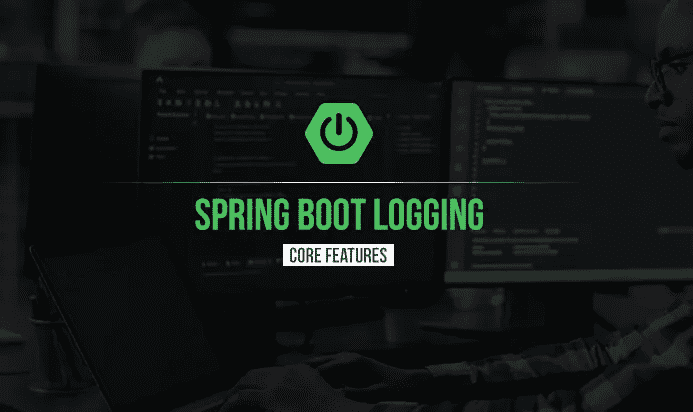
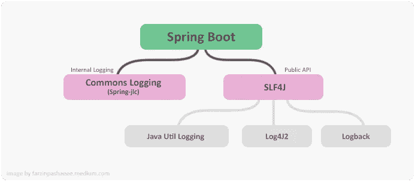
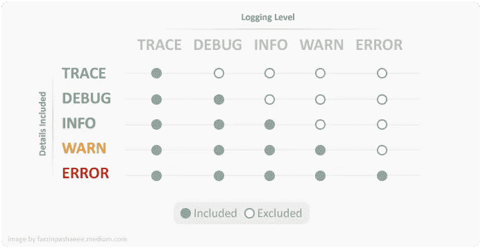
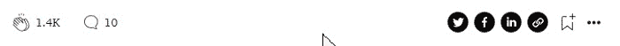

# Spring Boot 伐木公司

> 原文：<https://medium.com/codex/spring-boot-logging-da61911ce8e6?source=collection_archive---------4----------------------->



日志中包含的详细信息

Spring Boot 使用 [Apache Commons logging](https://commons.apache.org/proper/commons-logging/index.html) 进行所有内部日志记录，但是底层日志实现是灵活的。您可以使用 **Util Logging** 、 [**Log4j2**](https://logging.apache.org/log4j/2.x/) 和 [**Logback**](https://logback.qos.ch/) ，并且对于每一个都预先配置为使用控制台输出，也可以使用可选的文件输出。在 Spring Boot，默认情况下，如果你使用启动器，你将得到 **Logback** 实现。



另一方面，对于公共 API，Spring Boot 使用 SLF4J(Java 的简单日志接口),它允许程序员选择不同的日志框架。

# 日志记录级别

日志记录级别有助于控制不同环境中的日志输出。基于这些级别，您可以根据需要记录适当的信息。



包括日志级别和详细信息

在上表中，您可以看到每个日志记录级别将包括输出中的详细信息和日志类型。TRACE 包含所有类型的日志，ERROR 只包含错误日志。所有受支持的日志系统都可以在 Spring 环境中设置日志级别。

## **命令行虚拟机选项**

使用以下格式的属性，您可以根据您对命令行 VM 选项的要求，为 root 或任何其他记录器(包名)设置记录器级别:

```
java -jar **-Dlogging.level.<logger-name>=<level>** application.jar
```

在这个命令中`<level>`是跟踪、调试、信息、警告、错误、致命或关闭中的一个。此外，可以使用 logging.level.root 配置根日志记录器。

```
java -jar **-Dlogging.level.root=DEBUG** application.jar
java -jar **-Dlogging.level.org.springframework=TRACE** application.jar
```

## **属性文件**

属性文件和 YAML 配置文件中的相同属性名称可用于设置日志记录级别配置。

**应用属性文件示例:**

```
**logging.level.root=DEBUG
logging.level.org.springframework=TRACE**
```

**YAML 文件示例:**

```
logging:
   level:
 **root: "DEBUG"
     org.springframework: "TRACE"**
```

## **操作系统环境变量**

还可以使用环境变量来设置日志记录级别。(如`LOGGING_LEVEL_ORG_SPRINGFRAMEWORK=TRACE`会将`org.springframework`设置为`DEBUG`)。所有可能的配置和映射的环境变量的列表可以在 [Spring Boot 参考](https://docs.spring.io/spring-boot/docs/current/reference/htmlsingle/#features.logging.custom-log-configuration)页面上找到。

# 记录器启动

使用 Logger Factory，我们可以创建一个 Logger 实例，我们将使用它在应用程序中记录日志。对于每个日志级别，您可以找到正确的调用方法，如下所示:

```
@Component
**public class** LoggingTest {
    Logger **logger** = LoggerFactory.*getLogger*(LoggingTest.**class**);
    **public void** test(){
        **logger**.trace(**"trace"**);
        **logger**.info(**"info"**);
    }
}
```

另一种方法是使用来自 [Lombok](https://projectlombok.org/) 库的`@Slf4j`注释，它将处理记录器的初始化。

```
**@Slf4j**
@Component
**public class** LoggingTest {
    **public void** test(){
        **log**.trace(**"trace"**);
        **log**.info(**"info"**);
    }
}
```

## 日志输出

**控制台输出:**默认情况下，Spring Boot 只记录到控制台，不写日志文件，您可以在 IDE 控制台或运行实例中看到它。命令行中有一些选项可以帮助您将控制台的输出写入文件，但它们只是不同的工具。

**文件输出:**为了在文件中写入日志，你需要设置一个`logging.file.name`或`logging.file.path`属性(例如，在你的`application.properties`中)。

```
**logging.file.name=app-log-file.log
logging.file.path=/var/log**
```

这些配置将把日志输出写到这个目录`/var/log.`的文件名`app-log-file.log`中

## 日志格式

基本上，在 Spring Boot，日志的每个记录都遵循一个默认的模式，这个模式是可以定制的。这种定制可以通过在 Spring Boot 运行环境中设置相关属性或者运行日志实现的配置来完成。

这是 spring-boot 1.5.8.RELEASE 上的默认模式:

```
%clr(%d{yyyy-MM-dd HH:mm:ss.SSS}){faint} %clr(${LOG_LEVEL_PATTERN:-%5p}) %clr(${PID:- }){magenta} %clr(---){faint} %clr([%15.15t]){faint} %clr(%-40.40logger{39}){cyan} %clr(:){faint} %m%n${LOG_EXCEPTION_CONVERSION_WORD:-%wEx}
```

您可以使用`application.properties`文件和`application.yaml`中的以下属性在控制台输出中更改它

```
**logging.pattern.console**=<Customized pattern>
```

关于 Logback 布局模式格式的更多信息，可以参考[Logback 手册](https://logback.qos.ch/manual/layouts.html)。

# 自定义日志配置

根据您使用的实现，将加载以下文件:

**回退:** `logback-spring.xml`、`logback-spring.groovy`、`logback.xml`或`logback.groovy`

**Log4j2:** `log4j2-spring.xml`或`log4j2.xml`

**JDK (Java Util 日志):** `logging.properties`

## 回溯配置

虽然默认配置已经有了，可以满足一些项目的需求，但是对于我们的日常需求还是不够的。在 application.properties 文件中，一些用于回退的设置也可以作为属性使用。但是在 XML 基本配置文件格式上进行回退配置更灵活。Spring boot 将自动加载类路径中具有以下名称之一的文件，并覆盖默认配置:

*   *logback.xml*
*   *logback-spring.xml*
*   *logback-spring.groovy*
*   *logback.groovy*

在[日志返回网站](https://logback.qos.ch/manual/configuration.html)上的日志返回配置文件格式的文档可以让你全面了解它是如何工作的。

**文件旋转**

默认情况下，日志文件在达到 10 MB 时会进行循环，但是如果您正在使用回退，您可以使用额外的高级选项来增强文件循环配置。一些轮换政策如下:

`logging.logback.rollingpolicy.file-name-pattern`:文件名模式用于创建日志档案。

`logging.logback.rollingpolicy.clean-history-on-start`:是否在应用程序启动时进行日志归档清理。

`logging.logback.rollingpolicy.max-file-size`:日志文件存档前的最大大小。

`logging.logback.rollingpolicy.total-size-cap`:日志归档在被删除之前可以占用的最大大小。

`logging.logback.rollingpolicy.max-history`:保留的归档日志文件的最大数量(默认为 7)。

**回溯扩展**

如果您使用`logback-spring.xml`配置文件，那么在 Spring Boot 有一些额外的扩展可以让您受益。

> 注意:因为标准的`logback.xml`配置文件加载得太早，所以不能在其中使用扩展。您需要使用`logback-spring.xml`或者定义一个`logging.config`属性。

其中一个有用的扩展是特定于概要文件的扩展，它帮助您为您的应用程序定义概要文件的基本配置。一个示例如下所示:

```
<springProfile name="!production">     
   <!-- configuration to be enabled when the "production" profile is not active --> 
</springProfile>
```

# 结论

在本文中，我们试图介绍一些关于 Spring Boot 日志功能的基本信息。当然，您可以通过参考每个实现的官方文档来了解更多的细节。

希望这篇文章对你有所帮助，请支持我，为这个故事鼓掌。如果你不知道事情是这样的:



或者在这里给我买杯咖啡！