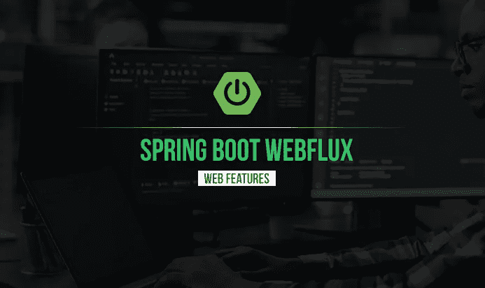
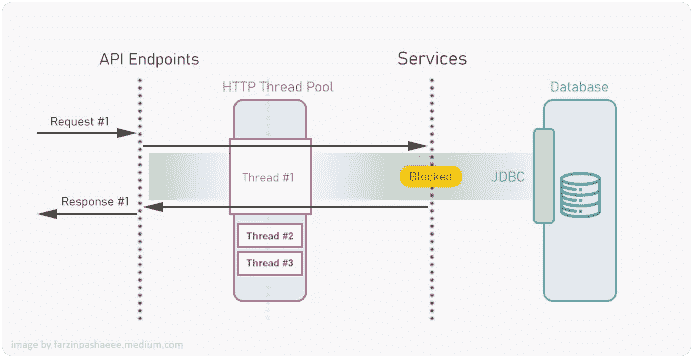
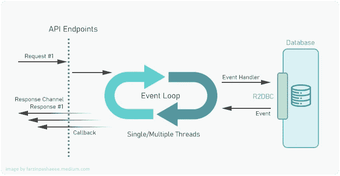

# Spring Boot 反应式网络应用— WebFlux

> 原文：<https://medium.com/codex/spring-boot-reactive-web-application-webflux-acef6ed7f37f?source=collection_archive---------3----------------------->



WebFlux 是 Spring Framework 的一部分，它有助于实现一种编程范式，这种范式提倡一种异步、非阻塞、事件驱动的数据处理方法，称为反应式编程。反应式系统具有某些特性，使其成为低延迟、高吞吐量工作负载的理想选择。但这意味着什么呢？让我们先快速描述一下这些关键词。

**异步:**异步代码是一种并行编程技术，允许一个工作单元独立于主应用线程运行。当该单元的工作完成时，它将通知主线程，该主线程最终将通过精确的设计来提高性能和增强响应能力。

**非阻塞:**如果任何一个线程的失败或挂起不会导致另一个线程的失败或挂起，那么这个进程称为非阻塞。

**事件驱动:** It

**为了更好地理解它，让我们考虑一个例子，比如 REST API，它简单地从数据库获取一些信息，并以 JSON 响应的形式返回。用 Spring Web MVC 实现这个例子，它有一个阻塞的特性，你会得到这样一个流程:**

****

**用阻塞线程处理 Web MVC 请求**

**每个传入的请求都将由 HTTP 线程池中不同线程中的 HTTP 请求处理程序来处理。在服务层处理请求(包括从数据库获取信息)期间，线程被阻塞，不能被任何其他请求使用。正如您所看到的，服务器可以处理的请求数量取决于线程池的大小，如果阻塞过程花费的时间比预期的长，您将面临更长的响应时间，并且无法响应新的传入请求。**

**另一方面，我们可以使用一种反应式方法，在我们的例子中是作为 Spring Boot 应用程序一部分的 WebFlux。Spring WebFlux 在内部使用 [Project Reactor](https://projectreactor.io/) 及其 publisher 实现 Flux 和 Mono。**

## **通量**

**一个`**Flux<T>**`是一个标准的`**Publisher<T>**`，它代表一个 0 到 N 个发射项的异步序列，可选地由一个完成信号或一个错误终止。正如在 Reactive Streams 规范中，这三种类型的信号转换成对下游用户的`**onNext**`、`**onComplete**`和`**onError**`方法的调用。**

## **单声道**

**一个`**Mono<T>**`是一个专门的`**Publisher<T>**`，它通过发出最多一个*信号，然后以一个`**onComplete**`信号终止(成功的`**Mono**`，有或没有值)，或者只发出一个`**onError**`信号(失败的`**Mono**`)。***

****

**使用非阻塞线程处理 Webflux 请求**

**正如您在该图中看到的，与 web MVC 阻塞模型不同，所有传入的 HTTP 请求实际上都是由一个或一小组线程处理的。对于作为事件的每个传入请求，流程将传递给 EventHandler 来执行预期的业务逻辑，在本例中是从数据库中检索数据。使用非阻塞的 R2DBC 代替 JDBC 将有助于我们获得完全的非阻塞流。这意味着一旦从数据库请求的数据可用，它将被返回，在此期间，将不会有线程被阻塞请求。由于这个功能，您不会因为 I/O 延迟而阻塞线程，从而浪费处理时间。**

## **应用服务器**

**Spring Webflux 默认将 [Netty](https://netty.io/) 作为嵌入式服务器。除此之外，在 [Tomcat](https://tomcat.apache.org/) 、 [Jetty](https://www.eclipse.org/jetty/) 、[under flow](https://undertow.io/)等 Servlet 3.1+容器上也支持。这里要注意的是，Netty 和 Undertow 是非 servlet 运行时，Tomcat 和 Jetty 是众所周知的 servlet 容器。**

# **Spring Boot 的例子**

**为了更好地理解，让我们使用 Webflux 创建一个示例 REST API。假设我们想要一个用于教育应用的 API，我们有两个端点，如下所示:**

****…/students/{id}** :使用 id 检索学生信息**

****…/学生/列表**:检索学生列表**

## **属国**

**以下依赖项是创建 WebFlux web 应用程序所需的基础。**

```
<**dependency**>
      <**groupId**>org.springframework.boot</**groupId**>
      <**artifactId**>spring-boot-starter-webflux</**artifactId**>
</**dependency**>
```

**除此之外，为了拥有一个完全非阻塞的反应式应用程序，您需要使用 r2dbc 启动器。**

```
<**dependency**>
   <**groupId**>org.springframework.boot</**groupId**>
   <**artifactId**>spring-boot-starter-data-r2dbc</**artifactId**>
</**dependency**>
```

**为简单起见，我们在测试应用程序中使用 H2，这就是为什么我们在应用程序中需要 r2dbc h2 驱动程序依赖项。如果您使用 MySQL、SQL Server 或任何其他数据库，您可以轻松找到合适的驱动程序。**

```
<**dependency**>
   <**groupId**>io.r2dbc</**groupId**>
   <**artifactId**>r2dbc-h2</**artifactId**>
</**dependency**>
```

## **控制器**

**对于 WebFlux 应用程序，控制器将类似于 Web MVC 应用程序。在我们的例子中，每个端点有两个 GET 方法，唯一的区别是方法的返回类型。**

```
@RestController
@RequestMapping(**"/student"**)
**public class** StudentController {

    @Autowired
    StudentService **studentService**;

    @GetMapping(**"/{id}"**)
    **public** Mono<Student> getStudentById(@PathVariable Long id ){
        **return studentService**.getStudentById(id);
    }

    @GetMapping(**"/list"**)
    **public** Flux<Student> getStudentList(){
        **return studentService**.getStudentList();
    }

}
```

**从代码中可以看出，这是一个非常常见的 rest 控制器。可能引起您注意的是 0 到 1 响应的返回类型`Mono<T>`和 0 到 n 响应的返回类型`Flux<T>`的不同。**

## **服务**

**为学生提供的服务与你日常使用的服务也没有太大的不同。**

```
@Service
**public class** StudentService {

    @Autowired
    StudentRepository **studentRepository**;

    **public** Mono<Student> getStudentById(Long id ){
        **return studentRepository**.findById(id);
    }

    **public** Flux<Student> getStudentList(){
        **return studentRepository**.findAll();
    }

}
```

## **贮藏室ˌ仓库**

**由于我们使用 r2dbc 数据，我们将从`R2dbcRepository<T,ID>`接口扩展我们的学生资源库。**

```
**public interface** StudentRepository **extends** R2dbcRepository<Student, Long> {
}
```

**对于应用程序属性，以下属性足以作为开始。**

```
**spring.r2dbc.url**=**r2dbc:h2:mem:///~/db/testdb
spring.r2dbc.username**=**sa
spring.r2dbc.password**=
```

**现在，准备好您的学生实体和一些样本记录，您就可以测试应用程序了。**

```
@Data
@AllArgsConstructor
@NoArgsConstructor
@Table(**"student"**)
**public class** Student {

    @Id
    @GeneratedValue(strategy = GenerationType.***SEQUENCE***)
    **private** Long **id**;
    **private** String **name**;

}
```

**你可以用任何像 chrome 一样支持事件流的客户端来测试这个 API。你可以在 [Github](https://github.com/farzinpashaee/medium/tree/main/Spring%20Boot%20WebFlux%20-%20Reactive) 上找到这个项目的代码。**

**希望这篇文章对你有所帮助，请支持我，为这个故事鼓掌。如果你不知道事情是这样的:**

****

**或者在这里给我买杯咖啡[！](https://www.buymeacoffee.com/fpashaee)**

****资源:**[en.wikipedia.org](https://en.wikipedia.org/wiki/Event-driven_programming)， [projectreactor.io](https://projectreactor.io/docs/core/release/reference/)**