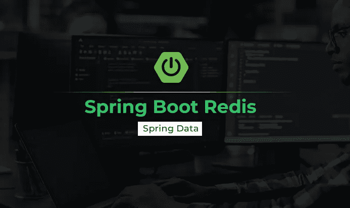
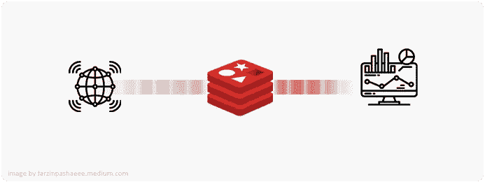
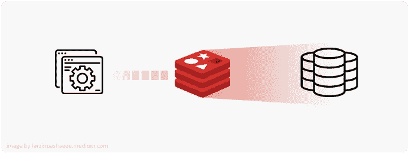
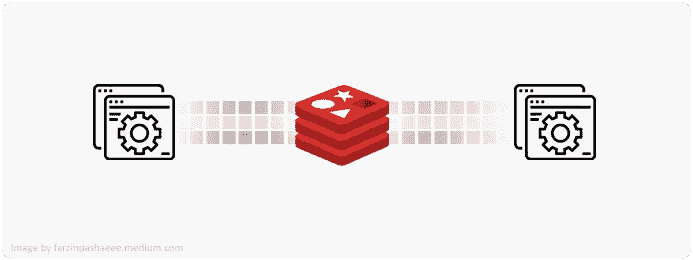
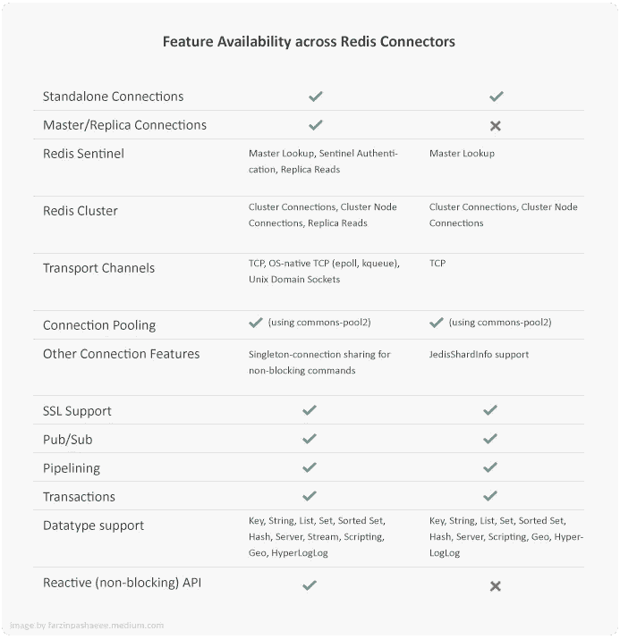

# Spring Boot-雷迪斯公司

> 原文：<https://medium.com/codex/spring-boot-redis-54e7c9ea3cee?source=collection_archive---------2----------------------->



在本文中，我们将讨论 Redis 以及如何通过 Spring Boot 应用程序连接到它。

# Redis 是什么？

数百万开发者使用 [Redis](https://github.com/redis/redis) 作为开源的内存数据存储、数据库、缓存、流媒体引擎和消息代理。Redis 经常被称为数据结构 T4 服务器。换句话说，这意味着 Redis 提供了基本的命令，TCP 套接字可以将这些命令用作服务器-客户端方法来访问和修改数据结构。因此，许多进程可以共享对相同数据结构的访问，并在需要时更改它们。

## 何时使用 Redis

Redis 有不同的已知用例，您可以在这里找到其中一些用例，并对其进行简单描述:

**实时数据存储**



拥有大量需要实时存储和处理的数据正成为企业的日常挑战。一般来说，实时数据库是一种数据存储，创建它是为了实时收集、处理和/或丰富输入的数据点序列，就像数据流一样，通常是在数据创建后立即进行。使用 Redis，您可以为要求低延迟和高吞吐量的实时应用程序创建数据基础设施。

**缓存和会话存储**



依赖高延迟系统的应用程序的另一个常见问题是需要快速缓存和交付数据。由于 Redis 的速度，它是缓存数据库查询、复杂计算、API 请求和会话状态的最佳选择。

**流媒体和信息服务**



在组织中传输数据并使其可用于系统中的不同组件一直是一项挑战。Redis 的流数据类型支持消息传递、事件源、通知和高速数据接收。

Redis 的用例不仅仅是我们提到的例子，但是在本文中，我们主要关注实时数据存储用例，下面使用 Spring Boot 的例子将展示如何使用它。

# 开始吧

在这个简单的例子中，您将学习如何建立到 Redis 服务器的连接并执行一些基本任务，比如输入数据和从 Redis 读取数据。安装 Redis 非常简单，你可以在这里找到安装指南。

## 属国

Redis 相关的库是 Spring 数据包的一部分，它使得使用数据访问技术、关系和非关系数据库、map-reduce 框架和基于云的数据服务变得容易。您有两种方法来处理相关的依赖关系。您可以使用`spring-boot-starter-data-redis`，它将准备好所有必要的依赖项。

```
<dependency>     
    <groupId>org.springframework.boot</groupId>
    <artifactId>spring-boot-starter-data-redis</artifactId> 
</dependency>
```

另一种方法是使用`spring-data-redis`，这样您就可以灵活地选择底层的连接器驱动程序实现。

```
<dependency>
    <groupId>org.springframework.data</groupId>
    <artifactId>spring-data-redis</artifactId>
</dependency>
```

现在，您可以选择首选的连接器驱动程序作为不同的依赖项，如下所示:目前，Spring Data Redis 使用的底层库有两个选项。

## 杰迪斯

[Jedis](https://github.com/redis/jedis) 是 Redis 的 Java 客户端，为性能和易用性而设计，也用于`spring-boot-starter-data-redis`。它帮助您创建一个连接池，并使用它与 Redis 通信。

```
<dependency>     
    <groupId>redis.clients</groupId>   
    <artifactId>jedis</artifactId>    
</dependency>
```

## **生菜**

[莴苣](https://github.com/lettuce-io/lettuce-core)是一个可伸缩的、线程安全的 Redis 客户端，支持同步、异步和反应式使用。

```
<dependency>
    <groupId>io.lettuce</groupId>
    <artifactId>lettuce-core</artifactId>
</dependency>
```

## 杰迪斯 VS 莴苣

目前，并非所有连接器都支持所有 Redis 特性。当调用底层库不支持的连接 API 上的方法时，会抛出一个`UnsupportedOperationException`。以下概述解释了各个 Redis 连接器支持的功能:



## 连接 Redis

默认情况下，使用 Spring Boot 启动器也会添加 Jedis 依赖项。使用 Redis 和 Spring 时，通过 IoC 容器连接到 Redis 存储是最初的任务之一。这需要使用 Java 连接器来完成，不管您有什么库。

`org.springframework.data.redis.connection`包中的`RedisConnection`和`RedisConnectionFactory`接口可用于检索 Redis 的活动连接。

`RedisConnection`，它管理与 Redis 后端的通信，为 Redis 通信提供基本的构建块，并自动将底层连接库异常转换为 Spring 的可靠 DAO 异常层次。

为了创建`RedisConnection`，你可以使用`RedisConnectionFactory`。使用`RedisConnectionFactory`最简单的方法是通过 IoC 容器配置适当的连接，并将其注入目标类。

如果您有一个简单的 Redis 独立实例在运行，您可以使用`RedisStandaloneConfiguration`来准备`JedisConnectionFactory`，只需在构造函数中传递服务器的 IP 地址或主机名以及端口号。

```
@Configuration
public class RedisConfiguration {

    @Bean
    public JedisConnectionFactory jedisConnectionFactory() {
        RedisStandaloneConfiguration redisConfiguration = new RedisStandaloneConfiguration("192.168.0.80", 6379);
        return new JedisConnectionFactory(redisConfiguration);
    }

}
```

## 重模板

`RedisTemplate`及其容器包`org.springframework.data.redis.core`，被广大用户使用。它是 Redis 交互的高级抽象，处理序列化和连接管理。

```
@Configuration
public class RedisConfiguration {

    @Bean
    public JedisConnectionFactory jedisConnectionFactory() {
        RedisStandaloneConfiguration redisConfiguration = new RedisStandaloneConfiguration("192.168.0.80", 6379);
        return new JedisConnectionFactory(redisConfiguration);
    }

    @Bean
    public RedisTemplate<String, Object> redisTemplate() {
        RedisTemplate<String, Object> template = new RedisTemplate<>();
        template.setConnectionFactory(jedisConnectionFactory());
        return template;
    }

}
```

设置好 JedisConnectionFactory 和 RedisTemplate 之后，就可以开始在 Redis 中处理数据了。但是，如果您熟悉存储库，甚至有一种使用 Redis 的简单方法。利用存储库可以无缝地读取和操作 Redis 散列中的域对象。

就像下面的例子，你可以简单地使用 Spring Data Redis 实现域实体。

```
@RedisHash("Student")
public class Student implements Serializable {
    private String id;
    private String name;
    private Integer age;
}
```

现在我们有了一个负责存储和检索的组件，我们可以通过扩展`CrudRepository`接口来创建我们的存储库。

```
public interface StudentRepository extends CrudRepository<Student, String> {
}
```

`CrudRepository`将提供基本的 CRUD 操作，以处理如下示例:

*   保存(学生学生)；
*   findById(字符串 id)；
*   count()；
*   删除(学生学生)；

是时候创建您的服务类、注入存储库并开始使用 Redis 了，就像下面的示例代码一样:

```
@Service
public class StudentService {

    @Autowired
    StudentRepository studentRepository;

    public Student addStudent(Student student){
        return studentRepository.save(student);
    }

    public List<Student> getStudents(){
        List<Student> list = new ArrayList<Student>();
        studentRepository.findAll().forEach( i -> {
            list.add(i);
        });
        return list;
    }

}
```

使用模型对象，您可以简单地插入记录进行散列，并按预期读取它们。

当然，在从 Redis 中读取和检索数据的过程中涉及到很多细节，但是这个例子可以让您对整个库是如何工作的有一个基本的了解。

希望这篇文章对你有帮助，请鼓掌支持我👏为了这个故事。如果你不知道它是如何工作的，它就像这样:


或者在这里给我买杯[咖啡！](https://www.buymeacoffee.com/fpashaee)