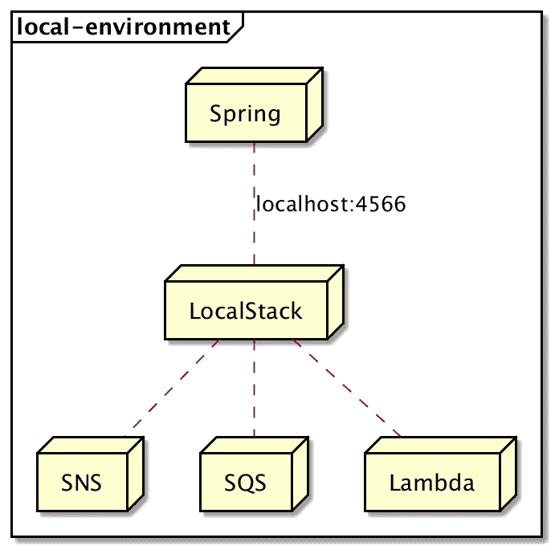

# Spring Boot +社交网络+本地堆栈

> 原文：<https://medium.com/codex/spring-boot-sns-localstack-619b9b75f2ac?source=collection_archive---------4----------------------->



本地环境上的本地堆栈

[LocalStack](https://github.com/localstack/localstack) 是一个开源的亚马逊网络服务(AWS)模仿服务。此外，它支持 shell 中的 aws-cli 命令。我们可以使用 LocalStack 来测试和调试我们的代码，而无需将其部署在 Amazon 环境中。LocalStack 有三个版本:标准版、专业版和企业版。标准版已经提供了 Lambda、SNS、SQS、S3 等常见的 AWS APIs。

在本文中，我们将使用 LocalStack 在本地环境中集成 Spring Boot 和 AWS 的简单通知服务(SNS)。首先，我们将运行 LocalStack，然后使用官方的 [AWS API](https://aws.amazon.com/sdk-for-java/) 从 Spring Boot 连接到 SNS 服务。然后我们将执行几个 SNS 场景，比如发布一条消息。

注意:你可以从[这里](https://github.com/turkdogan/spring-boot-guide/tree/main/spring-boot-sns-localstack)下载代码作为 Kotlin+Gradle 项目

# 运行 LocalStack

我们有几个选项可以在本地环境中运行 LocalStack。让我们使用 docker-compose 方法。这种方法需要安装 Docker。

```
version: '3.4'

services:
  localstack:
    image: localstack/localstack:0.12.15
    container_name: localstack_sns
    ports:
      - '4566:4566'
    environment:
      - DEFAULT_REGION=us-east-1
      - SERVICES=sns
      - DEBUG=1
      - DATA_DIR=/tmp/localstack/data
    volumes:
      - '/var/run/docker.sock:/var/run/docker.sock'
```

通过一个简单的`docker-compose`命令，我们可以初始化并运行 LocalStack。

```
docker-compose up -d
```

第一次运行时，下载 docker 映像可能需要一些时间。在连续运行中，它会启动得更快。我们可以像在 AWS 环境中一样离线使用 SNS。

# 集成社交网络的 Spring Boot

Amazon 为流行的编程环境提供了一个官方库。在本文中，我们将在 Kotlin 环境中使用 Java 客户端。让我们将 SNS 库添加到 Gradle 文件中:

```
implementation("com.amazonaws:aws-java-sdk-sqs:1.11.970")
```

## SNS 客户端

让我们将客户机创建为一个 Spring 组件，如下所示:

```
@Configuration
class AWSSNSConfig {

    @Bean(destroyMethod = "shutdown")
    fun amazonSNS(): AmazonSNS {
        return AmazonSNSClient.builder()
                .withEndpointConfiguration(AwsClientBuilder.EndpointConfiguration(
                        "http://localhost:4566", "us-east-1"))
                .withCredentials(AWSStaticCredentialsProvider(
                        BasicAWSCredentials("foo", "bar")))
                .build()
    }
}
```

LocalStack 使用 4566 端口与所有 AWS 服务进行通信。我们不需要提供任何真实的凭证来与 LocalStack 通信。

从现在开始，我们可以创建客户端，并使用该客户端进行 SNS 相关的呼叫。通过使用这个客户端组件，我们可以执行以下操作:

*   创建主题
*   列出主题
*   发布消息
*   订阅主题
*   列表订阅
*   取消订阅主题
*   删除主题

## 创建社交网络话题

从客户端创建 SNS 主题很简单。让我们创建一个主题，如下所示:

```
val topic = "topic"
val createTopic = amazonSNS.createTopic(topic)
val topicArn = createTopic.topicArn
```

对于复杂的场景，我们可以使用`CreateTopicRequest`而不是直接提供主题名称。

这段代码的行为类似于 aws-cli 工具的`create-topic`命令。

```
aws --endpoint-url http://localhost:4566 sns create-topic --name topic
```

## 列出社交网络话题

SNS 主题的列表可以通过使用 SNS 客户端的`listTopics`方法来执行，如下所示:

```
val request = ListTopicsRequest()
val result = amazonSNS.listTopics(request)
println(result.topics.first().topicArn)
```

在本例中，我们打印第一个主题的 ARN。该命令的工作方式类似于 aws-cli 的`list-topics`命令。我们可以通过使用以下 shell 命令来观察主题列表:

```
aws --endpoint-url http://localhost:4566 sns list-topics
```

该命令的输出应该给出以下响应:

```
"Topics": [
    {
        "TopicArn": "arn:aws:sns:us-east-1:000000000000:topic"
    }
]
```

## 发布社交网络消息

发布消息需要有效的主题 arn。

```
val request = PublishRequest()
request.topicArn = topicArn
request.message = "this is a sample message"
request.messageGroupId = "exampleGroupId"
val result = amazonSNS.publish(request)
```

## 订阅社交网络话题

订阅是社交网站的核心。主要目的是将消息定向到接收方服务。在本例中，我们将为特定主题创建一个简单的电子邮件订阅。

```
val request = SubscribeRequest()
request.protocol = "email"
request.endpoint = "example@turkdogan.dev"
request.topicArn = topicArn
val result = amazonSNS.subscribe(request)
subscriptionArn = result.subscriptionArn
```

SNS 支持以下订阅协议:

*   应用
*   电子邮件
*   消防水龙带
*   超文本传送协议（Hyper Text Transport Protocol 的缩写）
*   https
*   希腊字母的第 11 个
*   存储管理服务
*   sqs

同样，可以使用 aws-cli 完成相同的订阅，如下所示(注意，我们提供的是主题的 arn):

```
aws --endpoint-url http://localhost:4566 sns subscribe --topic-arn arn:aws:sns:us-east-1:000000000000:topic --protocol email --notification-endpoint example@turkdogan.dev
```

回应应该是这样的:

```
{
    "SubscriptionArn": "arn:aws:sns:us-east-1:000000000000:topic:6b6dccc9-baf6-4cbb-9d40-e55d737fb0b9"
}
```

## 列表订阅

我们可以使用以下代码，通过 SNS 客户端列出所有订阅:

```
val result = amazonSNS.listSubscriptions()
```

此外，我们可以通过以下 aws-cli 命令列出:

```
aws --endpoint-url http://localhost:4566 sns list-subscriptions
```

## 取消订阅社交网络话题

取消订阅需要有效的订阅 arn。

```
request.subscriptionArn =  subscriptionArn
val result = amazonSNS.unsubscribe(request)
```

这段代码类似于下面的 shell 命令(请注意，我们提供了之前创建的 subscription-arn):

```
aws --endpoint-url http://localhost:4566 sns unsubscribe --subscription-arn arn:aws:sns:us-east-1:000000000000:topic:6b6dccc9-baf6-4cbb-9d40-e55d737fb0b9
```

## 删除社交网络话题

像发布操作一样，删除也需要一个有效的主题 arn。

```
amazonSNS.deleteTopic(topicArn)
```

最后，我们可以使用 aws-cli 命令删除特定主题:

```
aws --endpoint-url http://localhost:4566 sns delete-topic --topic-arn arn:aws:sns:us-east-1:000000000000:topic
```

# 摘要

LocalStack 是在本地环境中使用 AWS Cloud API 的一个很好的工具。在这篇文章中，我们整合了 Spring Boot 和 LocalStack，并实现了常见的 SNS 场景。在接下来的文章中，我计划介绍 SQS 和 S3 的服务。