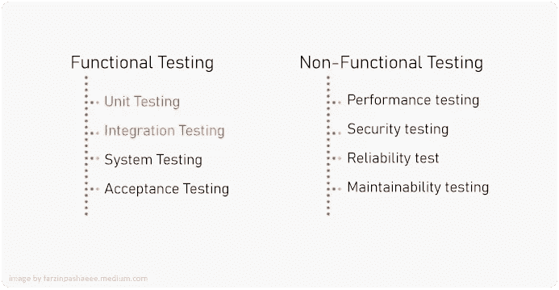

# Spring Boot 试验

> 原文：<https://medium.com/codex/spring-boot-test-42e67d2eae8c?source=collection_archive---------3----------------------->


Spring Boot 附带了一整套测试工具，如单元测试、集成测试、断言和模拟。est 支持由两个模块提供:`spring-boot-test`包含核心项，`spring-boot-test-autoconfigure`支持测试的自动配置，但大多数开发人员使用的`spring-boot-starter-test`既有 Spring Boot 测试模块，也有 JUnit Jupiter、AssertJ、Hamcrest 和许多其他有用的库。

```
<dependency>     
    <groupId>org.springframework.boot</groupId>     
    <artifactId>**spring-boot-starter-test**</artifactId>
    <scope>test</scope>     
</dependency>
<dependency>
    <groupId>junit</groupId>
    <artifactId>junit</artifactId>
    <scope>test</scope>
</dependency>
```

`spring-boot-starter-test`“Starter”(在`test` `scope`中)包含以下提供的库:

[**JUnit 5**](https://junit.org/junit5/)**:**Java 应用的单元测试库

[**春季测试**](https://docs.spring.io/spring-framework/docs/5.3.17/reference/html/testing.html#integration-testing) **& Spring Boot 测试:**对 Spring Boot 应用程序的实用程序和集成测试支持。

[**AssertJ**](https://assertj.github.io/doc/)**:**AssertJ 提供了一组丰富的断言，真正有用的错误消息，提高了测试代码的可读性，并被设计成在您最喜欢的 IDE 中超级容易使用。

[**ham crest**](https://github.com/hamcrest/JavaHamcrest)**:**ham crest 是一个用于编写匹配器对象的框架，允许以声明方式定义“匹配”规则。(也称为约束或谓词)。

[**mock ITO**](https://site.mockito.org/)**:**一个 Java mocking 框架，让你用干净&简单的 API 编写漂亮的测试。Mockito 测试可读性很强，并且会产生干净的验证错误。

[**JSONassert**](https://github.com/skyscreamer/JSONassert)**:**一个 JSON 的断言库，帮助编写 JSON 测试，就像你在比较一个字符串一样。在幕后，JSONassert 将字符串转换成 JSON 对象，并将逻辑结构和数据与实际的 JSON 进行比较

[**JSON path**](https://github.com/jayway/JsonPath)**:**JSON path 是一种针对 JSON 的查询语言，其特性类似于针对 XML 的 [XPath](https://en.wikipedia.org/wiki/XPath) 。JSONPath 用于从 JSON 文档中选择和提取子部分。

使用这些工具，您可以准备一组自动化的功能测试。他们将帮助你测试、模拟和评估基于任何用例的不同场景。使用 Spring Boot 很容易实现两种常见的功能测试，包括单元测试和集成测试。

# 软件测试类型

软件测试通常分为两大类:功能测试和非功能测试。



功能测试包括软件应用程序功能方面的测试，以确保您是否得到了想要的结果。另一方面，非功能性测试评估应用程序的其他方面，比如性能、可靠性、可用性、安全性等等，这可以在很大程度上提高我们软件的质量。在本文中，我们将关注两种主要的功能测试，其他的并不在本文的讨论范围之内。

# 功能测试

## 单元测试

单元测试包括测试你的软件所使用的类、组件或模块的单个功能和方法。这很重要，因为我们可以在单元测试级别发现更多的缺陷。JUnit 作为 test starter 的一部分，帮助我们在 Spring Boot 应用程序中进行单元测试。

编写一个好的单元测试需要一些经验，但是随着时间的推移，你会有信心覆盖你正在测试的每一个单元的所有可能的情况，并且你会感谢你在前进中所花费的时间。

有了`@SpringBootTest`作为注释，您已经可以开始编写您的第一个单元测试了。请记住，为了让 spring boot 和 JUnit 一起工作，我们需要使用`@ExtendWith(SpringExtension.class)`来代替`@RunWith`，但是由于`@SpringBootTest`它已经被处理了。

```
@SpringBootTest
**class** SpringbootApplicationTests {

   @Autowire
   StudentService **studentService**;

   @DisplayName(**"Student service find by Id test"**)
   @Test
   **void** testFindStudent_Successfull_returnStudent() {
      *assertEquals*(**"XX1"**, **studentService**.findStudentById(**"XX1"**).getId());
   }

}
```

这种方法的唯一问题是，为了有所有的注入和 Spring Boot 相关的布线，你将需要启动一个完整的 Spring Boot 应用程序，这将使测试过程缓慢。一个解决方案是使用其他注入方式，比如构造函数，这样你就不再需要`@SpringBootTest`了。

假设您有这样一个简单的服务:

```
@Service
**public class** StudentService {

    @Autowired
    StudentRepository **studentRepository**;

    **public** Student findStudentById( String id ){
        **return studentRepository**.findById(id).get();
    }

}
```

如果您使用 JUnit5 来避免运行整个 spring boot 应用程序，另一个解决方案是使用`@ExtendWith(MockiatoExtension.class)`，它将帮助您注入您想要测试的单元。

```
**@ExtendWith(MockitoExtension.class)**
**class** SpringbootApplicationTests {

   @InjectMocks
   StudentService **studentService**;

   @Mock
   StudentRepository **studentRepository**;

   @DisplayName(**"Student service find by Id test"**)
   @Test
   **void** testFindStudent_Successfull_returnStudent() {
     // Mocking repository
     *when*(**studentRepository**.findById(**"XX1"**))
        .thenReturn(Optional.*of*(**new** Student(**"XX1"**,**"John"**,10L))); // Asserting result
     *assertEquals*(**"XX1"**, **studentService**.findStudentById(**"XX1"**).getId());
   }

}
```

在这种情况下，`@InjectMock`将帮助你自动连接你需要测试的单元，而`@Mock`可以用来模拟单元内部的依赖关系。被模仿的对象将模仿真实的实现，以帮助我们的测试更加关注被测试的单元，而不是它们所具有的依赖性。最后，我们使用了 *assertEquals* 来查看结果是否符合预期，如果符合，测试将会通过。

对于 JUnit 4，您可以使用这个`@RunWith(MockitoJUnitRunner.class)`注释。剩下的和 JUnit 5 差不多。

```
**@RunWith(MockitoJUnitRunner.class)**
**class** SpringbootApplicationTests {
    ...
}
```

## 集成测试

另一方面，集成测试验证应用程序使用的不同模块或服务能够很好地协同工作。这些类型的测试运行起来更加昂贵，因为它们需要启动并运行应用程序的多个部分。

假设我们的应用程序中有一个如下所示的控制器，我们希望通过调用该 API 来进行集成测试。这个测试可以涉及多个模块和类，我们将得到他们一起工作的结果。

```
@SpringBootTest(webEnvironment = WebEnvironment.RANDOM_PORT)
public class SpringBootIntegrationTest{

    @LocalServerPort
    private int port;

    @Autowired
    private TestRestTemplate restTemplate;

    @Test
    public **void** testGetStudentById_success_returnStudent() 
            **throws** Exception {
        ResponseEntity<Student> response = this.restTemplate
           .getForObject("http://localhost:" 
                + port 
                + "**/student/find-by-id?id=XX1**"
		, Student.class); *assertEquals*(**"XX1"**, response.getBody().getId());
    }
}
```

这个解决方案将运行一个完整的 Spring boot 应用程序，我们可以使用 TestRestTemplate 来检查 API 调用的结果。正如你所看到的，你只需要设置`@SpringBootTest`就可以开始了。拥有`webEnvironment`并不重要，只是有助于避免与任何其他运行环境应用的冲突。

还有另一个解决方案有助于更快地运行测试。在这种方法中，我们根本不启动服务器，而是只测试它下面的一层，在这一层，Spring 处理传入的 HTTP 请求，并将它交给您的控制器。要做到这一点，使用 Spring 的`MockMvc`,并通过使用测试用例上的`@AutoConfigureMockMvc`注释来请求注入。

```
@SpringBootTest
**@AutoConfigureMockMvc**
**public class** SpringBootIntegrationTest {

    @Autowired
    **private MockMvc mockMvc;**

    @Test
    **public void** testGetStudentById_success_returnStudent() **throws** Exception {
        **this**.**mockMvc** .perform(*get*(**"/student/find-by-id?id=XX1"**))
            .andExpect(*status*().isOk());
    }

}
```

这些是通过 Spring Boot 测试启动程序及其提供的工具创建单元测试和集成测试的基本样本。正如您所猜测的，有许多特性适合您的特定使用情形，您可以参考不同的参考资料来找到这些特性。

希望这篇文章对你有所帮助，请支持我，为这个故事鼓掌。如果你不知道事情是这样的:


或者在这里给我买杯咖啡[！](https://www.buymeacoffee.com/fpashaee)