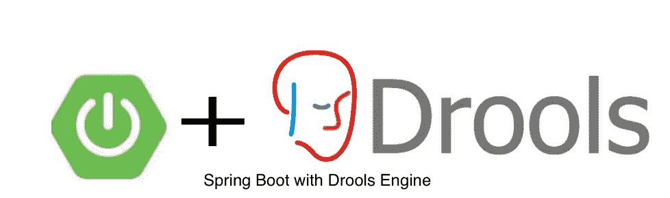

# 搭载 Drools 发动机的 Spring Boot

> 原文：<https://medium.com/codex/spring-boot-with-drools-engine-7119774c559f?source=collection_archive---------0----------------------->

## 在这个博客中，我们将看到 Spring boot 如何轻松地与 Drools 规则引擎集成。



Spring Boot 和 Drools 规则引擎集成

当我们必须实现最复杂的业务规则时，规则引擎是最常用的集成模式。

Drools 是一个开源的业务规则管理系统(BRMS ),可以很容易地与许多应用程序集成。它是用 100%纯 Java 编写的，可以在任何 JVM 上运行，也可以在 Maven 中央存储库中获得。

我们今天将探索并实现与 Spring boot 的集成。

[](https://www.kie.org/)**(知识就是一切)是一个伞式项目，旨在将相关技术集中在一个屋檐下。因此，KIE 是与弹簧靴集成的主要核心部件。**

**在这篇博客中，我们将看到如何集成 Drools 规则引擎，并使用 spring boot 实现一个演示规则引擎服务。**

**我们还将通过创建**来使用 DRL (Drools 规则语言)规则。spring boot 应用程序中的 drl** 文件。**

## **1.添加 maven 依赖项**

**让我们创建一个基本的 spring boot 应用程序，并将下面的 **drools** 依赖项添加到 pom.xml。**

```
<?xml version="1.0" encoding="UTF-8"?>
<project  xmlns:xsi="http://www.w3.org/2001/XMLSchema-instance"
   xsi:schemaLocation="http://maven.apache.org/POM/4.0.0 https://maven.apache.org/xsd/maven-4.0.0.xsd">
   <modelVersion>4.0.0</modelVersion>
   <parent>
      <groupId>org.springframework.boot</groupId>
      <artifactId>spring-boot-starter-parent</artifactId>
      <version>2.6.6</version>
      <relativePath/> <!-- lookup parent from repository -->
   </parent>
   <groupId>com.praveen.drools.example</groupId>
   <artifactId>springboot-drools-demo</artifactId>
   <version>0.0.1-SNAPSHOT</version>
   <name>springboot-drools-demo</name>
   <description>Demo project for Spring Boot with Drools Engine</description>
   <properties>
      <java.version>11</java.version>
      <drools.version>7.67.0.Final</drools.version>
      <springfox-swagger2.version>3.0.0</springfox-swagger2.version>
   </properties>
   <dependencies>
      <dependency>
         <groupId>org.springframework.boot</groupId>
         <artifactId>spring-boot-starter-web</artifactId>
      </dependency>

      <dependency>
         <groupId>org.springframework.boot</groupId>
         <artifactId>spring-boot-starter-test</artifactId>
         <scope>test</scope>
      </dependency>

      <dependency>
         <groupId>org.drools</groupId>
         <artifactId>drools-core</artifactId>
         <version>${drools.version}</version>
      </dependency>

      <dependency>
         <groupId>org.drools</groupId>
         <artifactId>drools-compiler</artifactId>
         <version>${drools.version}</version>
      </dependency>

      <dependency>
         <groupId>org.drools</groupId>
         <artifactId>drools-decisiontables</artifactId>
         <version>${drools.version}</version>
      </dependency>

      <!-- swagger ui -->
      <dependency>
         <groupId>io.springfox</groupId>
         <artifactId>springfox-boot-starter</artifactId>
         <version>${springfox-swagger2.version}</version>
      </dependency>

      <dependency>
         <groupId>io.springfox</groupId>
         <artifactId>springfox-swagger-ui</artifactId>
         <version>${springfox-swagger2.version}</version>
      </dependency>
   </dependencies>

   <build>
      <plugins>
         <plugin>
            <groupId>org.springframework.boot</groupId>
            <artifactId>spring-boot-maven-plugin</artifactId>
         </plugin>
      </plugins>
   </build>

</project>
```

## **2.配置 Drools 应用程序**

**创建一个名为**DroolsConfig.java**的配置 java 类，并将下面的配置添加到这个 java 类中。**

```
package com.praveen.drools.example.configuration;

import com.praveen.drools.example.service.CustomerCategorizeService;
import org.kie.api.KieServices;
import org.kie.api.builder.KieBuilder;
import org.kie.api.builder.KieFileSystem;
import org.kie.api.builder.KieModule;
import org.kie.api.runtime.KieContainer;
import org.kie.internal.io.ResourceFactory;
import org.springframework.context.annotation.Bean;
import org.springframework.context.annotation.Configuration;

*/**
 * Drools Config.
 ** ***@author*** *Praveen.Nair
 */* @Configuration
public class DroolsConfig {

    private static final String *RULES_CUSTOMER_RULES_DRL* = "rules/customer-category.drl";

    @Bean
    public KieContainer kieContainer() { 
        final KieServices kieServices = KieServices.Factory.*get*();
        KieFileSystem kieFileSystem = kieServices.newKieFileSystem();
        kieFileSystem.write(ResourceFactory.*newClassPathResource*(*RULES_CUSTOMER_RULES_DRL*));
        KieBuilder kb = kieServices.newKieBuilder(kieFileSystem);
        kb.buildAll();
        KieModule kieModule = kb.getKieModule();
        return kieServices.newKieContainer(kieModule.getReleaseId());
    }
}
```

**config 类创建一个 spring bean**kie container**来构建规则引擎，方法是加载应用程序的 **/resources** 文件夹下的规则文件。我们创建了 **KieFileSystem** 实例，并从应用程序的资源目录中加载 DRL 文件。**

**最后，我们使用 KieService 和 KieBuilder 创建一个 KieContainer，并将其配置为一个 spring bean。**

## **3.创建模型类**

**创建名为 **CustomerRequest** 的 Pojo 类，并定义以下字段。**

**我们接收这个类作为规则引擎的请求对象，并且我们还将这些字段作为输入发送给已定义的规则，以便为给定的客户请求导出 customerType。**

**还定义一个名为**CustomerCategory.java**的 java 枚举，如下所示。enum 保存客户类别，规则引擎根据该值导出客户类型。**

```
package com.praveen.drools.example.model;

*/**
 * Customer Categories.
 */* public enum CustomerCategory {

    *GENERAL*, *KIDS*, *SENIOR_CITIZEN*, *SUSPENDED*;

    public String getValue() {
        return this.toString();
    }
}
```

**最后，创建一个名为 CustomerType 的响应 POJO 类，如下所示。**

```
package com.praveen.drools.example.model;

import java.util.Objects;
import java.util.StringJoiner;

*/**
 * CustomerType Response model.
 ** ***@author*** *Praveen.Nair
 */* public class CustomerType {

    private CustomerCategory customerType;

    public CustomerCategory getCustomerType() {
        return customerType;
    }

    public void setCustomerType(CustomerCategory customerType) {
        this.customerType = customerType;
    }
}
```

****4。定义 Drools 规则****

**创建一个名为 **customer-category.drl** 的 drools 规则文件，并将该文件放在目录**/src/main/resources/rules**下。**

```
import com.praveen.drools.example.model.CustomerRequest
import com.praveen.drools.example.model.CustomerCategory;
global com.praveen.drools.example.model.CustomerType customerType;

dialect "mvel"

rule "Categorize customer based on age"
    when
        CustomerRequest(age < 20)
    then
        customerType.setCustomerType(CustomerCategory.*KIDS*);
end

rule "Categorize senior citizen customer based on age"
    when
        CustomerRequest(age > 50)
    then
      customerType.setCustomerType(CustomerCategory.*SENIOR_CITIZEN*);
end

rule "Categorize customer based on number of orders"
    when
        CustomerRequest(numberOfOrders == 0)
    then
        customerType.setCustomerType(CustomerCategory.*SUSPENDED*);
end

rule "Categorize customer general case"
    when
        CustomerRequest((gender == "M" || gender == "F") && age > 20 && age < 50)
    then
        customerType.setCustomerType(CustomerCategory.*GENERAL*);
end
```

**我们需要导入 DRL 文件中使用的模型。我们还使用名为 **customerType** 的全局参数。全局参数可以在多个规则之间共享。**

**DRL 文件可以包含一个或多个规则。我们可以使用 [mvel](http://mvel.documentnode.com/) 语法来指定规则。此外，每个规则都可以使用**规则**关键字进行描述。**

**然后我们定义 **when-then** 语法来指定规则的条件。基于客户请求的输入值，我们将 customerType 派生为结果。**

****5。添加控制器和服务层****

**创建一个名为**CustomerCategorizeService**的服务 java 类，并添加以下内容。**

```
package com.praveen.drools.example.service;

import com.praveen.drools.example.model.CustomerRequest;
import com.praveen.drools.example.model.CustomerType;
import org.kie.api.runtime.KieContainer;
import org.kie.api.runtime.KieSession;

*/**
 * Customer Categorization service.
 ** ***@author*** *Praveen.Nair
 */* public class CustomerCategorizeService {

    private final KieContainer kieContainer;

    public CustomerCategorizeService(KieContainer kieContainer) {
        this.kieContainer = kieContainer;
    }

    public CustomerType getCustomerType(CustomerRequest customerRequest) {
        CustomerType customerType = new CustomerType();
        KieSession kieSession = kieContainer.newKieSession();
        kieSession.setGlobal("customerType", customerType);
        kieSession.insert(customerRequest);
        kieSession.fireAllRules();
        kieSession.dispose();
        return customerType;
    }
}
```

**现在我们正在注入 **KieContainer** 实例并创建一个 **KieSession** 实例。我们还设置了一个类型为 **CustomerType** 的全局参数，它将保存规则的执行结果。**

**要将请求对象传递给 DRL 文件，我们可以使用 **insert()** 方法。然后我们通过调用 **fireAllRules()** 方法触发所有规则，最后通过调用 KieSession 的 **dispose()** 方法终止会话。**

**用端点 **/api/getCustomerType** 公开一个 POST API。端点需要一个 **CustomerRequest** 对象，并返回 **CustomerType** 响应。控制器内容如下所示:**

```
package com.praveen.drools.example.web;

import com.praveen.drools.example.model.CustomerRequest;
import com.praveen.drools.example.model.CustomerType;
import com.praveen.drools.example.service.CustomerCategorizeService;
import org.springframework.http.HttpStatus;
import org.springframework.http.ResponseEntity;
import org.springframework.web.bind.annotation.PostMapping;
import org.springframework.web.bind.annotation.RequestBody;
import org.springframework.web.bind.annotation.RequestMapping;
import org.springframework.web.bind.annotation.RestController;

@RestController
@RequestMapping("/api/getCustomerType")
public class CustomerCategorizeController {

    private final CustomerCategorizeService customerCategorizeService;

    public CustomerCategorizeController(
            CustomerCategorizeService customerCategorizeService) {
        this.customerCategorizeService = customerCategorizeService;
    }

    @PostMapping
    public ResponseEntity<CustomerType> getCustomer(@RequestBody CustomerRequest customerRequest) {
        CustomerType customerType = customerCategorizeService.getCustomerType(customerRequest);
        return new ResponseEntity<>(customerType, HttpStatus.OK);
    }

}
```

****6。添加 Swagger 配置(可选)****

**将 swagger 配置添加到应用程序中，以获得一个 swagger 页面。**

**使用下面的 curl 执行一些测试，或者通过 swagger 运行。**

1.  ***如果 numberOfOrders == 0，则 customerType = SUSPENDED***

```
curl -X POST "[http://localhost:8080/api/getCustomerType](http://localhost:8080/api/getCustomerType)" -H "accept: */*" -H "Content-Type: application/json" -d "{ \"age\": 0, \"gender\": \"M\", \"id\": 0, \"numberOfOrders\": 0}"Response :
{"customerType":"SUSPENDED"}
```

**2.*如果年龄> 0 且订单数量！= 0，则 customerType = KIDS***

```
curl -X POST "[http://localhost:8080/api/getCustomerType](http://localhost:8080/api/getCustomerType)" -H "accept: */*" -H "Content-Type: application/json" -d "{ \"age\": 10, \"gender\": \"M\", \"id\": 0, \"numberOfOrders\": 1}"Response :
{"customerType":"KIDS"}
```

**3.*如果年龄> 50 且数量订单！=0 那么 customer type = SENIOR _ CITIZEN***

```
curl -X POST "[http://localhost:8080/api/getCustomerType](http://localhost:8080/api/getCustomerType)" -H "accept: */*" -H "Content-Type: application/json" -d "{ \"age\": 60, \"gender\": \"M\", \"id\": 0, \"numberOfOrders\": 1}"Response :
{"customerType":"SENIOR_CITIZEN"}
```

## **摘要**

**在这篇博客中，我们学习了如何使用 spring boot 框架创建 drools 规则引擎。我们还看到了如何使用 DRL 文件来定义业务规则。**

**希望你喜欢学习。我已经将全部代码推送到 [github](https://github.com/PraveenGNair/springboot-drools-demo) 中。
如果不想错过类似内容，关注并订阅我的中柄。编码快乐！！**